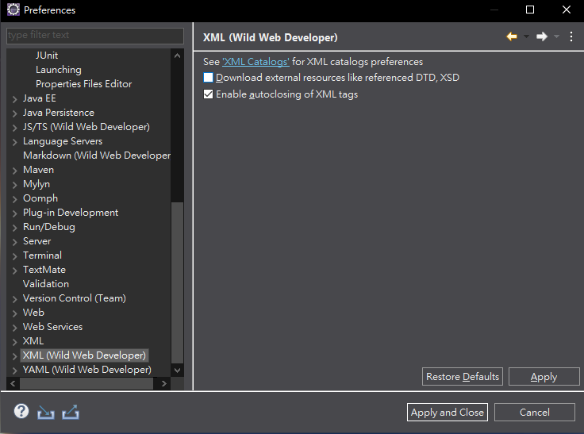
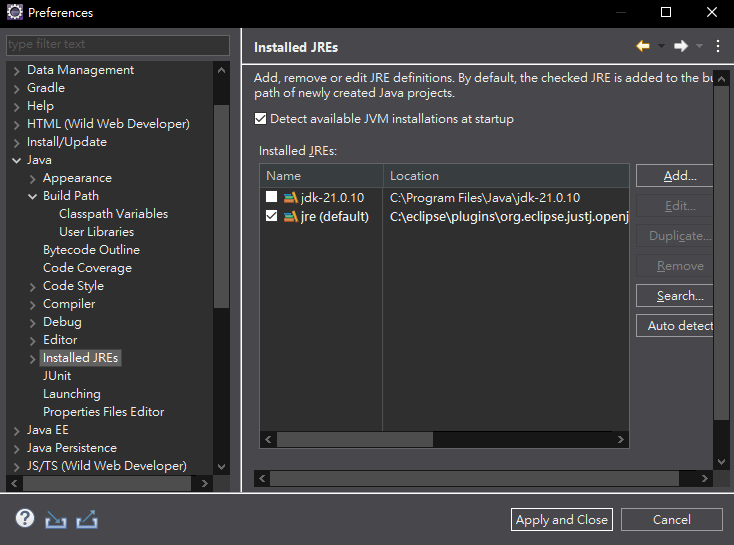
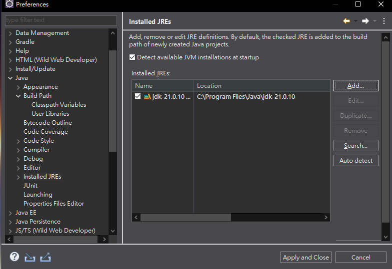
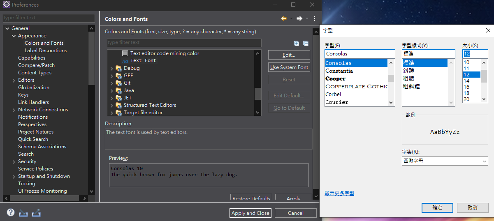
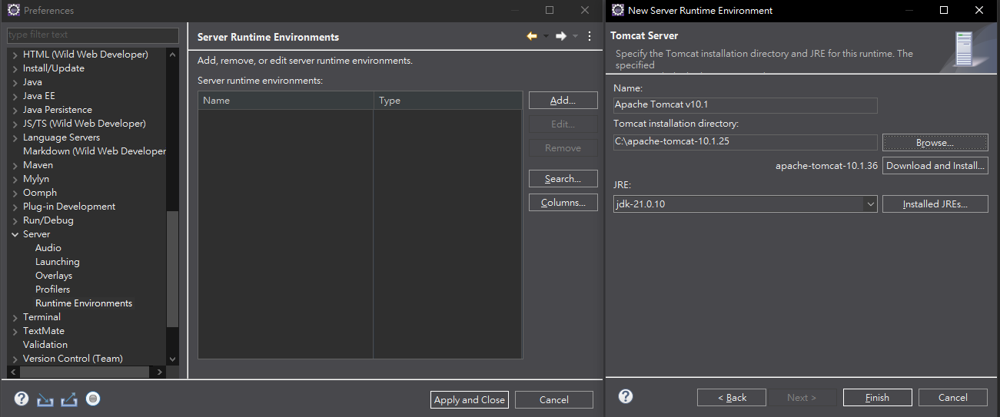
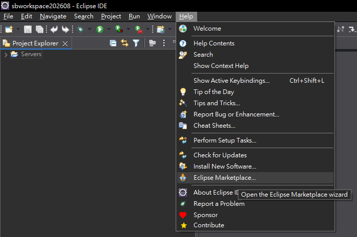
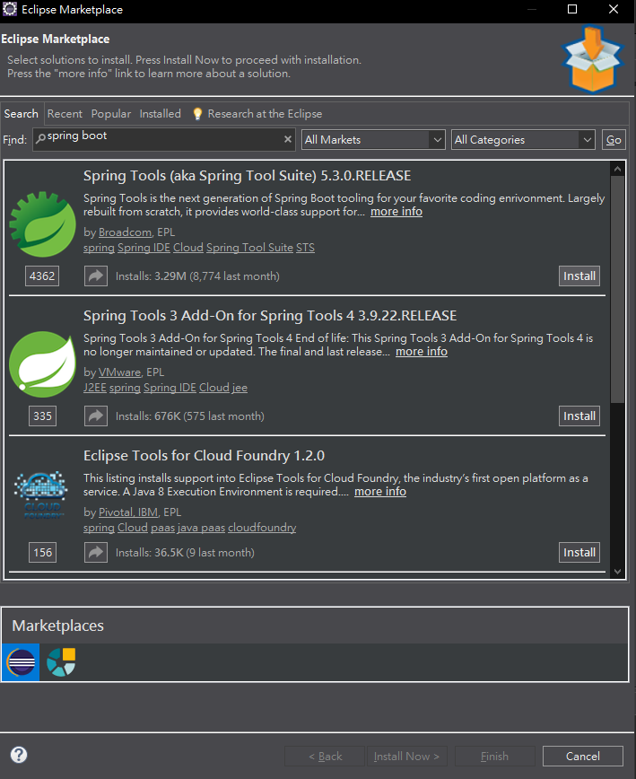
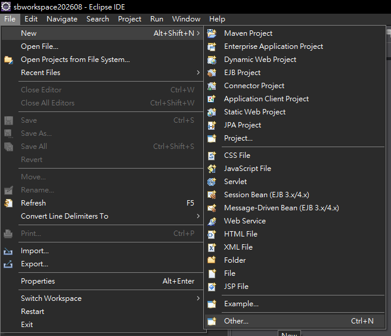
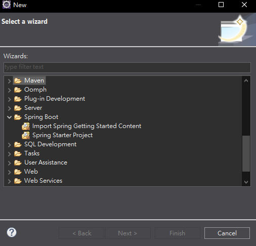

# Spring Boot 圖文學習筆記 01：環境設定

- 使用環境：Eclipse IDE、JDK 21、Apache Tomcat 10.1、Spring Tools

> 語法速查：[設定檔與建置](../語法字典/09_設定檔與建置.md)

## 本章快速索引

- [0. 前置條件與完成結果](#0-前置條件與完成結果)
- [1. XML 設定](#1-xml-設定)
- [2. 將 Java 改為 JDK 21](#2-將-java-改為-jdk-21)
- [3. 調整 Eclipse 字體](#3-調整-eclipse-字體)
- [4. 設定 Apache Tomcat](#4-設定-apache-tomcat)
- [5. 安裝 Spring Tools（STS）](#5-安裝-spring-toolssts)
- [6. 確認 Spring Tools 是否安裝成功](#6-確認-spring-tools-是否安裝成功)
- [環境設定檢查表](#環境設定檢查表)

## 0. 前置條件與完成結果

開始前準備：

- 已安裝可開啟的 Eclipse IDE，建議使用包含 Java／Web 工具的版本。
- 已安裝完整 JDK 21；範例路徑為`C:\Program Files\Java\jdk-21.0.10`。
- 已下載並解壓縮 Tomcat 10.1；範例路徑為`C:\apache-tomcat-10.1.25`。
- 電腦可連線至 Eclipse Marketplace。

完成本章後，應能在 Eclipse 中選用JDK 21、建立Tomcat 10.1 Runtime，並在新建精靈中看到`Spring Boot → Spring Starter Project`。實際小版本可以不同，但JDK主版本應為21、Tomcat主次版本應為10.1。

## 1. XML 設定

進入：

`Window → Preferences → XML (Wild Web Developer)`

勾選：

- `Download external resources like referenced DTD, XSD`
- `Enable autoclosing of XML tags`

完成後按下 `Apply and Close`。

*圖1：XML設定位置。畫面中的第一個選項尚未勾選；完成設定時兩個選項都應勾選。*

## 2. 將 Java 改為 JDK 21

進入：

`Window → Preferences → Java → Installed JREs`

調整前可能同時看到JDK 21與Eclipse原本的預設JRE：

*圖2：JDK 21已存在，但尚未成為預設；另一個JRE仍被勾選。*

設定步驟：

1. 確認已加入 JDK 21。
2. JDK 路徑範例：`C:\Program Files\Java\jdk-21.0.10`
3. 勾選 JDK 21，使它成為預設 Java 執行環境。
4. 選取 Eclipse 原本不使用的預設 JRE，按 `Remove` 移除設定。
5. 最後只保留並使用 JDK 21。
6. 按下 `Apply and Close`。

*圖3：完成後只保留並勾選JDK 21。*

> 注意：移除的是 Eclipse 內的 JRE 設定，不是刪除電腦中的 JDK 21 安裝資料夾。Spring Boot 開發應使用完整 JDK。

## 3. 調整 Eclipse 字體

進入：

`Window → Preferences → General → Appearance → Colors and Fonts`

選擇 `Basic → Text Font`，按下 `Edit`，例如設定：

- 字型：`Consolas`
- 樣式：標準
- 大小：`12`

設定完成後按「確定」，再按 `Apply and Close`。

*圖4：選取Text Font後設定Consolas、標準、12。*

## 4. 設定 Apache Tomcat

進入：

`Window → Preferences → Server → Runtime Environments`

設定步驟：

1. 按 `Add`。
2. 選擇 Apache Tomcat 10.1。
3. 指定 Tomcat 安裝目錄，例如：`C:\apache-tomcat-10.1.25`
4. JRE 選擇 `jdk-21.0.10`。
5. 按 `Finish`。
6. 最後按 `Apply and Close`。

*圖5：指定Tomcat安裝目錄，並讓Runtime使用JDK 21。*

若尚未安裝 Tomcat，可以使用 `Download and Install`，或先自行下載、解壓縮，再用 `Browse` 指定資料夾。

## 5. 安裝 Spring Tools（STS）

進入：

`Help → Eclipse Marketplace`

*圖6：由Help選單進入Eclipse Marketplace。*

安裝步驟：

1. 搜尋 `spring boot`。
2. 找到 `Spring Tools (aka Spring Tool Suite)`。

*圖7：選擇新版Spring Tools；不要選已停止維護的Spring Tools 3 Add-On。*
3. 按 `Install`。
4. 依畫面接受授權條款並繼續。
5. 等待右下角安裝進度完成。

*圖8：安裝期間先等待右下角進度完成。*
6. Eclipse 若要求重新啟動，選擇重新啟動。

> 不要安裝 `Spring Tools 3 Add-On for Spring Tools 4`，因為 Spring Tools 3 已停止維護。應選擇新版 `Spring Tools (aka Spring Tool Suite)`。

## 6. 確認 Spring Tools 是否安裝成功

STS 安裝並重新啟動 Eclipse 後，開啟建立專案的介面：

`File → New → Other...`

*圖9：由File選單開啟完整的新建精靈清單。*

在 `New` 視窗的精靈清單中查看是否出現 `Spring Boot` 分類。展開後應能看到：

- `Import Spring Getting Started Content`
- `Spring Starter Project`

*圖10：出現Spring Boot分類與Spring Starter Project，表示Spring Tools已可使用。*

如果能看到 `Spring Boot → Spring Starter Project`，就代表 Spring Tools 已成功安裝，可以開始建立 Spring Boot 專案。

若沒有看到，可以先在上方搜尋欄輸入 `spring`；仍找不到時，請確認安裝進度已完成，並重新啟動 Eclipse 後再檢查。

## 環境設定檢查表

- [ ] 開啟 XML 外部資源下載
- [ ] 開啟 XML 標籤自動閉合
- [ ] Eclipse 預設 Java 改為 JDK 21
- [ ] 移除不使用的預設 JRE 設定
- [ ] 調整程式編輯器字體
- [ ] 加入 Apache Tomcat 10.1
- [ ] Tomcat 使用 JDK 21
- [ ] 安裝新版 Spring Tools
- [ ] 等待安裝完成並重新啟動 Eclipse
- [ ] 在 `File → New → Other...` 中看到 `Spring Boot → Spring Starter Project`
