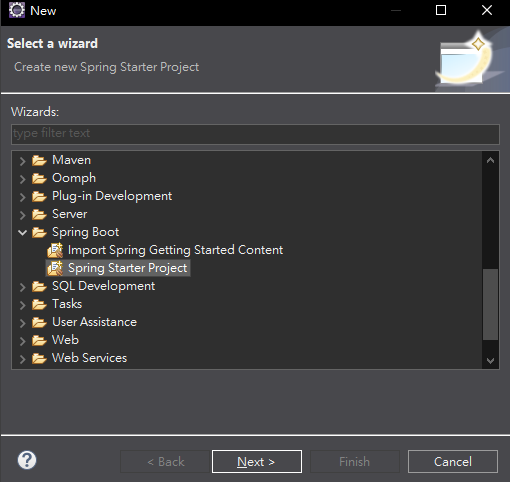
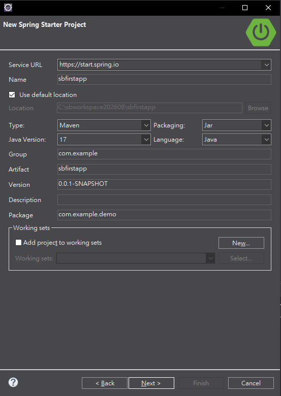
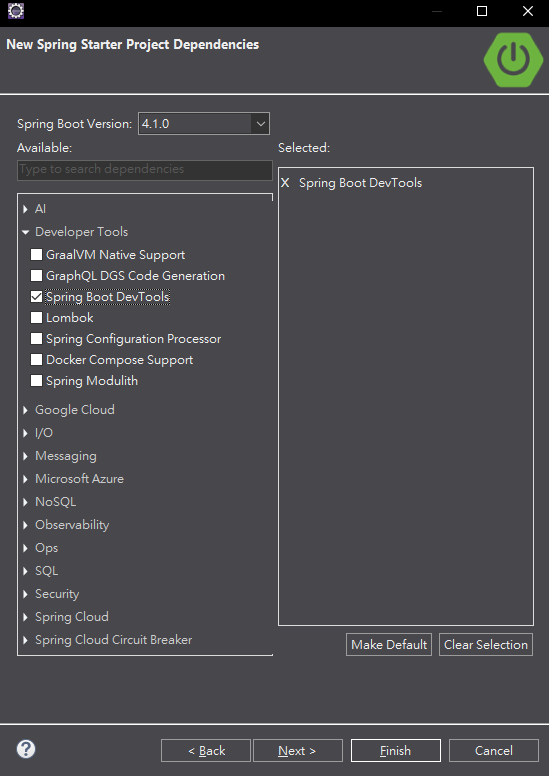
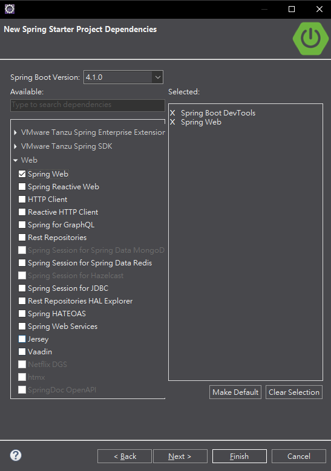
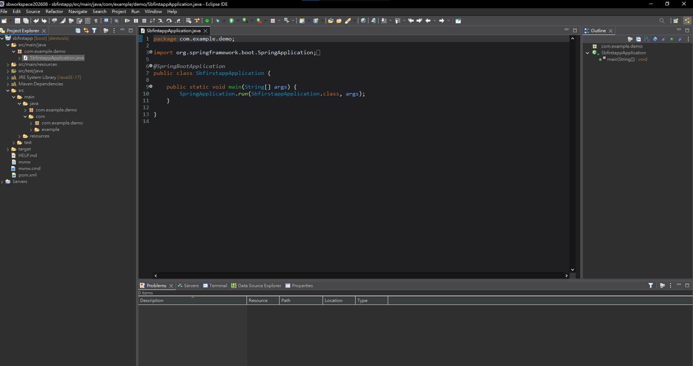
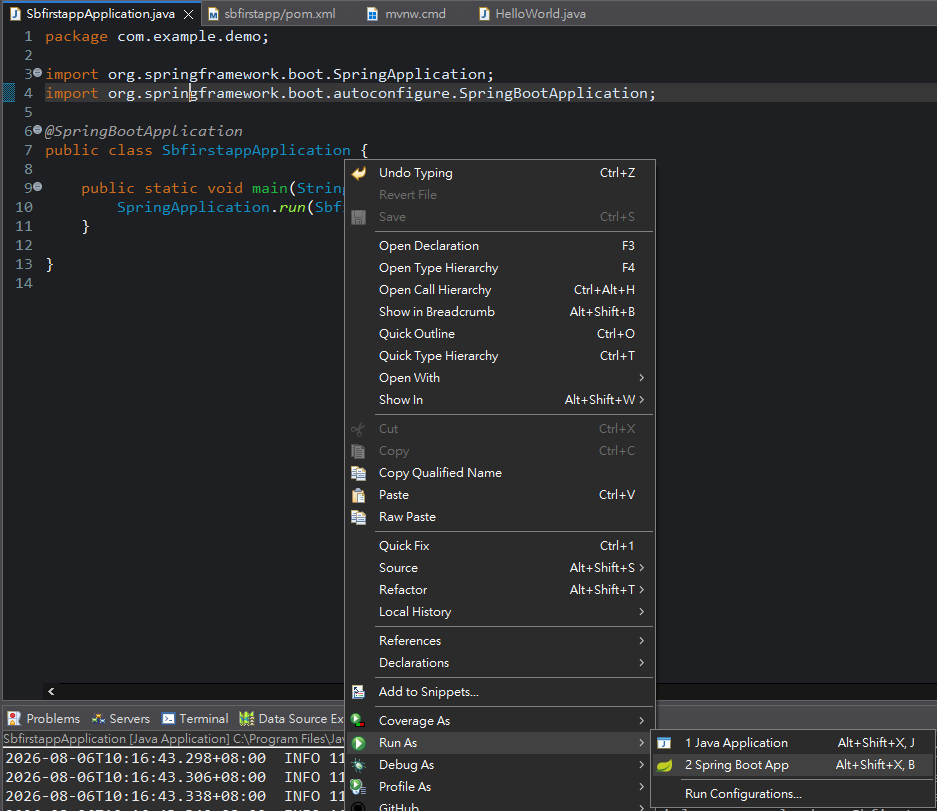

# Spring Boot 圖文學習筆記 02：建立第一個專案

[返回總目錄](../README.md)｜[純文字版](../純文字版/02_建立第一個SpringBoot專案.md)｜[上一章：環境設定](01_環境設定.md)

- 範例專案：`sbfirstapp`
- 完成目標：建立使用Maven、Jar、Java 21、Spring Web與DevTools的Spring Boot專案，並能由主要類別啟動

> 課堂截圖保留了建立當時的Java 17與Spring Boot 4.1.0畫面。重現本章時，Java應改選21；Spring Boot則選建立畫面目前提供的穩定版本，不必強求與截圖的小版本完全相同。

## 0. 開始前確認

先完成第1章，並確認：

- Eclipse的預設Java是完整JDK 21。
- `File → New → Other...`中看得到`Spring Boot → Spring Starter Project`。
- 電腦可連線至`https://start.spring.io`下載專案與相依套件。

## 1. 開啟Spring Starter Project

進入：

```text
File → New → Other...
```

展開`Spring Boot`，選擇`Spring Starter Project`後按`Next`。



*圖1：Spring Tools安裝成功後，New精靈會出現Spring Boot分類與Spring Starter Project。*

## 2. 填寫專案基本資料

在`New Spring Starter Project`設定：

| 欄位 | 本章設定 | 用途 |
|---|---|---|
| Service URL | `https://start.spring.io` | 取得Spring Boot專案骨架 |
| Name | `sbfirstapp` | Eclipse專案名稱 |
| Location | 使用預設位置 | 建立於目前Workspace |
| Type | `Maven` | 使用Maven管理建置與相依套件 |
| Packaging | `Jar` | 產生可執行JAR |
| Java Version | `21` | 配合第1章設定的JDK 21 |
| Language | `Java` | 開發語言 |
| Group | `com.example` | Maven群組識別 |
| Artifact | `sbfirstapp` | Maven成品與專案識別 |
| Version | `0.0.1-SNAPSHOT` | 開發中的初始版本 |
| Package | `com.example.demo` | Java基礎套件 |



*圖2：課堂截圖中的Java Version仍是17；依本課程環境重做時，這裡應改選21，其餘欄位可依表格設定。*

填寫完成後按`Next`。

## 3. 選擇依賴

在Dependencies畫面加入兩項依賴。

### 3.1 Spring Boot DevTools

展開`Developer Tools`並勾選`Spring Boot DevTools`。



*圖3：DevTools提供開發階段自動重新啟動等便利功能；右側Selected會顯示已選項目。*

### 3.2 Spring Web

展開`Web`並勾選`Spring Web`。



*圖4：Spring Web提供Spring MVC、REST API及內嵌Web Server；完成時右側應同時有DevTools與Spring Web。*

確認後按`Finish`，等待Eclipse下載依賴。下載尚未完成時，不要急著把暫時的紅色錯誤標記當成程式錯誤。

## 4. 確認專案建立完成

Project Explorer應出現`sbfirstapp`，並至少包含：

```text
sbfirstapp
├─ src/main/java
│  └─ com.example.demo
│     └─ SbfirstappApplication.java
├─ src/main/resources
├─ src/test/java
├─ JRE System Library [JavaSE-21]
├─ Maven Dependencies
├─ pom.xml
├─ mvnw
└─ mvnw.cmd
```



*圖5：專案已建立並產生主要啟動類別。截圖保留課堂當時的JavaSE-17；依本章重做後，目標應是JavaSE-21。*

主要類別的基本結構如下：

```java
package com.example.demo;

import org.springframework.boot.SpringApplication;
import org.springframework.boot.autoconfigure.SpringBootApplication;

@SpringBootApplication
public class SbfirstappApplication {

    public static void main(String[] args) {
        SpringApplication.run(SbfirstappApplication.class, args);
    }
}
```

- `@SpringBootApplication`標示主要設定與啟動類別。
- `main()`是Java程式進入點。
- `SpringApplication.run(...)`建立並啟動Spring應用程式。
- `pom.xml`記錄Java版本、Spring Boot版本與Maven依賴。

## 5. 核對Java 21是否完整套用

建立畫面、Maven設定與Eclipse建置路徑是三個不同位置，必須一起確認：

1. `pom.xml`包含：

   ```xml
   <properties>
       <java.version>21</java.version>
   </properties>
   ```

2. Project Explorer顯示`JRE System Library [JavaSE-21]`。
3. `Project → Properties → Java Build Path → Libraries`中的JRE指向JDK 21。

如果曾用Java 17建立專案，先修改`pom.xml`，再執行`Maven → Update Project...`；若JRE仍是17，再到Java Build Path編輯JRE System Library。只改其中一處，不代表專案已完整切換至Java 21。

## 6. 啟動Spring Boot專案

在`SbfirstappApplication.java`內按右鍵，選擇：

```text
Run As → Spring Boot App
```



*圖6：兩個選項都會執行main方法；Spring Boot App由Spring Tools管理啟動設定，適合平常開發Spring Boot專案。*

兩種執行方式的差別：

| 選項 | 使用時機 |
|---|---|
| `Spring Boot App` | 平常開發Spring Boot專案，方便管理Profiles、參數與Boot啟動設定 |
| `Java Application` | 沒有Spring Tools、要測試一般Java main，或排除STS啟動設定影響 |

啟動成功時，Console會出現`Started SbfirstappApplication`，而且不應出現`APPLICATION FAILED TO START`。

## 完成檢查

- [ ] New精靈中能選`Spring Starter Project`
- [ ] Type為Maven、Packaging為Jar、Java Version為21
- [ ] 已加入Spring Boot DevTools與Spring Web
- [ ] Project Explorer已出現完整專案結構
- [ ] `pom.xml`與JRE System Library都使用Java 21
- [ ] 使用`Spring Boot App`啟動後，Console顯示`Started SbfirstappApplication`

