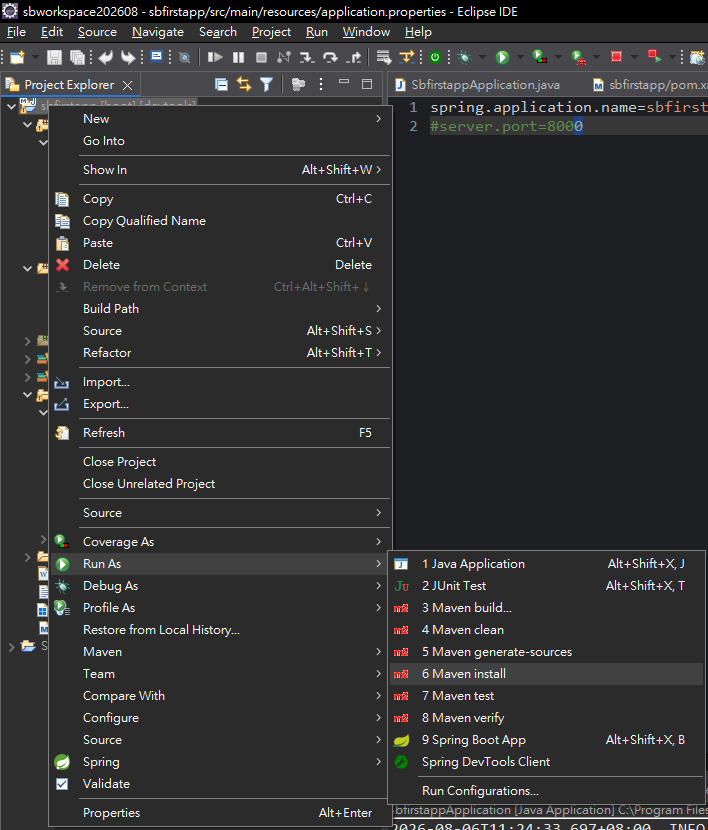
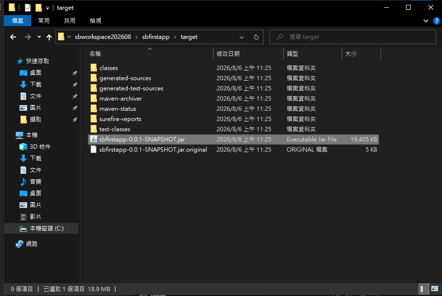
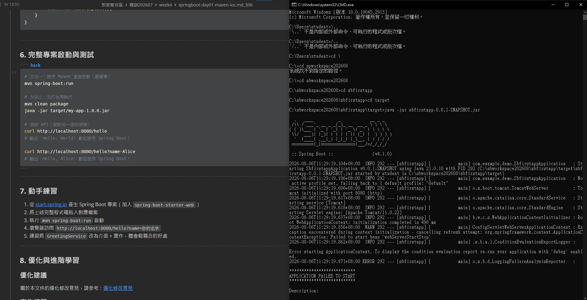

# Spring Boot 圖文學習筆記 03：Maven打包與執行JAR

[返回總目錄](../README.md)｜[純文字版](../純文字版/03_Maven打包與執行JAR.md)｜[上一章：建立第一個專案](02_建立第一個SpringBoot專案.md)

- 範例專案：`sbfirstapp`
- 範例位置：`C:\sbworkspace202608\sbfirstapp`
- 完成目標：使用Maven產生Spring Boot可執行JAR，並從Windows命令提示字元啟動

## 0. 開始前確認

- 已完成第2章，專案能在Eclipse中正常啟動。
- 專案包含`pom.xml`、`mvnw`與`mvnw.cmd`。
- 開啟Windows命令提示字元；本章指令使用CMD語法。

> 從命令列啟動JAR前，先停止Eclipse中正在執行的同一個應用程式，避免兩份程式同時占用8080。

## 1. 在Eclipse執行Maven install

在Project Explorer對`sbfirstapp`按右鍵：

```text
Run As → Maven install
```



*圖1：Maven install會執行編譯、測試、打包，並把成品安裝到本機Maven Repository。它不是啟動Spring Boot服務的選項。*

常用Maven階段：

| 指令／選項 | 結果 |
|---|---|
| `mvnw.cmd clean package` | 清除舊產物、編譯、測試並在`target`產生JAR |
| `mvnw.cmd clean install` | 完成package後，再把成品放入本機Maven Repository |
| Eclipse的`Maven install` | 從Eclipse執行Maven的install階段 |

若只需要可執行JAR，執行`package`已足夠。專案附有Maven Wrapper時，不必先在系統另外安裝`mvn`：

```bat
cd /d C:\sbworkspace202608\sbfirstapp
mvnw.cmd clean package
```

## 2. 確認target中的打包產物

建置成功後，重新整理專案並查看`target`資料夾。



*圖2：target中同時有可執行JAR與`.jar.original`；命令列啟動時應選沒有`.original`的檔案。*

本範例的兩個JAR：

- `sbfirstapp-0.0.1-SNAPSHOT.jar`：Spring Boot Maven Plugin重新封裝後的可執行JAR，包含啟動結構與相依套件。
- `sbfirstapp-0.0.1-SNAPSHOT.jar.original`：重新封裝前的原始JAR，一般不直接用來啟動Spring Boot。

每次版本或Artifact改變時，實際檔名也可能改變；應以`target`內真正產生的檔名為準。

## 3. 從命令列執行JAR

### 從專案根目錄執行

```bat
cd /d C:\sbworkspace202608\sbfirstapp
java -jar target\sbfirstapp-0.0.1-SNAPSHOT.jar
```

### 已經位於target資料夾

```bat
cd /d C:\sbworkspace202608\sbfirstapp\target
java -jar sbfirstapp-0.0.1-SNAPSHOT.jar
```

CMD中切換上層資料夾要使用`cd ..`，不能只輸入`..`。`cd /d`則能同時切換磁碟機與資料夾。

啟動成功時應看到Spring Boot標誌、Tomcat啟動訊息，以及最後的：

```text
Started SbfirstappApplication
```

命令視窗必須保持開啟；按`Ctrl+C`才會停止目前服務。

## 4. 啟動失敗案例：8080可能已被占用

課堂畫面從`target`執行JAR後，Spring Boot已開始載入並使用Java 21.0.10，但最後顯示`APPLICATION FAILED TO START`：



*圖3：畫面能證明應用程式啟動失敗，但截圖沒有完整顯示最下方Description，因此不能只靠這張圖斷定原因一定是8080衝突。*

若`application.properties`為：

```properties
spring.application.name=sbfirstapp
#server.port=8000
```

第二行前面的`#`代表註解，所以`server.port=8000`不會生效，程式仍使用預設8080。如果Eclipse已經執行另一份服務，第二份JAR就可能因連接埠衝突而失敗。

## 5. 確認原因後再處理

先查看錯誤最下方的`Description`。只有看到類似下列訊息，或查詢結果顯示8080確實被監聽，才能確認是port衝突：

```text
Port 8080 was already in use
```

查詢8080：

```bat
netstat -ano | findstr :8080
```

確認是連接埠衝突後，可選一種方法：

### 方法一：停止原本的服務

在Eclipse Console按紅色停止按鈕，再重新執行JAR。

### 方法二：固定改用8000

移除註解符號：

```properties
spring.application.name=sbfirstapp
server.port=8000
```

修改設定後要重新執行Maven package或install，讓新設定進入JAR，再啟動新產物。

### 方法三：只在本次啟動改用8000

```bat
java -jar target\sbfirstapp-0.0.1-SNAPSHOT.jar --server.port=8000
```

這個參數只影響本次執行，不修改`application.properties`。

## 6. Java版本判讀

Java 21通常可以執行以Java 17為目標編譯的程式，所以「JAR以Java 21執行、`pom.xml`仍設定17」本身不等於啟動失敗原因。若要統一成Java 21，應回到第2章，同時修改`pom.xml`、Maven專案設定與JRE System Library。

## 完成檢查

- [ ] Maven建置顯示成功，沒有測試或編譯失敗
- [ ] `target`中出現沒有`.original`字樣的可執行JAR
- [ ] `java -jar`使用正確的資料夾與檔名
- [ ] 啟動前已停止占用相同port的舊服務，或明確改用其他port
- [ ] Console最後顯示`Started SbfirstappApplication`
- [ ] 若曾修改`application.properties`，已重新打包JAR

