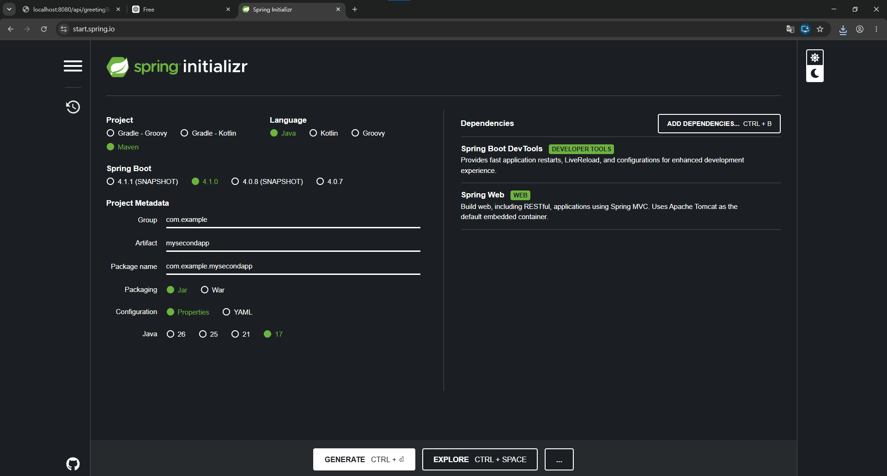

# Spring Boot 圖文學習筆記 04：使用 Spring Initializr 建立專案

- 網站：`https://start.spring.io`
- 範例專案：`mysecondapp`
- 範例專案名稱：`mysecondapp`

> 語法速查：[設定檔與建置](../語法字典/09_設定檔與建置.md)

## 本章快速索引

- [0. 前置條件與完成結果](#0-前置條件與完成結果)
- [1. Spring Initializr 是什麼？](#1-spring-initializr-是什麼)
- [2. 開啟網站](#2-開啟網站)
- [3. 選擇專案與語言](#3-選擇專案與語言)
- [4. 填寫 Project Metadata](#4-填寫-project-metadata)
- [5. 選擇 Java 版本](#5-選擇-java-版本)
- [6. 加入依賴](#6-加入依賴)
- [7. 產生並匯入專案](#7-產生並匯入專案)
- [8. 產生後應有的結構](#8-產生後應有的結構)
- [檢查表](#檢查表)

## 0. 前置條件與完成結果

- 需要瀏覽器、網路連線與可匯入Maven專案的Eclipse。
- 完成本章後，應得到一個可在Eclipse中匯入並啟動的`mysecondapp`專案。
- 若要與第1章環境一致，產生專案時選Java 21；若要精確重現既有範例，則選Java 17。兩條路線不可混寫成同一個實際狀態。

## 1. Spring Initializr 是什麼？

Spring Initializr 是 Spring 提供的專案產生器，可以在瀏覽器中選擇專案類型、Java 版本、Spring Boot 版本及依賴，然後下載已建立好的專案壓縮檔。

Eclipse 的`Spring Starter Project`底層也是使用 Spring Initializr 服務；差別主要是：

- Eclipse 精靈：直接在 IDE 中建立並匯入專案。
- `start.spring.io`：先從網站產生 ZIP，再解壓縮、匯入 IDE。

## 2. 開啟網站

下圖對照本節的操作位置或執行結果：



*圖1：Spring Initializr把專案類型、語言、Boot版本、Metadata、Java版本及Dependencies集中在同一頁；截圖中的Java 17應依課程環境改選21。*

在瀏覽器進入：

`https://start.spring.io`

## 3. 選擇專案與語言

建立範例時使用：

| 項目 | 選擇 |
|---|---|
| Project | `Maven` |
| Language | `Java` |
| Spring Boot | `4.1.0` |

版本名稱含`SNAPSHOT`代表開發中的快照版；本章範例選擇不含`SNAPSHOT`的`4.1.0`。

## 4. 填寫 Project Metadata

| 欄位 | 設定值 | 用途 |
|---|---|---|
| Group | `com.example` | 組織或專案群組識別 |
| Artifact | `mysecondapp` | Maven Artifact 與預設專案名稱 |
| Package name | `com.example.mysecondapp` | Java 基礎套件名稱 |
| Packaging | `Jar` | 產生可執行 JAR 專案 |
| Configuration | `Properties` | 使用`application.properties`設定檔 |

## 5. 選擇 Java 版本

既有範例選用：

`Java 17`

直接檢查已產生的`mysecondapp/pom.xml`後，也確認目前實際內容為：

```xml
<properties>
    <java.version>17</java.version>
</properties>
```

因此既有範例的產生設定與`pom.xml`一致，都是Java 17。

> 若採用Java 21路線，應在按`GENERATE`以前改選`21`，並在匯入後確認`pom.xml`與JRE System Library都顯示21。既有`mysecondapp`則是Java 17對照範例。

## 6. 加入依賴

按`ADD DEPENDENCIES...`，加入：

### Spring Boot DevTools

提供開發階段的自動重新啟動、LiveReload 等便利功能。

### Spring Web

用來建立 Web 與 RESTful 應用程式，使用 Spring MVC，並預設採用內嵌 Apache Tomcat。

既有範例的`pom.xml`對應依賴為：

- `spring-boot-starter-webmvc`
- `spring-boot-devtools`
- `spring-boot-starter-webmvc-test`（測試用）

## 7. 產生並匯入專案

設定完成後按：

`GENERATE`

網站會下載 ZIP。接下來：

1. 解壓縮 ZIP。
2. 將資料夾放到要保存的位置。
3. 在 Eclipse 選擇`File → Import...`。
4. 選擇`Maven → Existing Maven Projects`。
5. 指定解壓縮後、包含`pom.xml`的專案根目錄。
6. 完成匯入並等待 Maven 下載依賴。

## 8. 產生後應有的結構

以範例專案`mysecondapp`為例：

`mysecondapp/`

主要內容包括：

```text
mysecondapp
├─ src/main/java/com/example/mysecondapp/MysecondappApplication.java
├─ src/main/resources/application.properties
├─ src/test/java/com/example/mysecondapp/MysecondappApplicationTests.java
├─ pom.xml
├─ mvnw
└─ mvnw.cmd
```

`application.properties`目前為：

```properties
spring.application.name=mysecondapp
```

## 檢查表

- [ ] Project 選擇 Maven
- [ ] Language 選擇 Java
- [ ] 使用不含`SNAPSHOT`的課程指定 Spring Boot 版本
- [ ] Artifact 設為`mysecondapp`
- [ ] Packaging 選擇 Jar
- [ ] Configuration 選擇 Properties
- [ ] 若課程統一使用 JDK 21，Java 改選 21
- [ ] 加入 Spring Boot DevTools
- [ ] 加入 Spring Web
- [ ] 按`GENERATE`下載專案
- [ ] 解壓縮後以 Existing Maven Projects 匯入 Eclipse
