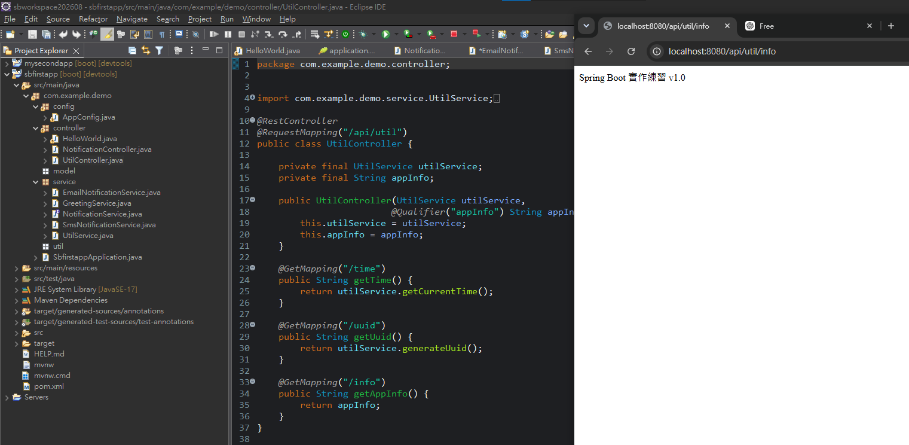

# Spring Boot 圖文學習筆記 07：Component、Configuration 與 Bean

[返回總目錄](../README.md)｜[純文字版](../純文字版/07_Component_Configuration與Bean.md)｜[上一章：介面多實作與Qualifier](06_介面多實作與Qualifier依賴注入.md)｜[下一章：HTML表單與JSON資料綁定](08_HTML表單與JSON資料綁定.md)

- 整理日期：2026-08-06
- 範例專案：`sbfirstapp`
- 測試路徑前綴：`http://localhost:8080/api/util`

## 0. 前置條件與重現步驟

1. 使用已能啟動的`sbfirstapp`。
2. 在`com.example.demo`下建立`service`、`config`與`controller`package。
3. 依第3節建立`UtilService`。
4. 依第5節建立`AppConfig`。
5. 依第8節建立`UtilController`。
6. 啟動後測試第9節的三個URL。

三個URL能分別回傳時間、UUID與固定應用程式資訊，才代表Component Scan、`@Bean`與`@Qualifier`均生效。

## 1. 本章範例的目的

本章示範兩種把物件交給 Spring 容器管理的方式：

1. 在自己的類別上加`@Component`，由 Component Scan 自動建立 Bean。
2. 在`@Configuration`類別中使用`@Bean`方法，手動建立並設定 Bean。

Controller 再透過建構子注入這些 Bean。

## 2. 相關專案結構

需要建立的檔案：

```text
com.example.demo
├─ config
│  └─ AppConfig.java
├─ controller
│  └─ UtilController.java
└─ service
   └─ UtilService.java
```

## 3. 使用 Component 建立 Bean

`UtilService.java`：

```java
package com.example.demo.service;

import org.springframework.stereotype.Component;

@Component
public class UtilService {

    public String getCurrentTime() {
        return "目前時間: " + java.time.LocalDateTime.now();
    }

    public String generateUuid() {
        return "UUID: " + java.util.UUID.randomUUID().toString();
    }
}
```

`@Component`表示：

- 這個類別是 Spring 元件。
- Spring 進行 Component Scan 時會找到它。
- Spring 會建立並管理一個`UtilService`Bean。
- 其他類別可以透過依賴注入使用它。

## 4. Component 與 Service 的差異

- `@Component`：通用的 Spring 元件標記。
- `@Service`：語意上表示業務邏輯層，本身也是一種`@Component`。
- `@Repository`：語意上表示資料存取層，也屬於 Component 類型。
- `@Controller`／`@RestController`：表示 Web Controller。

這個`UtilService`使用`@Component`可以正常運作；若想明確表達它屬於 Service 層，也可以使用`@Service`。

## 5. 使用 Configuration 與 Bean

`AppConfig.java`位於：

`com.example.demo.config`

內容：

```java
package com.example.demo.config;

import org.springframework.context.annotation.Bean;
import org.springframework.context.annotation.Configuration;

@Configuration
public class AppConfig {

    @Bean
    public String appInfo() {
        return "Spring Boot 實作練習 v1.0";
    }
}
```

### Configuration

`@Configuration`表示這是一個 Spring Java 設定類別，裡面可以定義要交給 Spring 管理的 Bean。

### Bean

`@Bean`表示：

- Spring 會執行`appInfo()`。
- 方法回傳值會被放進 Spring 容器。
- Bean 型別是`String`。
- 預設 Bean 名稱是方法名稱`appInfo`。

等同於建立：

```text
Bean 名稱：appInfo
Bean 型別：String
Bean 內容：Spring Boot 實作練習 v1.0
```

`@Bean`特別適合：

- 需要自己控制物件建立方式。
- 類別來自第三方套件，不能在它上面加入`@Component`。
- 物件建立前需要額外設定。
- 要建立的 Bean 不是一般自訂類別，例如本例的 String。

## 6. 注入 UtilService 與 appInfo

`UtilController`的欄位：

```java
private final UtilService utilService;
private final String appInfo;
```

建構子：

```java
public UtilController(
        UtilService utilService,
        @Qualifier("appInfo") String appInfo) {
    this.utilService = utilService;
    this.appInfo = appInfo;
}
```

注入關係：

| 建構子參數 | Bean 來源 |
|---|---|
| `UtilService utilService` | `@Component`自動掃描建立 |
| `@Qualifier("appInfo") String appInfo` | `AppConfig.appInfo()`的`@Bean`方法建立 |

## 7. 為什麼 String 要搭配 Qualifier？

單靠型別注入`String`不夠清楚，Spring 容器中可能出現多個 String Bean。使用：

```java
@Qualifier("appInfo")
```

可明確表示要注入 Bean 名稱為`appInfo`的 String。

`Qualifier`的字串要與`@Bean`方法名稱一致：

```java
@Bean
public String appInfo() { ... }
```

也可以明確指定 Bean 名稱：

```java
@Bean("appInfo")
public String createAppInfo() {
    return "Spring Boot 實作練習 v1.0";
}
```

## 8. 完整 UtilController



*圖1：UtilController同時注入UtilService及名稱為appInfo的String Bean；瀏覽器結果證明/api/util/info取得設定值。*

```java
package com.example.demo.controller;

import com.example.demo.service.UtilService;
import org.springframework.beans.factory.annotation.Qualifier;
import org.springframework.web.bind.annotation.GetMapping;
import org.springframework.web.bind.annotation.RequestMapping;
import org.springframework.web.bind.annotation.RestController;

@RestController
@RequestMapping("/api/util")
public class UtilController {

    private final UtilService utilService;
    private final String appInfo;

    public UtilController(
            UtilService utilService,
            @Qualifier("appInfo") String appInfo) {
        this.utilService = utilService;
        this.appInfo = appInfo;
    }

    @GetMapping("/time")
    public String getTime() {
        return utilService.getCurrentTime();
    }

    @GetMapping("/uuid")
    public String getUuid() {
        return utilService.generateUuid();
    }

    @GetMapping("/info")
    public String getAppInfo() {
        return appInfo;
    }
}
```

## 9. API 與結果

### 目前時間

網址：

`http://localhost:8080/api/util/time`

結果格式：

```text
目前時間: 2026-08-06T14:56:15.123
```

每次呼叫都會重新取得`LocalDateTime.now()`。

### 隨機 UUID

網址：

`http://localhost:8080/api/util/uuid`

結果格式：

```text
UUID: 123e4567-e89b-12d3-a456-426614174000
```

每次呼叫`UUID.randomUUID()`，通常會得到不同結果。

### 應用程式資訊

網址：

`http://localhost:8080/api/util/info`

成功時應回傳：

```text
Spring Boot 實作練習 v1.0
```

這個結果不是 Controller 寫死的，而是來自`AppConfig`建立的`appInfo`Bean。

## 10. 被註解的 RestTemplate Bean

`AppConfig`目前還有一段被註解的程式：

```java
// @Bean
// public RestTemplate restTemplate() {
//     return new RestTemplate();
// }
```

因為整段被註解，所以目前不會建立`RestTemplate`Bean。若日後解除註解，就能讓其他元件注入該 RestTemplate。

## 檢查表

- [ ] `UtilService`有`@Component`
- [ ] `AppConfig`有`@Configuration`
- [ ] `appInfo()`有`@Bean`
- [ ] `@Qualifier("appInfo")`與 Bean 名稱一致
- [ ] Controller 使用建構子注入與`final`欄位
- [ ] `/api/util/time`可以取得時間
- [ ] `/api/util/uuid`可以產生 UUID
- [ ] `/api/util/info`回傳「Spring Boot 實作練習 v1.0」

