# Spring Boot 圖文學習筆記 11：REST JSON與Thymeleaf模板

[返回總目錄](../README.md)｜[純文字版](../純文字版/11_REST_JSON與Thymeleaf模板.md)｜[圖文延伸閱讀](延伸閱讀/11_Thymeleaf表達式與常見疑難.md)｜[上一章：Swagger／OpenAPI API文件](10_Swagger_OpenAPI_API文件.md)｜[下一章：REST CRUD進階](12_REST_CRUD進階_參數DTO與統一回應.md)

- 整理日期：2026-08-13
- 範例專案：`sbrest0810`
- Java目標版本：17

## 0. 前置條件、實作順序與完成判定

前置條件：

- 已完成第5章，Controller位於主要啟動套件`com.example.demo`或其子套件。
- 已完成第9章的User、UserService與記憶體Repository；本章沿用資料層，新增MVC網頁。
- 專案包含Spring Web、Thymeleaf與Lombok。

檔案位置：

```text
src/main/java/com/example/demo/
├─ controller/
│  ├─ BookController.java
│  ├─ ThymeleafController.java
│  ├─ AttributeController.java
│  └─ UserWebController.java
├─ model/
├─ service/
└─ Sbrest0810Application.java

src/main/resources/
├─ static/images/
└─ templates/
   ├─ index.html
   ├─ showimage.html
   ├─ status.html
   ├─ role.html
   ├─ session.html
   ├─ hyperlink.html
   └─ user/
      ├─ list.html
      ├─ form.html
      └─ detail.html
```

實作順序：

1. 完成Book REST API，確認Java物件能轉為JSON。
2. 建立第一個`@Controller`、Model與`index.html`。
3. 練習文字、HTML、圖片、條件、Session與URL屬性。
4. 沿用第9章User資料層，建立User網頁CRUD。
5. 依第12節逐項測試。

成功條件：

- `/api/books`回傳JSON。
- `/thymeleaf`回傳由模板產生的HTML。
- 圖片、條件、Session與連結能得到預期結果。
- `/web/users`可顯示列表，並完成建立、詳情、編輯與刪除流程。

若已能完成本章實作，只想進一步釐清模板取代規則、各種Expression的合法位置、Model與Session差異，可另讀[第11章延伸閱讀](延伸閱讀/11_Thymeleaf表達式與常見疑難.md)。延伸閱讀不是完成本章的必要步驟。

## 1. REST JSON與MVC HTML的差別

| Controller | 常見回傳值 | Spring的處理 |
|---|---|---|
| `@RestController` | Java物件、集合、字串 | 寫入Response Body；物件通常由Jackson轉成JSON |
| `@Controller` | View Name字串 | 交給View Resolver尋找Thymeleaf模板 |

資料流：

```text
GET /api/books
→ BookController
→ Book物件
→ Jackson
→ JSON

GET /thymeleaf
→ ThymeleafController
→ Model
→ templates/index.html
→ Thymeleaf
→ HTML
```

兩者都能處理HTTP Request，但回傳字串的含義不同。`@RestController`中的字串是Response Body；`@Controller`中的`"index"`通常是View Name。

## 2. Maven依賴

```xml
<dependency>
    <groupId>org.springframework.boot</groupId>
    <artifactId>spring-boot-starter-webmvc</artifactId>
</dependency>

<dependency>
    <groupId>org.springframework.boot</groupId>
    <artifactId>spring-boot-starter-thymeleaf</artifactId>
</dependency>

<dependency>
    <groupId>org.projectlombok</groupId>
    <artifactId>lombok</artifactId>
    <optional>true</optional>
</dependency>
```

- WebMVC提供Controller、Model、資料綁定與Jackson整合。
- Thymeleaf starter提供模板引擎與Spring MVC整合。
- Lombok只在編譯階段產生Getter、Setter等程式，不負責JSON或模板渲染。

## 3. Book物件轉成JSON

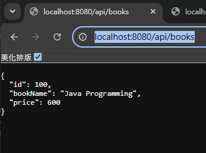

*圖1：瀏覽器呼叫GET /api/books後，Jackson把Book物件序列化為包含id、bookName與price的JSON。*

```java
@RestController
@RequestMapping("/api/books")
public class BookController {

    @GetMapping
    public ResponseEntity<Book> getBook() {
        Book book = new Book(100, "Java Programming", 600);
        return ResponseEntity.ok(book);
    }
}
```

測試：

```http
GET http://localhost:8080/api/books
```

預期Body：

```json
{
  "id": 100,
  "bookName": "Java Programming",
  "price": 600
}
```

JSON欄位來自Book可被Jackson讀取的property。若使用Lombok，Eclipse必須正確啟用annotation processing，否則Getter可能沒有產生。

## 4. 第一個Thymeleaf頁面

Controller把資料放入Model並回傳View Name：

```java
@Controller
@RequestMapping("/thymeleaf")
public class ThymeleafController {

    @GetMapping
    public String firstThymeleaf(Model model) {
        model.addAttribute("greeting", "<h1>Good Morning</h1>");
        model.addAttribute(
                "htmlContent",
                "<h1 style='color:blue'>Good Morning</h1>");
        return "index";
    }
}
```

`return "index"`會尋找：

```text
src/main/resources/templates/index.html
```

模板根元素加入Thymeleaf namespace：

```html
<html xmlns:th="http://www.thymeleaf.org">
```

啟動後測試：

```http
GET http://localhost:8080/thymeleaf
```

## 5. `th:text`、`th:utext`與文字模板

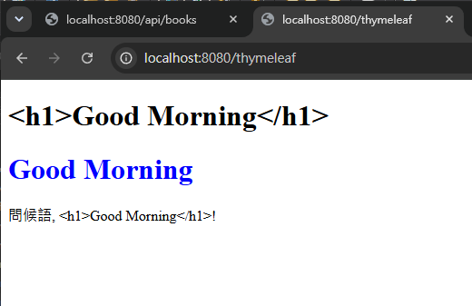

*圖2：同一段含HTML標籤的字串經th:text會被跳脫並顯示標籤文字，經th:utext才會被瀏覽器當成真正HTML渲染。*

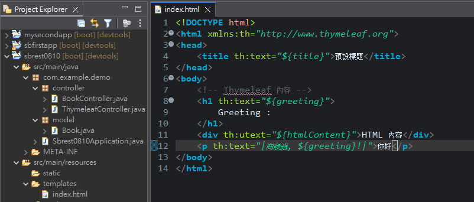

*圖3：th:text執行時會取代元素內原本的Greeting文字；它不是表達式沒有值時自動保留的預設內容。*

### 5.1 `th:text`

```html
<h1 th:text="${greeting}">Greeting :</h1>
```

`th:text`會做兩件事：

1. 將`${greeting}`求值。
2. 以求值結果取代元素原本的全部內容，並進行HTML escaping。

因此原本的`Greeting :`會消失。它只是直接開啟模板原始檔時可看的靜態原型文字，不是執行時的前綴或預設值。

若要保留固定前綴，可把動態部分放進子元素：

```html
<h1>Greeting：<span th:text="${greeting}"></span></h1>
```

如果`greeting`包含`<h1>Good Morning</h1>`，`th:text`會把標籤當文字顯示，不會建立另一個HTML元素。

### 5.2 `th:utext`

```html
<div th:utext="${htmlContent}">HTML內容</div>
```

`th:utext`不做HTML escaping，因此字串中的標籤會被瀏覽器解析。只可輸出程式產生或已清理的可信內容；把使用者輸入直接交給`th:utext`可能造成XSS。

### 5.3 文字模板

```html
<p th:text="|問候語，${greeting}!|">你好</p>
```

豎線`|...|`是Thymeleaf literal substitution，用於把固定文字與Expression組成一個字串。它不是Java statement，也不會把其中的HTML改成安全內容。

## 6. 圖片：`th:src`與靜態資源

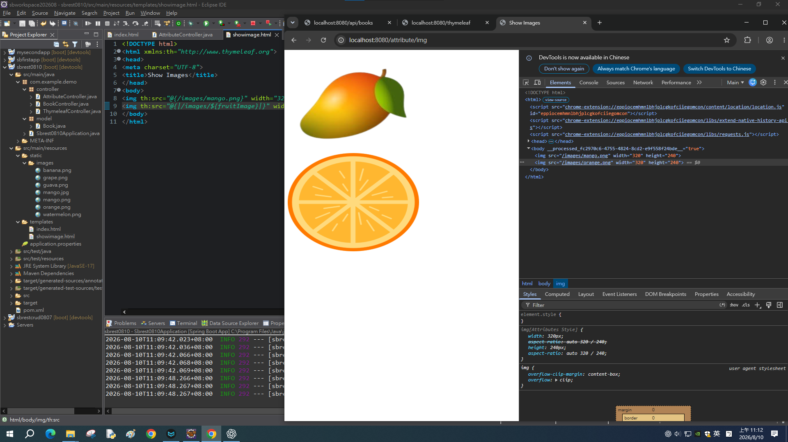

*圖4：第一張圖片使用固定靜態路徑，第二張由Model中的fruitImage組合網址；開發者工具可核對瀏覽器最後收到的src。*

圖片放在：

```text
src/main/resources/static/images/
```

固定圖片：

```html

```

動態圖片：

```java
String[] images = {
    "banana.png", "grape.png", "guava.png", "orange.png"
};
model.addAttribute(
        "fruitImage",
        images[(int) (Math.random() * images.length)]);
```

```html

```

測試：

```http
GET http://localhost:8080/attribute/img
```

瀏覽器收到的是普通`src="/images/xxx.png"`，不會保留`th:src`。若圖片顯示破圖，先確認實際檔名、大小寫與`static/images`位置。

## 7. 條件顯示：`th:if`、`th:switch`與`th:case`

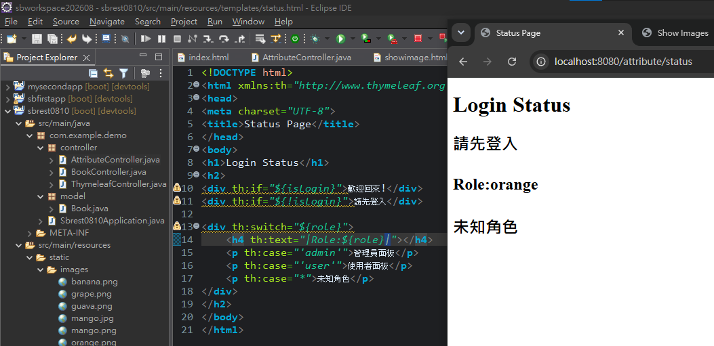

*圖5：isLogin為false時顯示請先登入；role為orange不符合admin或user，因此落入預設case並顯示未知角色。*

登入狀態：

```html
<div th:if="${isLogin}">歡迎回來！</div>
<div th:if="${!isLogin}">請先登入</div>
```

Controller最好傳入真正的boolean：

```java
model.addAttribute("isLogin", false);
```

課堂原始碼傳入字串`"false"`；目前範例能顯示「請先登入」，但用boolean能避免字串轉換規則造成誤解。

角色分支：

```html
<div th:switch="${role}">
    <p th:case="'admin'">管理員面板</p>
    <p th:case="'user'">使用者面板</p>
    <p th:case="*">未知角色</p>
</div>
```

`th:case="*"`是預設分支。因此`role=orange`或`grape`時會顯示「未知角色」。

測試：

```http
GET http://localhost:8080/attribute/status
GET http://localhost:8080/attribute/role
```

## 8. Session與格式化工具

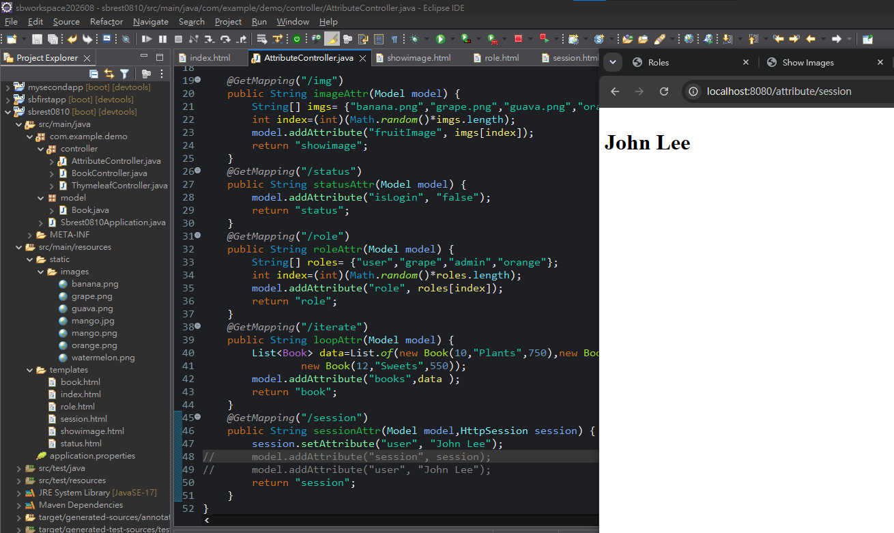

*圖6：Controller只把user放入HttpSession，沒有把session或user另加進Model；模板仍可透過Session namespace顯示John Lee。*

Controller把user放進目前Session：

```java
@GetMapping("/session")
public String sessionAttr(Model model, HttpSession session) {
    session.setAttribute("user", "John Lee");
    model.addAttribute("price", 19.9565);
    model.addAttribute("today", new Date());
    return "session";
}
```

模板：

```html
<p th:text="${session['user']}">Session資料</p>
<p th:text="${#numbers.formatDecimal(price, 1, 2)}">價格</p>
<p th:text="${#dates.format(today, 'yyyy-MM-dd HH:mm:ss')}">日期</p>
```

重點：

- `${session['user']}`直接讀Session attribute。
- 不必再把整個`HttpSession`放進Model。
- 若資料只供這一次頁面使用，`model.addAttribute("user", ...)`較直接。
- Session適合跨Request保存同一瀏覽器工作階段的資料，但不應任意存放大量物件或敏感資料。

測試：

```http
GET http://localhost:8080/attribute/session
```

應顯示John Lee、格式化價格與目前日期時間。

## 9. Link URL Expression

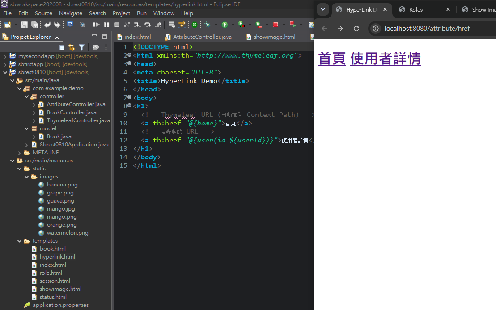

*圖7：th:href可建立一般連結及帶userId的動態網址；範例沒有開頭斜線，因此產生的是相對於目前路徑的網址。*

基本形式：

```html
<a th:href="@{/web/users}">使用者列表</a>
```

`@{...}`是Thymeleaf Link URL Expression，負責產生URL並處理Context Path與必要的URL encoding。它只建立網址，不會自行呼叫Controller。

### 9.1 Path variable

```html
<a th:href="@{/web/users/{id}(id=${user.id})}">詳情</a>
```

若`user.id=abc123`，產生：

```text
/web/users/abc123
```

Controller通常使用：

```java
@GetMapping("/{id}")
public String detail(@PathVariable String id) {
    // ...
}
```

`{id}`是這個URL樣板中的位置；`(id=${user.id})`提供要填入的值。

### 9.2 Query parameter

```html
<a th:href="@{/web/users(id=${user.id})}">查詢</a>
```

因URL中沒有`{id}`，結果是：

```text
/web/users?id=abc123
```

Controller通常改用`@RequestParam`接收。

### 9.3 相對網址

課堂`hyperlink.html`使用：

```html
<a th:href="@{home}">首頁</a>
<a th:href="@{user(id=${userId})}">使用者詳情</a>
```

因為沒有開頭斜線，產生的是相對網址。從`/attribute/href`開啟時，瀏覽器會相對目前路徑解析；若目標Controller不存在，點擊後仍會404。要建立從應用程式根路徑開始的網址，使用`@{/...}`。

完整的Request參數類型比較見第12章第7節。

## 10. User列表：`th:each`與動態操作網址

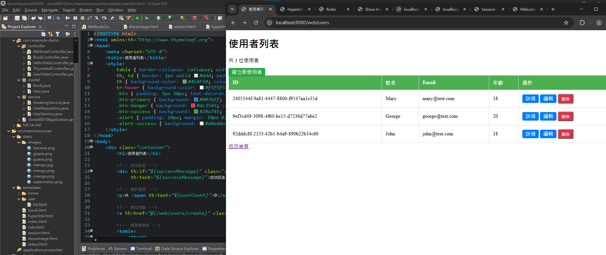

*圖8：th:each把三筆User渲染成表格列，並依每筆ID產生詳情、編輯與刪除操作網址。*

第9章已建立User資料層。本章Controller把清單放進Model：

```java
@GetMapping
public String listUsers(Model model) {
    model.addAttribute("users", userService.getAllUsers());
    model.addAttribute("userCount", userService.getUserCount());
    return "user/list";
}
```

模板用`th:each`逐筆產生列：

```html
<tr th:each="user : ${users}">
    <td th:text="${user.id}">ID</td>
    <td th:text="${user.name}">姓名</td>
    <td th:text="${user.email}">Email</td>
    <td th:text="${user.age}">年齡</td>
</tr>
```

顯示總數：

```html
<p>共 <span th:text="${userCount}">0</span> 位使用者</p>
```

操作網址：

```html
<a th:href="@{/web/users/{id}(id=${user.id})}">詳情</a>
<a th:href="@{/web/users/{id}/edit(id=${user.id})}">編輯</a>

<form th:action="@{/web/users/{id}/delete(id=${user.id})}"
      method="post">
    <button type="submit">刪除</button>
</form>
```

普通`<a>`只送GET，因此課堂刪除端點使用POST表單對應`@PostMapping`。正式應用仍需處理身分、權限與CSRF，不能只靠瀏覽器確認視窗。

測試：

```http
GET http://localhost:8080/web/users
```

啟動後應先看到三筆記憶體種子資料；ID是UUID，重新啟動後可能改變。

## 11. 共用新增／編輯表單

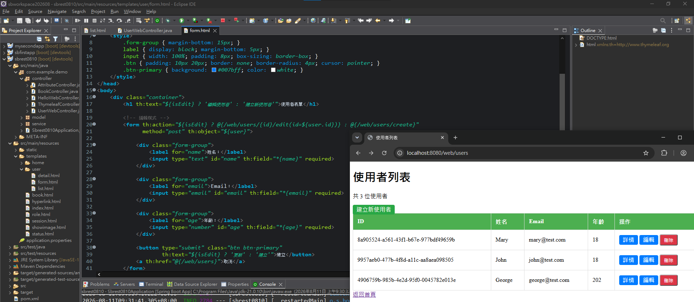

*圖9：同一份form.html利用條件表達式，建立模式送往create，編輯模式則把User ID帶入edit網址。*

Controller在建立模式放入空User與`isEdit=false`：

```java
model.addAttribute("user", new User());
model.addAttribute("isEdit", false);
return "user/form";
```

編輯模式則放入既有User與`isEdit=true`。模板依條件決定標題與提交網址：

```html
<h1 th:text="${isEdit} ? '編輯使用者' : '建立新使用者'">
    使用者表單
</h1>

<form th:action="${isEdit}
        ? @{/web/users/{id}/edit(id=${user.id})}
        : @{/web/users/create}"
      method="post"
      th:object="${user}">

    <input th:field="*{name}" required>
    <input type="email" th:field="*{email}" required>
    <input type="number" th:field="*{age}" required>
</form>
```

這段只需要分成四層理解：

| 部分 | 角色 |
|---|---|
| `th:action` | 設定最終HTML的`action`網址 |
| `${isEdit} ? A : B` | 條件運算式，從兩個網址選一個 |
| `@{...}` | 產生URL |
| `th:object`＋`*{name}` | 選定表單物件並綁定其property |

`*{name}`在這個form範圍內以`${user}`為基準；`th:field`會協助產生`name`、`value`等資料綁定所需屬性。複雜業務邏輯仍應放在Controller或Service，不放進模板Expression。

## 12. View Name、Redirect與Flash Attribute

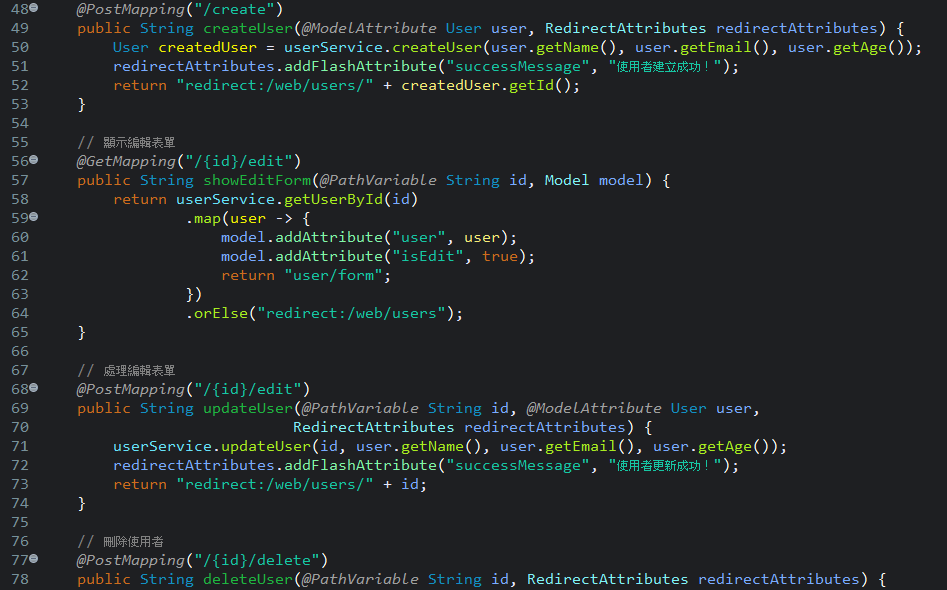

*圖10：return user/form交給View Resolver渲染模板；redirect:web/users則要求瀏覽器發出新的GET Request，兩者的Request流程不同。*

直接渲染模板：

```java
return "user/form";
```

- 同一次Request內尋找`templates/user/form.html`。
- HTTP通常回200。
- 目前Model可直接供模板使用。

重新導向：

```java
return "redirect:/web/users/" + id;
```

- Controller先回Redirect response。
- 瀏覽器再對新網址發出GET。
- 適合表單提交後使用Post／Redirect／Get，避免重新整理時重送POST。

一次性訊息：

```java
redirectAttributes.addFlashAttribute(
        "successMessage", "使用者建立成功！");
```

模板仍必須實際輸出：

```html
<div th:if="${successMessage}"
     th:text="${successMessage}"></div>
```

目前`list.html`有這段，`detail.html`沒有。因此刪除後導回列表可顯示訊息；建立、更新後導到詳情頁時，Flash Attribute雖存在，畫面不會自動顯示。

## 13. User網頁CRUD路徑

| 功能 | Method與路徑 | Controller結果 |
|---|---|---|
| 列表 | `GET /web/users` | `user/list` |
| 詳情 | `GET /web/users/{id}` | 找到時`user/detail`；否則Redirect列表 |
| 建立表單 | `GET /web/users/create` | 空User＋`user/form` |
| 處理建立 | `POST /web/users/create` | 建立後Redirect詳情 |
| 編輯表單 | `GET /web/users/{id}/edit` | 既有User＋`user/form` |
| 處理編輯 | `POST /web/users/{id}/edit` | 更新後Redirect詳情 |
| 刪除 | `POST /web/users/{id}/delete` | 刪除後Redirect列表 |

資料仍位於第9章的記憶體Repository。重新啟動應用程式後，課堂期間新增的User會消失，並重新載入種子資料。

## 14. 完整重現測試

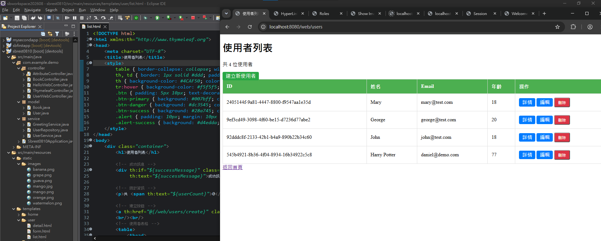

*圖11：表單建立第四位User後重新導向列表，總數由三筆變成四筆，驗證表單綁定、Service、Repository與PRG流程串接成功。*

依序測試，避免只確認單一頁面能開啟：

1. `GET /api/books`：收到Book JSON。
2. `GET /thymeleaf`：比較`th:text`與`th:utext`。
3. `GET /attribute/img`：固定及動態圖片都能載入。
4. `GET /attribute/status`：顯示請先登入。
5. `GET /attribute/role`：admin、user或預設角色擇一顯示。
6. `GET /attribute/session`：顯示John Lee、價格與日期。
7. `GET /attribute/href`：檢查瀏覽器收到的最終`href`。
8. `GET /web/users`：看到三筆種子資料。
9. 建立一名User：回到詳情頁並取得UUID。
10. 回到列表：總數由3變4。
11. 編輯該User：詳情頁顯示新內容。
12. 刪除該User：列表恢復3筆並顯示刪除成功訊息。

## 15. 常見錯誤

1. **回傳模板名稱卻使用`@RestController`：**字串會直接成為Response Body。
2. **模板放在`static`：**動態模板應放`templates`；`static`用於圖片、CSS、JavaScript等靜態資源。
3. **把`Greeting :`當fallback：**`th:text`執行時會取代元素全部內容。
4. **使用`th:utext`輸出未信任資料：**可能造成XSS。
5. **圖片路徑錯誤：**先核對`static/images`與檔名大小寫。
6. **URL有畫面但點擊404：**Link Expression只產生URL，不會建立對應Controller。
7. **把View Name和Redirect混淆：**`user/form`直接渲染；`redirect:/...`要求瀏覽器再發Request。
8. **Flash Attribute沒有顯示：**Redirect目標模板必須包含輸出該attribute的元素。

## 16. 本章檢查表

- [ ] 能區分`@RestController`與`@Controller`
- [ ] 能說明Model、View Name與模板位置
- [ ] 知道`th:text`取代原內容，`th:utext`不跳脫HTML
- [ ] 能用`th:src`載入`static/images`資源
- [ ] 能用`th:if`及`th:switch`控制顯示
- [ ] 知道如何讀Session attribute及使用格式化工具
- [ ] 能區分Link URL中的path variable與query parameter
- [ ] 能用`th:each`建立列表
- [ ] 能用`th:object`、`th:field`和動態`th:action`共用表單
- [ ] 能區分直接渲染View與Redirect
- [ ] 已完成第14節整套測試，而不是只開啟列表頁
