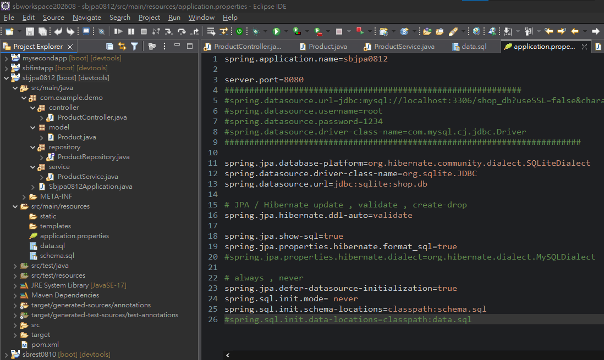
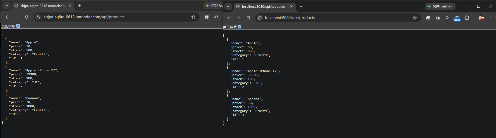

# Spring Boot 圖文學習筆記 14：Spring Data JPA、SQLite與Docker／Render部署

[返回總目錄](../README.md)｜[純文字版](../純文字版/14_Spring_Data_JPA與SQLite_Docker_Render部署.md)｜[圖文延伸閱讀：Git與Render故障排查](延伸閱讀/14_Git與Render部署故障排查.md)｜[上一章：Spring Data JPA與MySQL](13_Spring_Data_JPA與MySQL.md)｜[下一章：JPA查詢方法與分頁](15_Spring_Data_JPA查詢方法_Query與分頁.md)

- 整理日期：2026-08-12
- 課堂專案：`sbjpa0812`
- 部署用Git專案：`C:\git\sbjpa-SQLite-0812`
- 本機API：`http://localhost:8080/api/products`（Eclipse課堂專案）
- 部署API：`https://sbjpa-sqlite-0812.onrender.com/api/products`
- 完成判定：部署端與本機端都回傳相同的三筆商品JSON

> 本章以實際成功版本為準。課堂專案與部署用Git專案不是同一個資料夾；部署版本另外包含`Dockerfile`，而且目前將Spring Boot與容器說明的port都設為`8002`。

## 0. 前置條件與完整操作順序

開始前需要：

- 已完成第13章的Entity、Repository、Service、Controller與JPA概念。
- Git、GitHub帳號，以及可連接GitHub Repository的Render帳號。
- Maven／JDK 17可用；Dockerfile的兩個基底Image使用Java 17。

依下列順序重現：

1. 從Spring Initializr建立Maven／Jar專案，加入Spring Web、Spring Data JPA、Lombok與DevTools。
2. 依第3節加入SQLite JDBC Driver與Hibernate Community Dialects。
3. 依第4節設定SQLite DataSource；先用本機port啟動並測試。
4. 依第6～9節建立Product分層與三筆種子資料。
5. 呼叫本機`GET /api/products`，確認三筆JSON。
6. 在Git專案根目錄建立第10節的`Dockerfile`並提交至GitHub。
7. 在Render建立Docker Web Service，選擇該Repository與branch。
8. 等待Build與Deploy完成，再呼叫公開網址的`GET /api/products`。
9. 比較本機與部署端內容；若Push、Deploy或公開網址異常，再查閱第12節連結的部署故障排查。

> 若本機固定使用8080、部署版固定使用8002，兩者網址的port不同是預期結果。若改採`server.port=${PORT:8080}`，則由Render環境變數決定部署端內部port。

## 1. 本章完成了什麼？

本章把前一章的Spring Data JPA從MySQL改成SQLite，並把專案包成Docker Image部署到Render：

```text
Browser
   ↓ HTTPS
Render公開網址
   ↓ Render路由至Container監聽的port
Spring Boot REST Controller
   ↓
ProductService
   ↓
ProductRepository（JpaRepository）
   ↓
Hibernate＋SQLite JDBC Driver
   ↓
shop.db
```

成功時呼叫：

```http
GET /api/products
```

會取得類似結果：

```json
[
  {
    "name": "Apple",
    "price": 50.0,
    "stock": 500,
    "category": "Fruits",
    "id": 1
  },
  {
    "name": "Apple iPhone 17",
    "price": 39900.0,
    "stock": 100,
    "category": "3C",
    "id": 2
  },
  {
    "name": "Banana",
    "price": 30.0,
    "stock": 1000,
    "category": "Fruits",
    "id": 3
  }
]
```

## 2. SQLite和MySQL的主要差異

| 項目 | MySQL | SQLite |
|---|---|---|
| 執行方式 | 獨立資料庫Server | 程式直接讀寫資料庫檔案 |
| JDBC URL | `jdbc:mysql://host:3306/db` | `jdbc:sqlite:shop.db` |
| 帳號、密碼 | 通常需要 | 一般本機檔案模式不需要 |
| JDBC Driver | `com.mysql.cj.jdbc.Driver` | `org.sqlite.JDBC` |
| Hibernate Dialect | `MySQLDialect` | `SQLiteDialect` |
| 資料保存位置 | MySQL資料目錄 | 一個`.db`檔案 |

SQLite並不是「沒有資料庫」，而是資料庫引擎直接操作檔案，不需要另外啟動MySQL服務。

## 3. Maven依賴

除了原本的Spring Data JPA與Web依賴，SQLite版本加入：

```xml
<dependency>
    <groupId>org.xerial</groupId>
    <artifactId>sqlite-jdbc</artifactId>
    <scope>runtime</scope>
</dependency>

<dependency>
    <groupId>org.hibernate.orm</groupId>
    <artifactId>hibernate-community-dialects</artifactId>
    <version>7.4.1.Final</version>
</dependency>
```

兩者責任不同：

| 依賴 | 責任 |
|---|---|
| `sqlite-jdbc` | JDBC Driver，負責Java與SQLite通訊 |
| `hibernate-community-dialects` | 提供Hibernate的SQLite SQL方言 |
| `spring-boot-starter-data-jpa` | 提供JPA整合、Repository及Hibernate核心 |

目前`pom.xml`仍保留MySQL Connector，但SQLite設定已啟用、MySQL連線設定已註解。保留依賴不代表執行時同時使用兩個資料庫；實際DataSource由目前生效的設定決定。

## 4. `application.properties`實際設定



*圖1：課堂把MySQL連線註解後改為SQLite Driver、URL及Dialect；這是設定進行中的歷史畫面，不能單獨當作部署成功證據。*

部署成功版本的核心設定：

```properties
spring.application.name=sbjpa0812

server.port=8002

spring.jpa.database-platform=org.hibernate.community.dialect.SQLiteDialect
spring.datasource.driver-class-name=org.sqlite.JDBC
spring.datasource.url=jdbc:sqlite:shop.db

spring.jpa.hibernate.ddl-auto=update
spring.jpa.show-sql=true
spring.jpa.properties.hibernate.format_sql=true

spring.jpa.defer-datasource-initialization=true
spring.sql.init.mode= never
spring.sql.init.schema-locations=classpath:schema.sql
#spring.sql.init.data-locations=classpath:data.sql
```

### 4.1 SQLite連線三個核心值

```properties
spring.jpa.database-platform=org.hibernate.community.dialect.SQLiteDialect
spring.datasource.driver-class-name=org.sqlite.JDBC
spring.datasource.url=jdbc:sqlite:shop.db
```

- `database-platform`：告訴Hibernate如何產生SQLite可接受的SQL。
- `driver-class-name`：指定SQLite JDBC Driver類別。
- `url`：開啟相對路徑的`shop.db`。

`jdbc:sqlite:shop.db`使用相對路徑，因此資料庫檔案會出現在程式的工作目錄，而不是固定的Windows絕對路徑。

### 4.2 `ddl-auto=update`

```properties
spring.jpa.hibernate.ddl-auto=update
```

Hibernate會嘗試讓既有Schema符合Entity映射；資料表不存在時可建立，既有資料通常不會像`create-drop`那樣每次啟動就清除。

但`update`是開發便利設定，不是正式環境可靠的Migration方案。正式系統通常改用Flyway或Liquibase管理Schema版本。

### 4.3 顯示Hibernate SQL

```properties
spring.jpa.show-sql=true
spring.jpa.properties.hibernate.format_sql=true
```

這兩個設定只影響Console中的SQL顯示與排版，不會啟用`schema.sql`或`data.sql`。

## 5. `schema.sql`與`data.sql`為何沒有執行？

專案雖然存在：

```text
src/main/resources/schema.sql
src/main/resources/data.sql
```

但目前設定是：

```properties
spring.sql.init.mode= never
```

等號後的空白不會改變Java Properties的值；這一行的有效值仍是`never`。`never`代表停用Spring SQL初始化，因此：

- `schema.sql`不會由Spring執行。
- `data.sql`不會由Spring執行。
- `spring.sql.init.schema-locations`即使有填路徑，也因初始化已停用而不會生效。
- `spring.jpa.defer-datasource-initialization=true`只調整初始化順序，不會把`never`變成啟用。

因此成功結果中的三筆商品不是來自`data.sql`，而是來自`CommandLineRunner`。

### 5.1 目前`data.sql`還有MySQL式名稱

現有內容使用：

```sql
INSERT INTO shop_db.products VALUES (...);
```

`shop_db.products`是假設有名為`shop_db`的Database／Schema。現在的SQLite連線只開啟`shop.db`，如果日後啟用SQL初始化，通常應直接使用：

```sql
INSERT INTO products (...) VALUES (...);
```

除非另外使用SQLite的`ATTACH DATABASE`建立`shop_db`別名，否則不能直接照搬MySQL的資料庫限定名稱。

## 6. Entity：`Product`

```java
@Data
@Entity
@Table(name = "products")
public class Product {
    @Id
    @GeneratedValue(strategy = GenerationType.IDENTITY)
    private Integer id;

    @Column(nullable = false)
    private String name;

    @Column(nullable = false)
    private Double price;

    private Integer stock;
    private String category;

    public Product() {}
}
```

重要條件：

- `@Entity`讓JPA管理此類別。
- `@Table(name="products")`指定對應資料表。
- `@Id`指定主鍵。
- Repository的ID型別必須同樣是`Integer`。
- JPA建立Entity時需要無參數建構子。
- `GenerationType.IDENTITY`讓資料庫在INSERT時產生ID。

原始碼註解寫「MySQL AUTO_INCREMENT」，但註解不是限制條件；目前相同映射已在SQLite成功產生`1、2、3`三個ID。

## 7. Repository與Service

### 7.1 Repository

```java
public interface ProductRepository
        extends JpaRepository<Product, Integer> {
}
```

第二個泛型必須是`Product.id`的實際型別`Integer`。原始碼內部分註解仍寫`Long`，那是舊說明，不能當成目前程式的實際型別。

### 7.2 Service CRUD

`ProductService`封裝：

- `findAll()`
- `findById(Integer id)`
- `create(Product product)`
- `update(Integer id, Product updated)`
- `delete(Integer id)`

目前實際使用欄位注入：

```java
@Autowired
ProductRepository productRepository;
```

建構子注入版本仍被註解，不能把它寫成目前正在執行的程式。

## 8. `CommandLineRunner`才是目前的種子資料來源

```java
@Service
public class ProductService implements CommandLineRunner {
    @Override
    public void run(String... args) {
        if (productRepository.count() == 0) {
            productRepository.save(
                new Product("Apple", 50.0, 500, "Fruits"));
            productRepository.save(
                new Product("Apple iPhone 17", 39900.0, 100, "3C"));
            productRepository.save(
                new Product("Banana", 30.0, 1000, "Fruits"));
        }
    }
}
```

執行順序：

```text
建立ApplicationContext
    ↓
建立DataSource、Hibernate與Repository
    ↓
依Entity／ddl-auto準備products表
    ↓
呼叫CommandLineRunner.run()
    ↓
count()==0時新增三筆商品
```

`count()==0`可防止同一個資料庫已有資料時每次啟動都重複INSERT；但只要換成全新的`shop.db`，三筆資料就會再次建立。

## 9. Product REST API

Controller共同路徑：

```java
@RestController
@RequestMapping("/api/products")
public class ProductController {
}
```

| 功能 | Method | 路徑 | 成功回應 | 找不到時 |
|---|---|---|---|---|
| 查全部 | `GET` | `/api/products` | `200`＋JSON陣列 | — |
| 查單筆 | `GET` | `/api/products/{id}` | `200`＋Product | `404` |
| 新增 | `POST` | `/api/products` | `201`＋Location＋Product | 未自訂 |
| 更新 | `PUT` | `/api/products/{id}` | `200`＋Product | `404` |
| 刪除 | `DELETE` | `/api/products/{id}` | `204` | `404` |

### 9.1 POST目前使用`@ModelAttribute`

```java
public ResponseEntity<Product> create(
        @ModelAttribute Product product)
```

它主要從表單欄位或Request參數綁定Product；若Client要傳JSON Request Body，通常要改用`@RequestBody Product product`。不能因PUT使用`@RequestBody`，就假設POST也接受相同JSON格式。

## 10. Dockerfile的兩階段建置

### 10.1 第一階段：編譯

```dockerfile
FROM maven:3.9-eclipse-temurin-17-alpine AS builder
WORKDIR /sbjpaSQLite0812
COPY . .
RUN mvn clean package -DskipTests
```

這一層需要Maven與JDK，負責把原始碼打包成Spring Boot可執行JAR。

### 10.2 第二階段：執行

```dockerfile
FROM eclipse-temurin:17-jre-alpine
WORKDIR /sbjpaSQLite0812
COPY --from=builder \
     /sbjpaSQLite0812/target/*.jar sbjpaSQLite.jar
ENTRYPOINT ["java", "-jar", "sbjpaSQLite.jar"]
EXPOSE 8002
```

第二層只保留JRE與最後的JAR，不需要把Maven、下載快取和完整建置工具帶入正式Image，因此Image通常較小。

### 10.3 `EXPOSE`的確切角色

```dockerfile
EXPOSE 8002
```

`EXPOSE`是Image的連接埠說明資料，表示應用程式預計監聽8002；它本身不會啟動Server，也不等於自動建立對外port mapping。

真正讓Spring Boot監聽8002的是：

```properties
server.port=8002
```

固定8002的範例能部署成功，表示Render可以偵測並轉送到該port。若要讓同一份程式更容易適應不同部署平台，可改成讀取環境變數：

```properties
server.port=${PORT:8080}
```

這代表有`PORT`時使用平台提供值，沒有時本機預設8080；這是可攜式改良寫法，固定8002則是既有部署範例的實際設定。

Render Web Service預設提供的`PORT`值是`10000`，也通常能偵測程式實際綁定的其他port。固定8002的範例屬於後者；可攜式設定仍以讀取`PORT`為優先。

### 10.4 選用：在本機先測Docker Image

已安裝Docker Desktop時，可在含`Dockerfile`與`pom.xml`的專案根目錄執行：

```bat
docker build -t sbjpa-sqlite-0812 .
docker run --rm -p 8002:8002 sbjpa-sqlite-0812
```

再開啟：

```text
http://localhost:8002/api/products
```

看到三筆商品JSON表示Image可建置、Container可啟動，而且host的8002已映射至Container的8002。若本機已有其他程式占用8002，可以只改host端：

```bat
docker run --rm -p 9000:8002 sbjpa-sqlite-0812
```

此時改用`http://localhost:9000/api/products`。

### 10.5 建立Render Web Service

1. 先確認GitHub Repository的`main`已包含`Dockerfile`與所有原始碼。
2. 登入Render Dashboard，選擇`New → Web Service`。
3. 選擇GitHub作為來源並連接`sbjpa-SQLite-0812`Repository。
4. Branch選`main`，Runtime／Language選`Docker`。
5. Dockerfile位於根目錄時使用預設路徑`./Dockerfile`。
6. 選擇可用的Instance類型並建立服務。
7. 在Events／Logs等待Build與Deploy完成；Log應出現Spring Boot啟動完成及實際監聽port。
8. 從Render服務頁複製公開網址，再加上`/api/products`測試。

Render是從GitHub branch建置，不會讀取尚未Push的本機commit。因此部署前要同時核對本機、GitHub與Render最新Deploy所使用的commit。

## 11. SQLite在Docker與Render中的檔案位置

Docker第二階段設定：

```dockerfile
WORKDIR /sbjpaSQLite0812
```

資料庫URL又是相對路徑：

```properties
spring.datasource.url=jdbc:sqlite:shop.db
```

因此Container內實際檔案通常是：

```text
/sbjpaSQLite0812/shop.db
```

Render預設檔案系統是暫時性的。若沒有Persistent Disk，部署、重啟或重新建立Instance後，執行期間新增的SQLite資料可能消失；新Container啟動後，`CommandLineRunner`又會建立最初三筆資料。

所以目前成功代表「API與SQLite可以執行」，不代表使用者新增的資料能永久保存。正式保存SQLite資料時需要掛載Persistent Disk，並把JDBC URL指向掛載路徑。

## 12. 部署故障排查（延伸閱讀）

主章只保留正常部署流程。遇到下列情況時，改讀[第14章延伸閱讀：Git與Render部署故障排查](延伸閱讀/14_Git與Render部署故障排查.md)：

- Push顯示`fetch first`或non-fast-forward。
- Render只顯示`Not Found`，需要區分`no-server`與Spring Boot 404。
- 本機已修正，但GitHub或Render仍執行舊版本。


## 13. 最終驗證



*圖2：部署修正後，Render與localhost的GET /api/products都回傳相同三筆商品JSON，作為應用程式、SQLite種子資料及公開路由成功的證據。*

分別開啟：

```text
https://sbjpa-sqlite-0812.onrender.com/api/products
http://localhost:8080/api/products
```

兩邊都回傳Apple、Apple iPhone 17、Banana三筆資料，證明：

1. Render網址已有可路由的Server。
2. Docker Image能啟動Spring Boot。
3. `/api/products` mapping生效。
4. SQLite Driver、Dialect、Entity與Repository可正常初始化。
5. `CommandLineRunner`成功加入三筆初始資料。

兩個API內容一致只能證明當下部署可用，不能單獨證明資料具備永久性；持久化仍須用重啟／重新部署後資料是否保留來驗證。

## 14. 部署檢查表

### Git與Render

- [ ] 本機commit已成功Push到Render監看的Git branch
- [ ] GitHub最新commit和本機預期一致
- [ ] Render最新Deploy使用正確commit
- [ ] Build成功完成
- [ ] 啟動Log顯示Spring Boot已監聽port
- [ ] 公開網址回傳的是應用程式內容，不是`no-server`

### SQLite與JPA

- [ ] `sqlite-jdbc`與`hibernate-community-dialects`存在
- [ ] Driver是`org.sqlite.JDBC`
- [ ] Dialect是`SQLiteDialect`
- [ ] JDBC URL指向預期的`.db`位置
- [ ] Repository的ID泛型和Entity主鍵一致
- [ ] 清楚資料來自SQL初始化還是`CommandLineRunner`
- [ ] 若要求永久保存，已設定Persistent Disk

## 15. 官方資料入口

- Render Web Service與port binding：<https://render.com/docs/web-services#port-binding>
- Render Deploy流程：<https://render.com/docs/deploys>
- Render Persistent Disk：<https://render.com/docs/disks>
- Dockerfile `EXPOSE`：<https://docs.docker.com/reference/dockerfile/#expose>
- Spring Boot SQL資料庫初始化：<https://docs.spring.io/spring-boot/how-to/data-initialization.html>
- Spring Data JPA：<https://docs.spring.io/spring-data/jpa/reference/>

## 16. 本章複習重點

- [ ] SQLite是檔案式資料庫，但仍需要JDBC Driver與Hibernate Dialect
- [ ] 能解釋`jdbc:sqlite:shop.db`的相對路徑意義
- [ ] 知道`spring.sql.init.mode=never`會停用`schema.sql`與`data.sql`
- [ ] 知道目前三筆資料實際來自`CommandLineRunner`
- [ ] 能說明Docker兩階段建置的目的
- [ ] 能區分`server.port`與Dockerfile `EXPOSE`
- [ ] 知道Render上的相對SQLite檔案預設不等於永久保存
- [ ] 遇到Push或Render異常時，知道使用第12節的故障排查入口
