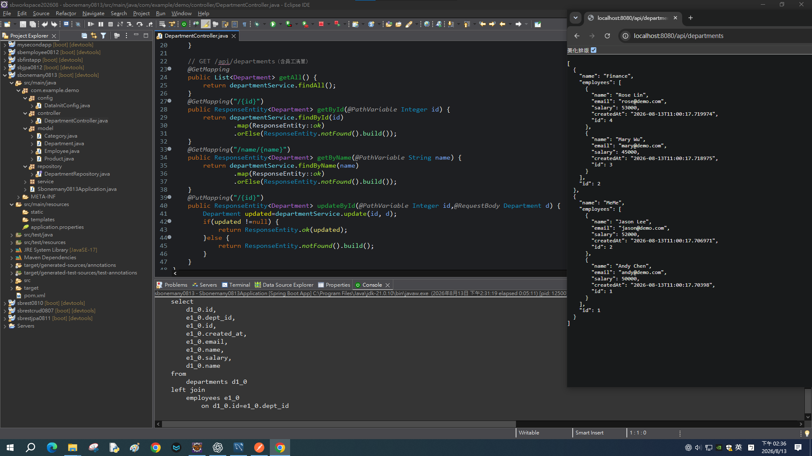

# Spring Boot 圖文學習筆記 16：JPA `OneToMany`、`ManyToOne`與JSON關聯

[返回總目錄](../README.md)｜[純文字版](../純文字版/16_JPA_OneToMany_ManyToOne與JSON關聯.md)｜[圖文延伸閱讀：JPA效能與批次更新](延伸閱讀/16_JPA查詢效能_批次更新與關聯風險.md)｜[上一章：JPA查詢方法與分頁](15_Spring_Data_JPA查詢方法_Query與分頁.md)

- 整理日期：2026-08-13
- 範例專案：`sbonemany0813`
- API前綴：`http://localhost:8080/api/departments`

## 0. 前置條件、實作順序與完成判定

前置條件：

- 已完成第13章的Spring Data JPA基本CRUD。
- MySQL已啟動，並準備專用的空資料庫`one2many_db`。
- 建立含Spring Web、Spring Data JPA、MySQL Driver、Lombok與DevTools的專案。
- 範例`pom.xml`的Java目標版本為17；可用JDK 21執行。

建議實作順序：

1. 建立`Department`／`Employee`與`Category`／`Product`兩組Entity。
2. 先在`Employee.department`建立`@ManyToOne`與外鍵。
3. 再在`Department.employees`建立`@OneToMany(mappedBy="department")`。
4. 設定Jackson序列化方向，避免雙向關聯造成JSON循環。
5. 建立Repository、Department Service、Controller及種子資料。
6. 啟動後查詢兩組關聯，並測試部門名稱更新。

完成判定：

- 資料庫出現`departments`與`employees`表，`employees.dept_id`為關聯欄位。
- `GET /api/departments`一次取得部門及其員工清單。
- JSON中的Employee不再反向展開Department，沒有無限巢狀或序列化錯誤。
- Console查詢全部部門時可看到包含employees的`LEFT JOIN`。
- `PUT /api/departments/{id}`可修改部門名稱，再查詢能看到更新結果。
- `GET /api/categories`取得兩個類別與各自商品，Product不反向輸出Category。

若要比較N+1與`JOIN FETCH`，或練習`@Modifying`批次更新、Persistence Context與Lombok關聯風險，再讀第7節連結的進階延伸閱讀。

## 1. 關聯的資料庫結構

需求是「一個部門有多名員工；一名員工屬於一個部門」：

```text
departments
├─ id (PK)
└─ name

employees
├─ id (PK)
├─ name
├─ email
├─ salary
├─ created_at
└─ dept_id (FK → departments.id)
```

外鍵放在多的一方`employees`。因此JPA關聯中：

- `Employee.department`是擁有關聯的Owning Side。
- `Department.employees`是反向查閱的Inverse Side。

Owning Side不是指「物件比較重要」，而是指哪一端實際負責外鍵映射與關聯更新。

## 2. Employee：`@ManyToOne`擁有外鍵

Employee的主鍵、name、email、salary、createdAt與無參數建構子沿用第13、15章；本章真正新增的映射是把原本的String department改成Department關聯：

```java
@ManyToOne(fetch = FetchType.LAZY)
@JoinColumn(name = "dept_id")
private Department department;
```

### 2.1 `@ManyToOne`

定義：多個`Employee`可參照同一個`Department`。

使用條件：

- 欄位型別必須是關聯目標Entity，而不是只放一個部門名稱字串。
- 這一端通常對應包含外鍵的資料表。
- `fetch=LAZY`表示讀Employee時先保留關聯代理，需要Department資料時才載入。

### 2.2 `@JoinColumn(name="dept_id")`

定義：指定此關聯使用`employees`表中的`dept_id`外鍵欄位。

若省略，JPA會依命名策略推導Join Column；明確指定可讓程式和實際Schema名稱一致。

目前沒有設定`nullable=false`，所以從映射本身看，員工可以沒有部門。若業務規則要求每名員工一定要有部門，可把Join Column設為不可空並同步建立輸入驗證。

## 3. Department：`@OneToMany`反向集合

```java
@Entity
@Table(name = "departments")
@Data
public class Department {
    @Id
    @GeneratedValue(strategy = GenerationType.IDENTITY)
    private Integer id;

    @Column(nullable = false, unique = true)
    private String name;

    @OneToMany(
        mappedBy = "department",
        cascade = CascadeType.PERSIST,
        targetEntity = Employee.class,
        fetch = FetchType.LAZY)
    @JsonIgnoreProperties("department")
    private List<Employee> employees = new ArrayList<>();

    public Department() {}
}
```

### 3.1 `mappedBy="department"`

`mappedBy`的值是另一端Java屬性名稱：

```java
Employee.department
```

它不是資料表名，也不是外鍵欄位`dept_id`。這個設定告訴JPA：「外鍵關係已由Employee的department欄位管理，Department這端不要再建立另一套Join Table或外鍵。」

成立條件：

- `Employee`必須真的有名為`department`的關聯屬性。
- 該屬性型別必須能和Department形成對應關係。
- 拼錯通常會在JPA建立EntityManagerFactory時失敗。

### 3.2 `cascade=PERSIST`

當新Department被`persist`時，新的Employee也一起被持久化：

```java
departmentRepository.save(department);
```

此設定只有`PERSIST`，不代表全部操作都連動：

- 不保證刪除Department時自動刪除Employees。
- 不等於`orphanRemoval=true`。
- 不應假設所有merge、remove操作都會級聯。

需要哪種級聯必須依生命週期規則明確選擇，不要為方便直接使用`CascadeType.ALL`。

### 3.3 `fetch=LAZY`

查詢Department時，`employees`集合預設不立即載入。只有在持久化Context仍可用時存取集合，Hibernate才能補查資料。

LAZY能避免每次都載入不需要的員工，但若在Context關閉後才存取，可能發生`LazyInitializationException`。本章查詢全部時用`JOIN FETCH`明確載入所需集合。

## 4. 建立雙向關聯時必須同步兩端

JPA不會因為只設定一端，就自動把Java記憶體中的另一端補好。種子資料同時設定：

```java
Department d1 = new Department("MIS");

List<Employee> employees = List.of(
    new Employee("Andy Chen", "andy@demo.com", d1, 50000.0),
    new Employee("Jason Lee", "jason@demo.com", d1, 52000.0)
);

d1.setEmployees(employees);
departmentRepository.save(d1);
```

這裡完成兩件事：

1. 每個Employee的`department`指向`d1`，讓Owning Side具有外鍵值。
2. `d1.employees`包含兩個Employee，讓Java物件圖雙向一致。

較穩定的寫法是在Department提供helper method：

```java
public void addEmployee(Employee employee) {
    employees.add(employee);
    employee.setDepartment(this);
}
```

之後只呼叫`department.addEmployee(employee)`，避免漏設其中一端。

課堂初始化使用`List.of(...)`，它建立不可修改List，第一次持久化已成功；若後續還要對集合執行`add()`或`remove()`，應改用`new ArrayList<>(...)`或直接使用Entity中已建立的`ArrayList`。

## 5. 雙向關聯為何會造成JSON遞迴

若兩端都完整序列化：

```text
Department
└─ employees[0]
   └─ department
      └─ employees[0]
         └─ department
            └─ ...
```

這不是JPA外鍵循環，而是Jackson沿著雙向Java物件參照持續輸出。常見結果是JSON過度巢狀、Stack Overflow或序列化例外。

本專案在`Department.employees`使用：

```java
@JsonIgnoreProperties("department")
private List<Employee> employees;
```

效果是：當Employee作為這個集合的內容輸出時，忽略它的`department`屬性。最終結構保持為：

```json
{
  "name": "MIS",
  "employees": [
    {
      "name": "Andy Chen",
      "email": "andy@demo.com",
      "salary": 50000.0
    }
  ],
  "id": 1
}
```

員工資料仍存在，只是JSON不再從Employee反向展開Department。

## 6. 另一組映射：`@JsonManagedReference`與`@JsonBackReference`

同一專案以`Category`／`Product`實作另一組雙向關聯：

```java
// Category.java
@OneToMany(mappedBy = "category", fetch = FetchType.LAZY,
           cascade = CascadeType.PERSIST)
@JsonManagedReference
private List<Product> products = new ArrayList<>();

// Product.java
@ManyToOne(fetch = FetchType.LAZY)
@JoinColumn(name = "category_id")
@JsonBackReference
private Category category;
```

語意：

- `@JsonManagedReference`端正常輸出子集合。
- `@JsonBackReference`端的反向參照不輸出。

這是Jackson的JSON序列化控制，不會決定資料庫外鍵。JPA關聯仍由`@OneToMany`、`@ManyToOne`、`mappedBy`與`@JoinColumn`決定。

這一組已具備`CategoryRepository`、`CategoryController`與種子資料，公開端點為：

```http
GET /api/categories
```

Controller直接使用Repository，沒有Category Service：

```java
@RestController
@RequestMapping("/api/categories")
public class CategoryController {
    @Autowired
    CategoryRepository repo;

    @GetMapping
    public ResponseEntity<List<Category>> getAll() {
        return ResponseEntity.ok(repo.findAll());
    }
}
```

執行結果會輸出Category的`products`陣列；每個Product的`category`因`@JsonBackReference`而省略，避免反向遞迴。

## 7. Repository查詢與JPA進階閱讀

為了讓查詢全部Department時直接載入employees，目前Repository使用：

```java
@Query("SELECT DISTINCT d FROM Department d " +
       "LEFT JOIN FETCH d.employees")
List<Department> findAllWithEmployees();
```

Service必須實際呼叫`findAllWithEmployees()`，Repository方法不會自動取代內建`findAll()`。主章只要求能取得正確關聯JSON並在Console看到`LEFT JOIN`。

以下內容另見[第16章延伸閱讀：JPA查詢效能、批次更新與關聯風險](延伸閱讀/16_JPA查詢效能_批次更新與關聯風險.md)：

- N+1如何發生，以及`JOIN FETCH`如何改變SQL次數。
- `@Modifying`、`@Transactional`、affected rows與Bulk Update。
- Persistence Context可能保留舊Entity狀態的原因。
- Lombok在雙向關聯中的`toString()`、`equals()`與`hashCode()`風險。

## 8. Controller與目前公開的API

| 功能 | Method與路徑 | 回應 |
|---|---|---|
| 查全部部門及員工 | `GET /api/departments` | `200`＋Department陣列 |
| 依ID查詢 | `GET /api/departments/{id}` | 找到200；否則404 |
| 依名稱查詢 | `GET /api/departments/name/{name}` | 找到200；否則404 |
| 更新部門名稱 | `PUT /api/departments/{id}` | 找到200；否則404 |
| 查全部類別及商品 | `GET /api/categories` | `200`＋Category陣列 |
| 依類別清空商品庫存 | `GET /api/products/{category}` | `200`＋更新筆數Map |

Service雖然已有`create()`與`delete()`，Controller目前沒有`POST`或`DELETE` Mapping，因此HTTP Client不能直接呼叫新增與刪除部門。

更新程式只修改名稱：

```java
Department department = found.get();
department.setName(updated.getName());
departmentRepository.save(department);
```

Request Body即使帶`employees`，目前Service也不會用它覆蓋關聯集合。

## 9. MySQL設定與種子資料

先建立專用資料庫：

```sql
CREATE DATABASE one2many_db
    CHARACTER SET utf8mb4
    COLLATE utf8mb4_unicode_ci;
```

`application.properties`沿用第15章第8節的MySQL Driver、帳密、`ddl-auto=update`與SQL顯示設定，只把資料庫名稱改為`one2many_db`：

```properties
spring.datasource.url=jdbc:mysql://localhost:3306/one2many_db?useSSL=false&characterEncoding=utf8
```

不能只建立這一行；必須先有第15章的其餘DataSource與JPA設定，帳密也要改成實際環境值。初始化器只有在`departmentRepository.count()==0`時建立：

- MIS：Andy Chen、Jason Lee
- Finance：Mary Wu、Rose Lin

另一段初始化器只在`categoryRepository.count()==0`時建立：

- 3C：iPhone 17、Samsung Phone
- Fruit：Apple、Banana

兩組`count()`分開判斷，所以其中一組表格已有資料，不會阻止另一組空表建立種子資料。

ID由MySQL產生，`createdAt`是執行當下時間，查詢沒有`ORDER BY`，所以不可把固定ID、時間或陣列順序當成通用成功條件。

## 10. 重現測試

### 10.1 查詢全部



*圖1：GET /api/departments回傳Department與巢狀Employee；Console的LEFT JOIN可用來核對這次查詢如何取得兩張表的關聯資料。*

```http
GET http://localhost:8080/api/departments
```

成功時應看到兩個Department，每個都包含兩名Employee，而且Employee內沒有再次出現`department`。

### 10.2 查詢單一部門

先由全部查詢取得實際ID，再呼叫：

```http
GET http://localhost:8080/api/departments/1
GET http://localhost:8080/api/departments/name/Finance
```

不要假設MIS一定是ID 1；資料庫已有資料時自動遞增值可能不同。

### 10.3 更新部門名稱

```http
PUT http://localhost:8080/api/departments/1
Content-Type: application/json

{
  "name": "MeMe"
}
```

再執行`GET /api/departments`。若該ID原本是MIS，名稱會變成MeMe，原本兩名員工仍保留。

課堂結果畫面中的`MeMe`不是初始化器預設值，而是部門名稱經PUT更新後的狀態。這可同時驗證更新成功及關聯員工沒有被清除。

### 10.4 SQL成功判定

查全部時，Console應出現概念上相當於：

```sql
select ...
from departments d
left join employees e
    on d.id = e.dept_id
```

實際別名與選取欄位由Hibernate決定，不必逐字相同；重點是只有部門主查詢並含對employees的Left Join。


## 11. 常見錯誤

1. **`mappedBy`寫成`dept_id`：**它必須寫Java屬性`department`。
2. **只設定Department集合：**Owning Side沒設，Employee外鍵可能沒有正確值。
3. **JSON無限巢狀：**JPA映射成功不代表Jackson知道哪一端要停止輸出。
4. **LAZY載入例外：**在Persistence Context關閉後才存取未載入集合。
5. **以為`PERSIST`會連動刪除：**目前沒有`REMOVE`與`orphanRemoval`。
6. **以為Service方法等於HTTP API：**沒有Controller Mapping就沒有對應端點。
7. **把更新後的MeMe當成初始資料：**初始化原值是MIS。

N+1、Bulk Update、GET修改資料與Lombok雙向關聯錯誤集中在第7節的進階延伸閱讀。

## 12. 本章檢查表

- [ ] 能指出外鍵位於哪張表、哪個欄位
- [ ] 能分辨Owning Side與Inverse Side
- [ ] 知道`mappedBy`填Java屬性名，不是SQL欄位名
- [ ] 建立關聯時會同步設定兩端
- [ ] 能區分JPA關聯註解與Jackson序列化註解
- [ ] 知道Repository自訂方法必須由Service或Controller實際呼叫
- [ ] 知道`CascadeType.PERSIST`沒有包含刪除級聯
- [ ] 已依第10節查詢、更新並核對JSON與Console SQL
