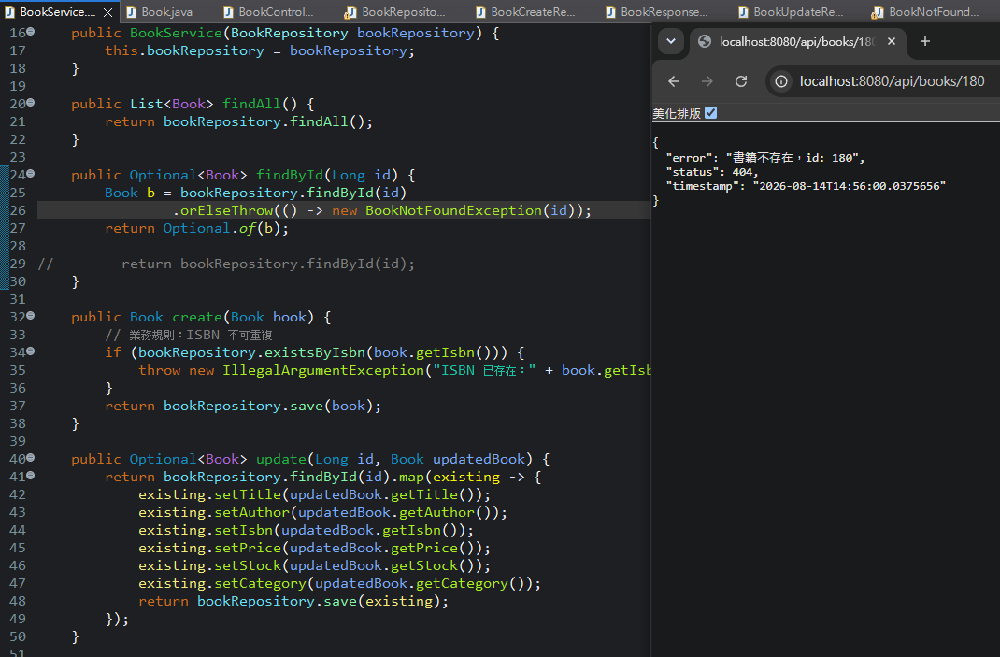
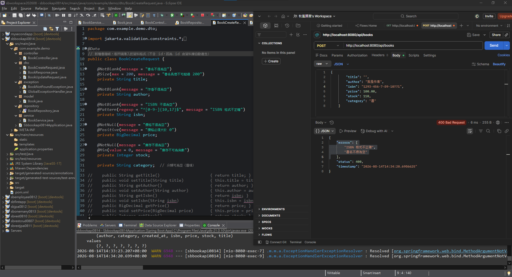

# Spring Boot 圖文學習筆記 17：Book API的DTO、Bean Validation與例外處理

[返回總目錄](../README.md)｜[上一章：JPA關聯與JSON](16_JPA_OneToMany_ManyToOne與JSON關聯.md)｜[驗證語法字典](../語法字典/07_驗證_Jackson_Lombok.md#validation)

- 範例專案：`sbbookapi0814`
- API前綴：`http://localhost:8080/api/books`

> 語法速查：[驗證、Jackson與Lombok](../語法字典/07_驗證_Jackson_Lombok.md)

## 本章快速索引

- [0. 前置條件、實作順序與完成判定](#0-前置條件實作順序與完成判定)
- [1. 為什麼從一個DTO拆成三個？](#1-為什麼從一個dto拆成三個)
- [2. 加入必要依賴](#2-加入必要依賴)
- [3. `BookCreateRequest`：新增輸入](#3-bookcreaterequest新增輸入)
- [4. `BookUpdateRequest`：修改輸入](#4-bookupdaterequest修改輸入)
- [5. `BookResponse`：控制輸出](#5-bookresponse控制輸出)
- [6. Controller把POST及PUT接上DTO](#6-controller把post及put接上dto)
- [7. `GlobalExceptionHandler`：統一錯誤JSON](#7-globalexceptionhandler統一錯誤json)
- [8. 驗證失敗測試](#8-驗證失敗測試)
- [9. 成功POST測試](#9-成功post測試)
- [10. 目前實際完成範圍](#10-目前實際完成範圍)
- [11. `@Transactional`測試程式的目前狀態](#11-transactional測試程式的目前狀態)
- [12. 本章檢查表](#12-本章檢查表)

## 0. 前置條件、實作順序與完成判定

前置條件：

- 已理解第13章的Entity、Repository、Service及Controller分層。
- MySQL已啟動，並準備`book_db`及`books`資料表。
- 專案包含Spring Web MVC、Spring Data JPA、MySQL Driver、Lombok與Validation依賴。
- `application.properties`能成功連線，且目前專案使用`spring.jpa.hibernate.ddl-auto=validate`，因此資料表必須先存在。

最小資料表可建立為：

```sql
CREATE DATABASE IF NOT EXISTS book_db
    CHARACTER SET utf8mb4
    COLLATE utf8mb4_unicode_ci;

USE book_db;

CREATE TABLE IF NOT EXISTS books (
    id BIGINT PRIMARY KEY AUTO_INCREMENT,
    title VARCHAR(200) NOT NULL,
    author VARCHAR(100) NOT NULL,
    isbn VARCHAR(20) NOT NULL UNIQUE,
    price DECIMAL(10, 2) NOT NULL,
    stock INT NOT NULL,
    category VARCHAR(50),
    created_at DATETIME
);
```

建議實作順序：

1. 確認原本的`Book`、`BookRepository`及`BookService`可正常執行CRUD。
2. 加入Validation與Lombok依賴。
3. 建立`BookCreateRequest`、`BookUpdateRequest`與`BookResponse`。
4. 把POST及PUT改為接收Request DTO，並以Response DTO回傳。
5. 建立`GlobalExceptionHandler`統一處理欄位驗證及業務規則錯誤。
6. 先送出故意錯誤的JSON確認得到400，再送出正確JSON確認得到201。

完成判定：

- 空白書名與錯誤ISBN會得到`400 Bad Request`及`errors`陣列。
- 正確POST會得到`201 Created`、`Location` Header及`BookResponse`。
- 重複ISBN會得到`400 Bad Request`，而不是將資料寫入資料庫。
- 查詢不存在的id會由`BookNotFoundException`產生`404 Not Found`及統一錯誤JSON。
- POST與PUT不再直接以`Book` Entity作為HTTP輸入格式。

## 1. 為什麼從一個DTO拆成三個？

第12章的`ProductDTO`只示範「不要讓Client傳入id與時間」；本章進一步把不同方向、不同操作的API契約拆開：

| 類別 | 資料方向 | 負責內容 |
|---|---|---|
| `BookCreateRequest` | Client → Server | 新增時允許輸入的欄位及必填驗證 |
| `BookUpdateRequest` | Client → Server | 修改時允許輸入的欄位及更新驗證 |
| `BookResponse` | Server → Client | API允許輸出的欄位，包括系統產生的id與createdAt |
| `Book` | Java ↔ Database | JPA Entity與`books`資料表映射 |

DTO不是Entity：

- DTO不加`@Entity`、`@Table`或`@Column`，不直接持久化。
- Entity不必等於公開API格式。
- Request DTO保護系統欄位；Response DTO控制輸出欄位。

完整資料流：

```text
JSON request
→ Jackson建立Request DTO
→ @Valid檢查DTO欄位
→ Controller轉成Book Entity
→ Service／Repository／MySQL
→ Book Entity
→ BookResponse.from(...)
→ JSON response
```

## 2. 加入必要依賴

`pom.xml`至少需要：

```xml
<dependency>
    <groupId>org.springframework.boot</groupId>
    <artifactId>spring-boot-starter-validation</artifactId>
</dependency>

<dependency>
    <groupId>org.projectlombok</groupId>
    <artifactId>lombok</artifactId>
    <optional>true</optional>
</dependency>
```

Validation提供`jakarta.validation.constraints.*`及`@Valid`整合；Lombok的`@Data`在編譯時產生Request DTO需要的getter與setter。只有欄位註解而沒有`@Valid`，不會在Controller入口自動拒絕錯誤JSON。

## 3. `BookCreateRequest`：新增輸入

檔案：`src/main/java/com/example/demo/dto/BookCreateRequest.java`

```java
package com.example.demo.dto;

import java.math.BigDecimal;
import jakarta.validation.constraints.*;
import lombok.Data;

@Data
public class BookCreateRequest {

    @NotBlank(message = "書名不得為空")
    @Size(max = 200, message = "書名長度不可超過 200")
    private String title;

    @NotBlank(message = "作者不得為空")
    private String author;

    @NotBlank(message = "ISBN 不得為空")
    @Pattern(regexp = "^[0-9-]{10,17}$", message = "ISBN 格式不正確")
    private String isbn;

    @NotNull(message = "價格不得為空")
    @Positive(message = "價格必須大於 0")
    private BigDecimal price;

    @NotNull(message = "庫存不得為空")
    @Min(value = 0, message = "庫存不可為負數")
    private Integer stock;

    private String category;
}
```

這個DTO故意沒有`id`與`createdAt`：

- `id`由資料庫自動編號。
- `createdAt`由`Book`的`@PrePersist`產生。
- Client即使在JSON多傳這兩個欄位，也不會綁定到此DTO的欄位。

驗證條件：

| 欄位 | 條件 |
|---|---|
| `title` | 必填、不可純空白、最多200字 |
| `author` | 必填、不可純空白 |
| `isbn` | 必填；只能包含數字與`-`，總長10～17 |
| `price` | 必填且大於0 |
| `stock` | 必填且不小於0 |
| `category` | 選填 |

## 4. `BookUpdateRequest`：修改輸入

檔案：`src/main/java/com/example/demo/dto/BookUpdateRequest.java`

```java
@Data
public class BookUpdateRequest {
    @NotBlank(message = "書名不得為空")
    private String title;

    @NotBlank(message = "作者不得為空")
    private String author;

    @Pattern(regexp = "^[0-9-]{10,17}$", message = "ISBN 格式不正確")
    private String isbn;

    @Positive(message = "價格必須大於 0")
    private BigDecimal price;

    @Min(value = 0, message = "庫存不可為負數")
    private Integer stock;

    private String category;
}
```

目前規則是：title與author必填；isbn、price、stock及category允許不傳。`@Pattern`、`@Positive`與`@Min`本身都允許`null`，只有值存在時才檢查格式或範圍。

但目前Service會把六個欄位全部覆蓋到Entity。若PUT省略isbn、price或stock，DTO會通過驗證，Service卻可能把Entity欄位設成`null`，最後違反資料庫`NOT NULL`。這是目前程式仍需統一的地方：

- 完整更新：維持PUT，並替所有必要欄位加入`@NotNull`／`@NotBlank`。
- 部分更新：改用PATCH，Service只更新Request中不為`null`的欄位。

目前尚未選定其中一種，所以測試PUT時應完整傳入六個欄位。

## 5. `BookResponse`：控制輸出

檔案：`src/main/java/com/example/demo/dto/BookResponse.java`

Response包含：

```java
private Long id;
private String title;
private String author;
private String isbn;
private BigDecimal price;
private Integer stock;
private String category;
private LocalDateTime createdAt;
```

單筆轉換集中在靜態工廠方法：

```java
public static BookResponse from(Book book) {
    BookResponse response = new BookResponse();
    response.id = book.getId();
    response.title = book.getTitle();
    response.author = book.getAuthor();
    response.isbn = book.getIsbn();
    response.price = book.getPrice();
    response.stock = book.getStock();
    response.category = book.getCategory();
    response.createdAt = book.getCreatedAt();
    return response;
}
```

多筆轉換：

```java
public static List<BookResponse> fromList(List<Book> books) {
    return books.stream()
            .map(BookResponse::from)
            .toList();
}
```

`BookResponse`只有getter，沒有setter。建立後主要供Jackson讀取並輸出JSON，不讓Controller任意改動回應內容。

## 6. Controller把POST及PUT接上DTO

### 6.1 POST新增

```java
@PostMapping
public ResponseEntity<BookResponse> create(
        @Valid @RequestBody BookCreateRequest req) {

    Book book = new Book(
            req.getTitle(), req.getAuthor(), req.getIsbn(),
            req.getPrice(), req.getStock(), req.getCategory());

    Book saved = bookService.create(book);
    URI location = URI.create("/api/books/" + saved.getId());

    return ResponseEntity.created(location)
            .body(BookResponse.from(saved));
}
```

執行順序：

1. `@RequestBody`請Jackson把JSON轉成`BookCreateRequest`。
2. `@Valid`執行Request DTO上的所有Constraint。
3. 驗證成功才會進入方法本體並建立`Book`。
4. Service檢查ISBN是否重複，再由Repository儲存。
5. Entity轉成`BookResponse`，回傳`201 Created`。

### 6.2 PUT修改

```java
@PutMapping("/{id}")
public ResponseEntity<BookResponse> update(
        @PathVariable Long id,
        @Valid @RequestBody BookUpdateRequest req) {

    Book updatedData = new Book(
            req.getTitle(), req.getAuthor(), req.getIsbn(),
            req.getPrice(), req.getStock(), req.getCategory());

    return bookService.update(id, updatedData)
            .map(BookResponse::from)
            .map(ResponseEntity::ok)
            .orElse(ResponseEntity.notFound().build());
}
```

這裡的`updatedData`只是把DTO欄位傳給既有Service的暫時Entity，不會直接新增一筆資料。真正被修改的是Service查出的`existing` Entity。

## 7. `GlobalExceptionHandler`：統一錯誤JSON

檔案：`src/main/java/com/example/demo/exception/GlobalExceptionHandler.java`

```java
@RestControllerAdvice
public class GlobalExceptionHandler {

    @ExceptionHandler(MethodArgumentNotValidException.class)
    public ResponseEntity<Map<String, Object>> handleValidation(
            MethodArgumentNotValidException e) {

        List<String> errors = e.getBindingResult()
                .getFieldErrors()
                .stream()
                .map(FieldError::getDefaultMessage)
                .toList();

        Map<String, Object> body = new HashMap<>();
        body.put("status", 400);
        body.put("errors", errors);
        body.put("timestamp", LocalDateTime.now());

        return ResponseEntity.badRequest().body(body);
    }
}
```

關鍵角色：

| 元件 | 作用 |
|---|---|
| `@RestControllerAdvice` | 攔截Controller向外拋出的例外，方法回傳值直接形成JSON Body |
| `@ExceptionHandler(...)` | 指定這個方法處理哪一種例外 |
| `MethodArgumentNotValidException` | `@Valid`檢查Request Body失敗時產生 |
| `getFieldErrors()` | 取得各欄位的驗證錯誤 |
| `FieldError::getDefaultMessage` | 讀取Constraint的`message`文字 |

同一個Handler也處理：

- `IllegalArgumentException`：例如Service發現ISBN重複，回傳400。
- `BookNotFoundException`：Service查不到id時已會拋出，Handler回傳404。
- 其他`Exception`：記錄完整錯誤後，對Client只回傳一般化的500訊息。

### 7.1 查不到Book時的目前流程



*圖2：Service以orElseThrow拋出BookNotFoundException，例外處理器把不存在的ID轉成404 JSON。*

Service目前寫成：

```java
public Optional<Book> findById(Long id) {
    Book book = bookRepository.findById(id)
            .orElseThrow(() -> new BookNotFoundException(id));
    return Optional.of(book);
}
```

呼叫不存在的id時：

```text
GET /api/books/180
→ Repository回傳Optional.empty()
→ orElseThrow建立BookNotFoundException
→ 方法不再回傳Optional
→ GlobalExceptionHandler.handleNotFound(...)
→ 404與統一JSON
```

回應格式：

```json
{
  "error": "書籍不存在，id: 180",
  "status": 404,
  "timestamp": "執行當下時間"
}
```

這段能正常運作，但同時使用了兩種找不到資料的策略：

1. `orElseThrow(...)`：找不到就拋例外。
2. `Optional<Book>`：讓呼叫端判斷empty。

`orElseThrow`執行後，能走到下一行的`book`一定存在，因此`Optional.of(book)`不再表示「可能找不到」。Controller中的`.orElse(...)`也不會處理缺少id，因為流程已先被例外中斷。

較一致的例外模式是直接回傳`Book`：

```java
public Book findById(Long id) {
    return bookRepository.findById(id)
            .orElseThrow(() -> new BookNotFoundException(id));
}
```

另一種做法是保留Repository的`Optional`，但不要在Service拋`BookNotFoundException`，改由Controller的`map(...).orElse(...)`建立404。兩種都能用，應選擇一種，不必重複包裝。

## 8. 驗證失敗測試



*圖1：空白書名與錯誤ISBN被Bean Validation攔下，API以統一JSON回傳兩項欄位錯誤。*

Postman設定：

```http
POST http://localhost:8080/api/books
Content-Type: application/json
```

故意傳入空白書名及含`?`的ISBN：

```json
{
  "title": "",
  "author": "我是作者",
  "isbn": "1293-456-7-89-10??1",
  "price": 100.00,
  "stock": 110,
  "category": "書"
}
```

預期狀態：

```text
400 Bad Request
```

回應Body包含兩項錯誤；陣列順序不應作為測試條件：

```json
{
  "errors": [
    "ISBN 格式不正確",
    "書名不得為空"
  ],
  "status": 400,
  "timestamp": "執行當下時間"
}
```

這能證明Request已先綁定到`BookCreateRequest`，而且`@Valid`及`GlobalExceptionHandler`都已生效。因為驗證在Controller方法本體之前失敗，此次請求不會執行`bookService.create()`。

## 9. 成功POST測試

改用符合規則且資料庫中未重複的ISBN：

```json
{
  "title": "Spring Boot入門",
  "author": "我是作者",
  "isbn": "978-1234567890",
  "price": 100.00,
  "stock": 110,
  "category": "書"
}
```

預期結果：

- HTTP狀態為`201 Created`。
- `Location`為`/api/books/{新id}`。
- Body包含`BookResponse`的八個欄位。
- 資料庫新增一筆書籍，`id`與`createdAt`由系統產生。

若ISBN已存在，Service會拋出`IllegalArgumentException`，由全域Handler轉成400。測試時應換成未使用過的ISBN，而不是誤判為DTO驗證失敗。

## 10. 目前實際完成範圍

| API | 輸入 | 輸出 | 現況 |
|---|---|---|---|
| `POST /api/books` | `BookCreateRequest` | `BookResponse` | 已接DTO與`@Valid` |
| `PUT /api/books/{id}` | `BookUpdateRequest` | `BookResponse` | 已接DTO；空值更新規則尚待統一 |
| `GET /api/books` | 無 | `List<Book>` | 仍直接回傳Entity |
| `GET /api/books/{id}` | 無 | `Book`或404錯誤JSON | 成功時直接回傳Entity；找不到時由例外Handler處理 |
| `DELETE /api/books/{id}` | 無 | 無Body | 不需要DTO |

`BookResponse.fromList(...)`雖已建立，但`GET /api/books`尚未使用。若要讓所有查詢都隔離Entity，查詢回傳型別還要改成`BookResponse`。

## 11. `@Transactional`測試程式的目前狀態

Service的create與update現在都加上`@Transactional`，並放入故意拋出例外的測試程式。這是用來觀察交易提交或回滾的實驗，不是正常CRUD最終寫法。

### 11.1 create：例外向外拋出

```java
@Transactional
public Book create(Book book) {
    Book saved = bookRepository.save(book);

    if (saved.getId() > 0) {
        throw new RuntimeException("測試是否儲存BOOK");
    }
    return saved;
}
```

`RuntimeException`離開`@Transactional`方法時，Spring交易預設會標記rollback。預期現象是：

- API由通用Exception Handler回傳500。
- 這次交易內的INSERT不應提交。
- 必須重新查詢資料庫，確認該筆Book確實不存在，才能判定rollback成功。

### 11.2 update：例外在方法內被catch

```java
@Transactional
public Optional<Book> update(Long id, Book updatedBook) {
    Book existing = bookRepository.findById(id)
            .map(book -> {
                book.setTitle(updatedBook.getTitle());
                // 其餘欄位省略
                return book;
            })
            .get();

    try {
        bookRepository.save(existing);
        throw new RuntimeException("測試修改");
    } catch (Exception ex) {
        return Optional.empty();
    }
}
```

這裡的例外被方法內部catch，沒有離開`@Transactional`方法。Spring通常不會因為已被吞掉的例外自動rollback；Entity又處於Managed狀態，方法正常結束時仍可能由Dirty Checking把修改提交。結果可能形成：

```text
Controller收到Optional.empty() → 回傳404
但資料庫中的Book欄位仍被更新
```

因此不能只看HTTP 404判斷資料沒有修改，還必須在Request後重新GET或查詢MySQL。若目的是測試rollback，例外應繼續向外拋出，或明確把目前交易標記為rollback-only。

此外，`.get()`遇到不存在的id會拋`NoSuchElementException`，不會形成前面設計的`BookNotFoundException`。這也是目前測試程式尚未統一的地方。

## 12. 本章檢查表

- [ ] 能分辨Create Request、Update Request、Response與Entity的責任
- [ ] 知道Constraint註解與`@Valid`缺一不可
- [ ] 知道`@Pattern`、`@Positive`與`@Min`通常允許`null`
- [ ] 能說明POST中Request DTO → Entity → Response DTO的轉換順序
- [ ] 能由400回應確認多欄位驗證錯誤已被統一處理
- [ ] 知道驗證失敗時不會進入Controller方法本體
- [ ] 知道目前GET仍直接回傳Entity
- [ ] 知道目前PUT的nullable規則與全欄位覆蓋邏輯尚未一致
- [ ] 能說明查不到id時，`BookNotFoundException`如何轉成404 JSON
- [ ] 能分辨例外向外拋出與在交易方法內被catch對rollback的影響
- [ ] 交易測試後會重新查詢資料庫，不只檢查HTTP狀態
