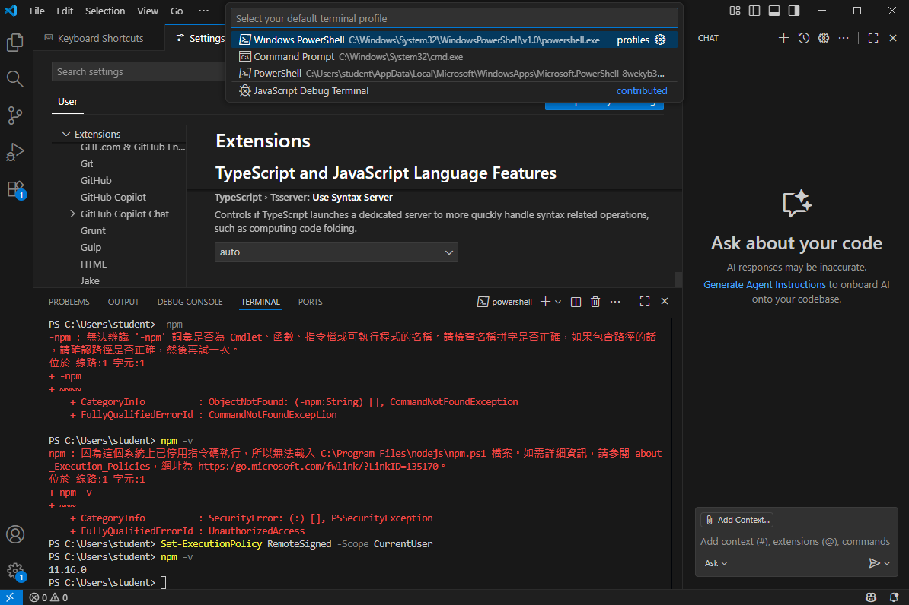

# Spring Boot 圖文學習筆記 18：VS Code首次設定、終端機與Live Server

- 使用環境：Windows、Visual Studio Code、JDK 21、Node.js／npm
- 適用情境：第一次使用VS Code進行Java、Spring Boot或基礎HTML練習

> 語法速查：[HTML、CSS與資源載入](../語法字典/10_HTML_CSS與瀏覽器載入.md)

## 本章快速索引

- [0. 完成本章後應達成的結果](#0-完成本章後應達成的結果)
- [1. 初次開啟VS Code時，哪些功能需要設定？](#1-初次開啟vs-code時哪些功能需要設定)
- [2. 安裝開發所需的擴充套件](#2-安裝開發所需的擴充套件)
- [3. 設定預設終端機Profile](#3-設定預設終端機profile)
- [4. 驗證npm與處理PowerShell執行原則](#4-驗證npm與處理powershell執行原則)
- [5. 三種容易混淆的「User」或Profile](#5-三種容易混淆的user或profile)
- [6. Live Server只顯示資料夾清單](#6-live-server只顯示資料夾清單)
- [7. 常見問題快速對照](#7-常見問題快速對照)
- [8. 完成檢查表](#8-完成檢查表)
- [9. 官方參考資料](#9-官方參考資料)

## 0. 完成本章後應達成的結果

完成設定後，應能：

1. 分辨Copilot、Java、Spring Boot及Live Server各自負責的功能。
2. 在VS Code中選定可正常啟動的終端機Profile。
3. 關閉舊終端後，以新Profile開啟終端機。
4. 成功執行`npm -v`並看見版本號。
5. 以Live Server開啟真正的`.html`檔，而不是只看到資料夾清單。

`CET fatal error`只是某些PowerShell安裝或啟動環境可能出現的故障案例，不是每台Windows電腦都會遇到。若目前Shell可正常執行，不必為了照抄範例而更換。

## 1. 初次開啟VS Code時，哪些功能需要設定？

VS Code的Welcome／Setup頁面是功能導覽，不是只能選一個選項的安裝精靈。各項功能彼此獨立。

### 1.1 GitHub Copilot

若要在VS Code內使用Chat、Agent或程式碼建議，可選擇`Set up Copilot`或`Use AI Features`，再登入具有Copilot使用權限的GitHub帳號。

Copilot不是Java、Spring Boot或Live Server正常執行的必要條件。只想先寫程式時，可以稍後再設定。

### 1.2 外觀與教學項目

- `Choose your theme`：只改變配色與外觀。
- `Watch video tutorials`：開啟教學內容。
- `Built-in terminal`：介紹內建終端機，不是額外安裝Shell。
- `Customize your shortcuts`：調整快捷鍵。

這些項目不會取代JDK、Node.js或擴充套件的安裝。

## 2. 安裝開發所需的擴充套件

開啟Extensions：

`View → Extensions`

也可使用快捷鍵：

`Ctrl + Shift + X`

依用途安裝：

| 用途 | 建議搜尋並安裝 | 說明 |
|---|---|---|
| Java開發 | `Extension Pack for Java` | 提供Java語言支援、除錯、測試、Maven及Java專案管理等功能 |
| Spring Boot | `Spring Boot Extension Pack` | 提供Spring Boot Tools、Dashboard及Spring Initializr支援 |
| 靜態HTML預覽 | `Live Server` | 啟動本機HTTP Server並自動重新整理頁面 |
| VS Code內AI | GitHub Copilot／VS Code內建AI設定 | 需要登入與可用方案；不影響Java編譯本身 |

`Extension Pack for Java`已包含Maven for Java，因此通常不需要再重複安裝另一套功能相同的Maven擴充套件。

安裝後應打開一個真正的專案資料夾，而不是只開單一檔案。Java功能通常會在開啟`.java`檔或Java專案後開始載入。

## 3. 設定預設終端機Profile

### 3.1 開啟選擇介面

方法一：

1. 開啟命令面板：`Ctrl + Shift + P`
2. 輸入並執行：`Terminal: Select Default Profile`

方法二：

1. 開啟下方Terminal面板。
2. 按新增終端機`+`旁邊的下拉箭頭。
3. 選擇`Select Default Profile`。

### 3.2 如何選擇可用的終端機？



*圖1：畫面示範在兩個PowerShell Profile中選擇可正常啟動者，並處理npm拼字與執行原則問題；實際路徑及版本依電腦而異。*

Windows電腦可能同時列出名稱相近、但來源路徑不同的PowerShell：

| 顯示名稱 | 常見來源 | 選擇方式 |
|---|---|---|
| `Windows PowerShell` | `C:\Windows\System32\WindowsPowerShell\v1.0\powershell.exe` | Windows內建版本；其他Profile無法啟動時可作為替代選項 |
| `PowerShell` | PowerShell 7安裝路徑、Microsoft Store或WindowsApps別名 | 能正常啟動並執行開發命令時即可使用；若別名損壞，改選實際可執行的Profile |

選擇依據不是名稱較舊或較新，而是實際Profile能否正常啟動並執行所需命令。若畫面中的WindowsApps版本出現`CET fatal error`，可改用能正常啟動的Windows PowerShell；若PowerShell 7本來就正常，則不需要更換。

### 3.3 為什麼點選後看起來沒反應？

`Select Default Profile`只會修改「之後新增終端機時使用的預設Profile」，不會把已經開著的終端機立即換成另一個Shell，也不一定顯示成功視窗。

選完後依序操作：

1. 按垃圾桶圖示關閉目前終端機。
2. 選擇`Terminal → New Terminal`，或按Terminal面板中的`+`。
3. 在新終端機中執行驗證命令。

確認目前PowerShell來源：

```powershell
$PSHOME
```

若選用Windows內建的Windows PowerShell，`$PSHOME`常見輸出為：

```text
C:\Windows\System32\WindowsPowerShell\v1.0
```

也可查看版本與種類：

```powershell
$PSVersionTable
```

## 4. 驗證npm與處理PowerShell執行原則

### 4.1 先確認命令拼字

錯誤寫法：

```powershell
-npm
```

開頭多出的`-`會使PowerShell把整個`-npm`當成不存在的命令，因此出現`CommandNotFoundException`。

正確寫法：

```powershell
npm -v
```

### 4.2 出現`npm.ps1`禁止執行

若Node.js已安裝，但PowerShell顯示無法載入`C:\Program Files\nodejs\npm.ps1`，並出現`PSSecurityException`或`UnauthorizedAccess`，代表命令已找到，但目前PowerShell執行原則禁止執行該指令碼。

在個人開發電腦上，可依安全政策考慮：

```powershell
Set-ExecutionPolicy RemoteSigned -Scope CurrentUser
```

若出現確認提示，確認變更後再次執行：

```powershell
npm -v
```

成功時會輸出已安裝的npm版本號，例如：

```text
11.16.0
```

`-Scope CurrentUser`只修改目前Windows帳號的PowerShell執行原則，不等於修改整台電腦的System環境變數。若電腦由公司或學校集中管理，不應強行覆蓋管理規則；可先詢問管理者，或暫時使用`npm.cmd -v`確認Node.js與npm是否已安裝。

## 5. 三種容易混淆的「User」或Profile

| 畫面或設定 | 實際意思 | 是否為同一件事 |
|---|---|---|
| VS Code Settings中的`User` | 設定套用到目前VS Code使用者Profile | 否 |
| `Terminal: Select Default Profile` | 選擇新終端機預設啟動哪一個Shell | 否 |
| PowerShell的`-Scope CurrentUser` | 指定執行原則只套用到目前Windows帳號 | 否 |
| Windows環境變數中的User／System variables | 決定環境變數套用到單一帳號或整台電腦 | 否 |

看到`User`字樣時，必須先確認目前所在的設定系統，不能只憑同一個單字判斷操作位置。

## 6. Live Server只顯示資料夾清單

### 6.1 問題現象

瀏覽器網址是：

```text
http://127.0.0.1:5500/day1/
```

畫面只顯示`listing directory /day1/`，沒有顯示預期的HTML內容。

專案內的檔名是：

```text
first
```

雖然VS Code可能依內容把它顯示成HTML語法，但檔名沒有`.html`副檔名，Live Server不會把它當成`first.html`入口。

### 6.2 修正方式

將檔案重新命名為：

```text
first.html
```

接著：

1. 按`Ctrl + S`儲存。
2. 在Explorer對`first.html`按右鍵。
3. 選擇`Open with Live Server`。

正常網址應類似：

```text
http://127.0.0.1:5500/day1/first.html
```

如果檔名改成：

```text
index.html
```

則直接開啟下列資料夾網址時，Web Server通常會自動尋找`index.html`：

```text
http://127.0.0.1:5500/day1/
```

因此，資料夾清單不代表Live Server損壞；它表示目前開啟的是目錄，而且該目錄沒有被當成預設首頁的`index.html`。

## 7. 常見問題快速對照

| 現象 | 先檢查什麼 | 處理方式 |
|---|---|---|
| 選完Default Profile沒有畫面變化 | 是否仍在使用舊終端機 | 關閉舊終端，重新建立Terminal |
| 終端機啟動出現CET fatal error | 實際PowerShell路徑 | 改選可正常啟動的Shell；Windows內建的Windows PowerShell 5.1通常可作為替代選項 |
| 輸入`-npm`找不到命令 | 命令前是否多了`-` | 改成`npm -v` |
| `npm.ps1`被禁止執行 | 錯誤是否為Execution Policy／PSSecurityException | 依管理規範調整CurrentUser執行原則，或先測試`npm.cmd -v` |
| Live Server顯示目錄清單 | 檔名是否真的有`.html` | 改成`first.html`並直接用Live Server開啟該檔 |
| 開目錄網址仍顯示清單 | 是否存在`index.html` | 將首頁命名為`index.html`，或直接開啟完整檔案網址 |

## 8. 完成檢查表

- [ ] 已安裝`Extension Pack for Java`
- [ ] 需要Spring Boot時已安裝`Spring Boot Extension Pack`
- [ ] 需要靜態HTML預覽時已安裝Live Server
- [ ] Copilot依實際需求決定是否登入與啟用
- [ ] 已選擇目前電腦可正常啟動的Terminal Profile
- [ ] 選完Profile後已關閉舊終端並建立新終端
- [ ] `$PSHOME`與預期Shell路徑一致
- [ ] `npm -v`能輸出版本號
- [ ] HTML檔名具有`.html`副檔名
- [ ] Live Server網址指向實際HTML檔，或目錄中存在`index.html`

## 9. 官方參考資料

- [VS Code：Terminal Profiles](https://code.visualstudio.com/docs/terminal/profiles)
- [VS Code：Getting Started with the Terminal](https://code.visualstudio.com/docs/terminal/getting-started)
- [VS Code：Getting Started with Java](https://code.visualstudio.com/docs/java/java-tutorial)
- [VS Code：Set up GitHub Copilot](https://code.visualstudio.com/docs/setup/copilot)
