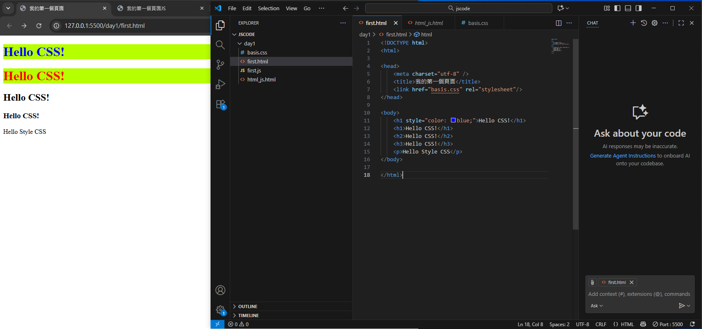
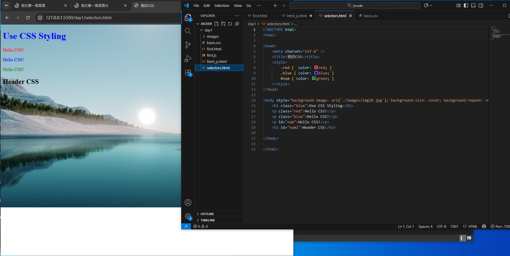
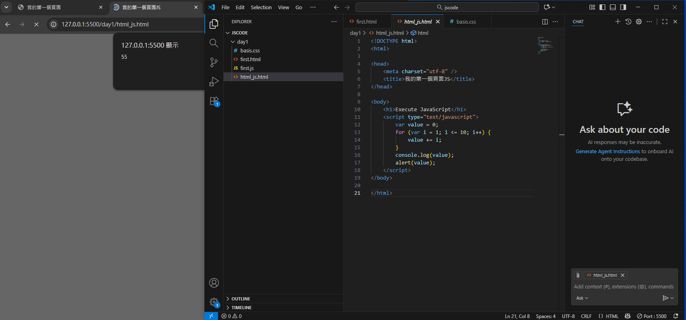
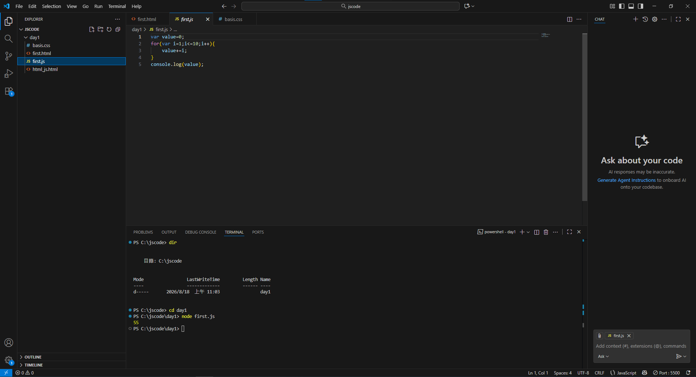
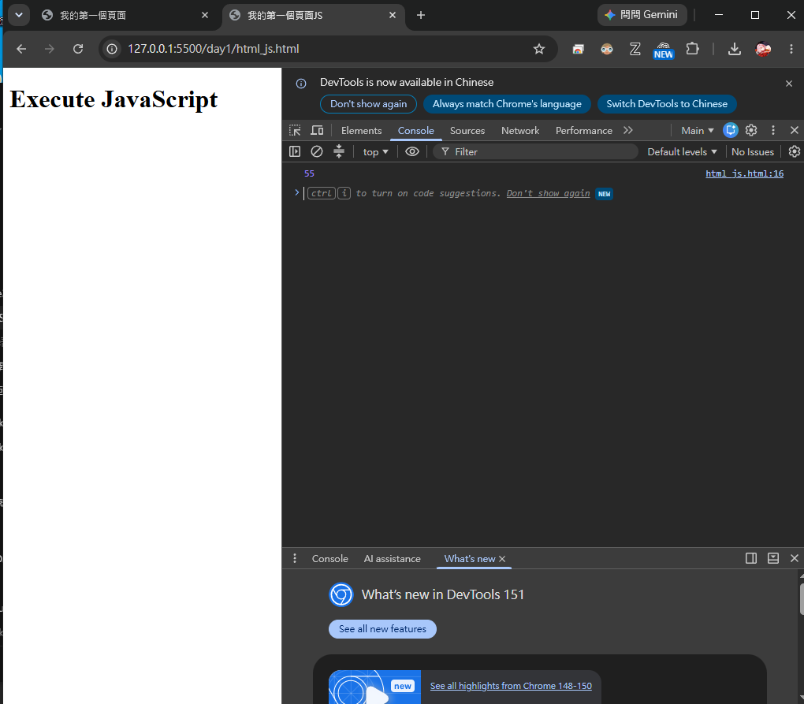

# Spring Boot 圖文學習筆記 19：HTML、CSS與JavaScript基礎

[返回JavaScript課程功能快速索引](00_JavaScript功能快速索引.md)

- 使用環境：Visual Studio Code、Live Server、Chrome DevTools
- 範例資料夾名稱：`day1/`

> 語法速查：[HTML、CSS與資源載入](../語法字典/10_HTML_CSS與瀏覽器載入.md)

## 本章快速索引

- [0. 本章目標與檔案結構](#0-本章目標與檔案結構)
- [1. HTML載入外部CSS](#1-html載入外部css)
- [2. 外部CSS與inline style的套用結果](#2-外部css與inline-style的套用結果)
- [3. Class Selector、ID Selector與背景圖片](#3-class-selectorid-selector與背景圖片)
- [4. 在HTML中執行JavaScript](#4-在html中執行javascript)
- [5. `for`迴圈如何得到55？](#5-for迴圈如何得到55)
- [6. `console.log`與`alert`的差別](#6-consolelog與alert的差別)
- [7. 使用Node.js執行外部`first.js`](#7-使用nodejs執行外部firstjs)
- [8. 使用Chrome DevTools查看Console](#8-使用chrome-devtools查看console)
- [9. 使用Live Server驗證](#9-使用live-server驗證)
- [10. 常見錯誤](#10-常見錯誤)
- [11. 本章檢查表](#11-本章檢查表)

## 0. 本章目標與檔案結構

本章使用靜態網頁練習三種前端語言的分工：

| 技術 | 主要責任 | 本章範例 |
|---|---|---|
| HTML | 建立頁面結構與內容 | 標題、段落、載入CSS與JavaScript |
| CSS | 控制顏色、背景與其他外觀 | 外部CSS與元素上的inline style |
| JavaScript | 執行程式邏輯與瀏覽器互動 | 迴圈加總、Console輸出、alert視窗 |

範例目錄：

```text
JSCODE/
└─ day1/
   ├─ basis.css
   ├─ first.html
   ├─ first.js
   └─ html_js.html
```

本章使用四個範例檔：`first.html`直接載入`basis.css`；`html_js.html`直接在`<script>`內寫JavaScript；`first.js`是內容相近的獨立JavaScript檔，可由Node.js執行。兩份HTML都沒有`<script src="first.js">`，所以`first.js`不是由瀏覽器頁面載入。

完成本章後，應能重現：

1. `first.html`顯示五段不同層級的文字。
2. 第一個`h1`是藍字綠底，第二個`h1`是紅字綠底。
3. JavaScript把1到10加總成55。
4. 55同時出現在`alert`對話框與DevTools Console。

## 1. HTML載入外部CSS

### 1.1 `first.html`

```html
<!DOCTYPE html>
<html>
<head>
    <meta charset="utf-8" />
    <title>我的第一個頁面</title>
    <link href="basis.css" rel="stylesheet" />
</head>
<body>
    <h1 style="color: blue;">Hello CSS!</h1>
    <h1>Hello CSS!</h1>
    <h2>Hello CSS!</h2>
    <h3>Hello CSS!</h3>
    <p>Hello Style CSS</p>
</body>
</html>
```

`<link>`放在`<head>`內，用來告訴瀏覽器載入外部樣式表：

| 部分 | 定義 |
|---|---|
| `href="basis.css"` | CSS檔案的URL；這裡是相對於`first.html`的同層檔案 |
| `rel="stylesheet"` | 宣告被連結的資源是樣式表 |

檔名、路徑與副檔名都必須完全一致。若實際檔名是`basis.css`，HTML卻寫成`basic.css`，瀏覽器會找不到樣式表，頁面便只剩預設外觀。

### 1.2 `basis.css`

目前`basis.css`的實際內容：

```css
h1 {
    color: red;
    background: #b6ff00;
}
```

`h1`是Type Selector／Element Selector，會選取頁面中的所有`<h1>`元素。`#b6ff00`是十六進位色碼；`background`是背景相關屬性的Shorthand，本例只提供顏色，因此畫面呈現亮綠色背景。

## 2. 外部CSS與inline style的套用結果



*圖1：外部CSS提供共用樣式，第一個h1的inline style再覆寫文字顏色。*

第一個標題同時符合外部CSS的`h1`規則，元素本身又有：

```html
style="color: blue;"
```

最後結果：

| 元素 | 外部CSS | inline style | 最終畫面 |
|---|---|---|---|
| 第一個`h1` | 紅字、綠底 | 藍字 | 藍字、綠底 |
| 第二個`h1` | 紅字、綠底 | 無 | 紅字、綠底 |
| `h2`、`h3`、`p` | 沒有被`h1`規則選中 | 無 | 使用瀏覽器預設樣式 |

重點不是「inline style會刪除外部CSS」，而是兩邊都設定同一個CSS property時，元素上的inline declaration會在一般Cascade中覆蓋外部規則的該項property。

第一個`h1`只在inline style重新設定`color`，沒有重新設定`background-color`，所以背景仍沿用外部CSS。

## 3. Class Selector、ID Selector與背景圖片

### 3.1 `selectors.html`

```html
<!DOCTYPE html>
<html>
<head>
    <meta charset="utf-8" />
    <title>我的CSS</title>

    <style>
        .red { color: red; }
        .blue { color: blue; }
        #num { color: green; }
    </style>
</head>
<body style="background-image: url('./images/img28.jpg');
             background-size: cover;
             background-repeat: no-repeat;">
    <h1 class="blue">Use CSS Styling</h1>
    <p class="red">Hello CSS!</p>
    <p class="blue">Hello CSS!</p>
    <p id="num">Hello CSS!</p>
    <h2 id="num2">Header CSS</h2>
</body>
</html>
```

原始檔將`<body>`的三個style declaration寫在同一行；上例只是為了閱讀而換行，語意相同。

### 3.2 三種Selector的寫法

| CSS寫法 | Selector類型 | HTML對應方式 | 適用特性 |
|---|---|---|---|
| `h1` | Type／Element Selector | 所有`<h1>` | 依標籤種類批次套用 |
| `.blue` | Class Selector | `class="blue"` | 同一Class可重複套用到多個元素 |
| `#num` | ID Selector | `id="num"` | 精確選取具有該ID的元素；同一份HTML中的ID應保持唯一 |

`.`與`#`是CSS Selector的一部分，不會寫進HTML的`class`或`id`值：

```css
.blue { color: blue; }
#num { color: green; }
```

```html
<h1 class="blue">Use CSS Styling</h1>
<p id="num">Hello CSS!</p>
```

### 3.3 為什麼`id="num2"`沒有變綠色？

CSS只有：

```css
#num { color: green; }
```

`#num`只匹配完整ID等於`num`的元素，不是「ID以num開頭」的模糊搜尋。因此：

```html
<p id="num">Hello CSS!</p>
```

會變成綠色；但：

```html
<h2 id="num2">Header CSS</h2>
```

不符合`#num`，所以仍使用瀏覽器預設的黑色文字。如果要選取它，必須另外寫：

```css
#num2 { color: green; }
```

### 3.4 實際畫面對照



*圖2：Class與ID Selector只影響匹配元素；背景圖片由相對路徑載入。*

| HTML元素 | 命中的規則 | 最終文字顏色 |
|---|---|---|
| `<h1 class="blue">` | `.blue` | 藍色 |
| `<p class="red">` | `.red` | 紅色 |
| `<p class="blue">` | `.blue` | 藍色 |
| `<p id="num">` | `#num` | 綠色 |
| `<h2 id="num2">` | 無對應的`#num2` | 預設黑色 |

在沒有`!important`及其他特殊來源介入時，若多個規則同時設定同一個property，一般Specificity順序可先記成：

```text
inline style > ID Selector > Class Selector > Type Selector
```

真正比較時還會考慮Style來源、`!important`、Specificity與先後順序；上列只用來理解本章的基本案例。

### 3.5 背景圖片的相對路徑

```html
<body style="background-image: url('./images/img28.jpg');
             background-size: cover;
             background-repeat: no-repeat;">
```

| declaration | 作用 |
|---|---|
| `background-image: url('./images/img28.jpg')` | 以`selectors.html`所在位置為基準，載入同層`images`資料夾內的`img28.jpg` |
| `background-size: cover` | 等比例放大或縮小背景圖，使背景定位區域被覆蓋；圖片邊緣可能被裁掉 |
| `background-repeat: no-repeat` | 圖片不足以填滿區域時也不重複平鋪 |

實際檔案位置：

```text
day1/selectors.html
day1/images/img28.jpg
```

`./`代表目前HTML所在資料夾。若把`selectors.html`移至其他目錄，或把圖片資料夾改名，就必須同步調整URL。

## 4. 在HTML中執行JavaScript

### 4.1 `html_js.html`



*圖3：1到10累加得到55，alert在瀏覽器對話框顯示結果。*

```html
<!DOCTYPE html>
<html>
<head>
    <meta charset="utf-8" />
    <title>我的第一個頁面JS</title>
</head>
<body>
    <h1>Execute JavaScript</h1>

    <script type="text/javascript">
        var value = 0;

        for (var i = 1; i <= 10; i++) {
            value += i;
        }

        console.log(value);
        alert(value);
    </script>
</body>
</html>
```

在HTML5中，瀏覽器已預設`<script>`內容為JavaScript，因此`type="text/javascript"`可以保留，也可以簡寫為：

```html
<script>
    // JavaScript
</script>
```

## 5. `for`迴圈如何得到55？

初始值：

```javascript
var value = 0;
```

迴圈：

```javascript
for (var i = 1; i <= 10; i++) {
    value += i;
}
```

`for`括號內有三個部分：

| 部分 | 程式 | 作用 |
|---|---|---|
| 初始化 | `var i = 1` | 第一次進入迴圈前，令`i`從1開始 |
| 繼續條件 | `i <= 10` | `i`仍小於或等於10時繼續執行 |
| 每輪更新 | `i++` | 每完成一次，將`i`加1 |

`value += i`等同：

```javascript
value = value + i;
```

所以最後計算：

```text
0 + 1 + 2 + 3 + 4 + 5 + 6 + 7 + 8 + 9 + 10 = 55
```

程式使用`<= 10`，因此10也會被加進去。如果改成`i < 10`，只會加到9，結果會變成45。

本章保留範例使用的`var`寫法。現代JavaScript也常用`let`限制變數作用域：

```javascript
let value = 0;

for (let i = 1; i <= 10; i++) {
    value += i;
}
```

兩段程式在本例都會得到55，但`var`與`let`的作用域規則不同，不能在所有程式中不加判斷地互換。

## 6. `console.log`與`alert`的差別

```javascript
console.log(value);
alert(value);
```

| 語法 | 輸出位置 | 特性 | 常見用途 |
|---|---|---|---|
| `console.log(value)` | 瀏覽器DevTools的Console | 不會直接出現在網頁正文 | 除錯、檢查變數與執行流程 |
| `alert(value)` | 瀏覽器彈出式對話框 | 使用者關閉對話框前會阻擋目前頁面互動 | 簡單示範或立即提醒；正式介面通常避免濫用 |

因此開啟頁面後，會先看到顯示`55`的alert；按下確定後，網頁正文仍只顯示`Execute JavaScript`。若要查看`console.log`的55，必須開啟DevTools。

## 7. 使用Node.js執行外部`first.js`



*圖5：在Terminal執行node first.js，結果直接輸出於終端機。*

`first.js`的實際內容：

```javascript
var value = 0;

for (var i = 1; i <= 10; i++) {
    value += i;
}

console.log(value);
```

在VS Code Terminal先進入檔案所在資料夾，再交給Node.js執行：

```powershell
PS ...> cd day1
PS ...\day1> node first.js
55
```

命令格式：

```text
node <JavaScript檔案路徑>
```

`node first.js`會啟動Node.js執行該檔，`console.log(value)`的結果會輸出在Terminal。這不需要Live Server，也不會開啟瀏覽器。

### 7.1 瀏覽器與Node.js的差異

| 比較 | 瀏覽器中的`html_js.html` | Terminal中的`node first.js` |
|---|---|---|
| JavaScript位置 | HTML內的`<script>` | 獨立`.js`檔 |
| `console.log`輸出 | Chrome DevTools Console | VS Code Terminal |
| `alert` | 瀏覽器提供，可使用 | Node.js沒有瀏覽器`window`，不能直接使用 |
| HTML／DOM | 瀏覽器建立並提供 | Node.js預設沒有HTML頁面或DOM |
| 是否需要Live Server | 本章用Live Server開頁面 | 不需要 |

`first.js`目前只有`console.log`，所以可直接由Node.js執行。若把`alert(value)`原樣加入並執行`node first.js`，會因Node.js預設沒有`alert`而發生錯誤。

### 7.2 若要讓HTML載入外部JavaScript

可以在HTML的`</body>`前加入：

```html
<script src="first.js"></script>
```

這時瀏覽器會以`first.html`為基準尋找同層的`first.js`。但這是外部檔案的另一種組織方式；目前範例中的`html_js.html`仍使用內嵌`<script>`，不可把建議寫法誤當成目前檔案已完成的狀態。

## 8. 使用Chrome DevTools查看Console



*圖4：console.log的55出現在開發者工具Console，而不是網頁正文。*

開啟方式：

- 按`F12`；或
- 在頁面上按右鍵，選擇「檢查」；或
- 使用`Ctrl + Shift + I`。

切換至`Console`分頁後，可以看到：

```text
55
```

Console右側的來源連結類似：

```text
html_js.html:16
```

這表示輸出來自`html_js.html`約第16行，按下連結可跳至對應程式位置。行號可能因空白行或程式碼修改而改變，不是固定API的一部分。

## 9. 使用Live Server驗證

1. 確認`basis.css`與`first.html`位於同一個`day1`資料夾。
2. 儲存全部檔案。
3. 對`first.html`按右鍵，選擇`Open with Live Server`。
4. 確認網址類似：

```text
http://127.0.0.1:5500/day1/first.html
```

5. 確認兩個`h1`分別是藍字綠底與紅字綠底。
6. 再對`html_js.html`使用Live Server，確認網址類似：

```text
http://127.0.0.1:5500/day1/html_js.html
```

7. 確認alert顯示55。
8. 開啟DevTools Console，確認也有一筆55。

`127.0.0.1`代表本機；`5500`是本次Live Server使用的Port。Port若被占用或設定不同，實際數字可能改變，只要瀏覽器確實連到Live Server即可。

## 10. 常見錯誤

| 現象 | 原因 | 檢查方式 |
|---|---|---|
| CSS完全沒有作用 | `href`檔名或相對路徑錯誤 | 比對Explorer中的`basis.css`與HTML的`href` |
| 第一個標題不是藍色 | inline style拼字錯誤或未儲存 | 檢查`style="color: blue;"`並重新整理 |
| 第二個標題不是紅色／綠底 | 外部CSS沒有載入或沒有設定`h1` | 查看Network／Console及CSS檔內容 |
| `id="num2"`沒有變綠色 | `#num`只匹配完整ID`num` | 改成`id="num"`或新增`#num2`規則 |
| 背景圖片沒有顯示 | `./images/img28.jpg`相對路徑或檔名錯誤 | 確認`selectors.html`與`images`的相對位置 |
| 背景圖比例正常但邊緣被裁掉 | `background-size: cover`的預期行為 | 若不能裁切，依需求改用`contain`並處理空白區域 |
| 頁面沒有顯示55 | `console.log`不會寫入HTML正文 | 開啟DevTools Console |
| alert不是55 | 迴圈起點、終點或累加式不同 | 檢查`i = 1`、`i <= 10`及`value += i` |
| `node first.js`找不到檔案 | Terminal不在`first.js`所在資料夾 | 先用`cd`進入`day1`，再執行Node命令 |
| Node.js顯示`alert is not defined` | 把瀏覽器API放進Node.js環境 | Node版本只保留`console.log`，或改在瀏覽器中執行 |
| 修改後畫面未更新 | 檔案未儲存或瀏覽器仍是舊內容 | `Ctrl + S`後重新整理；確認網址是正確檔案 |

## 11. 本章檢查表

- [ ] 能說明HTML、CSS與JavaScript的責任差異
- [ ] 能用`<link>`載入同層的`basis.css`
- [ ] 能說明第一個`h1`為何是藍字但仍保留綠色背景
- [ ] 能分辨Type、Class與ID Selector的符號及使用條件
- [ ] 能說明`#num`為何不會選到`id="num2"`
- [ ] 能用相對URL載入`images/img28.jpg`
- [ ] 能說明`cover`與`no-repeat`的作用
- [ ] 能拆解`for (var i = 1; i <= 10; i++)`的三個部分
- [ ] 能說明`value += i`的作用
- [ ] 能分辨`console.log`與`alert`的輸出位置
- [ ] 能執行`node first.js`並在Terminal取得55
- [ ] 能說明瀏覽器與Node.js提供的API不同
- [ ] 能說明目前`first.js`並未被兩份HTML載入
- [ ] 能在DevTools Console找到55及來源行號
- [ ] 能透過Live Server重現兩個頁面的結果
