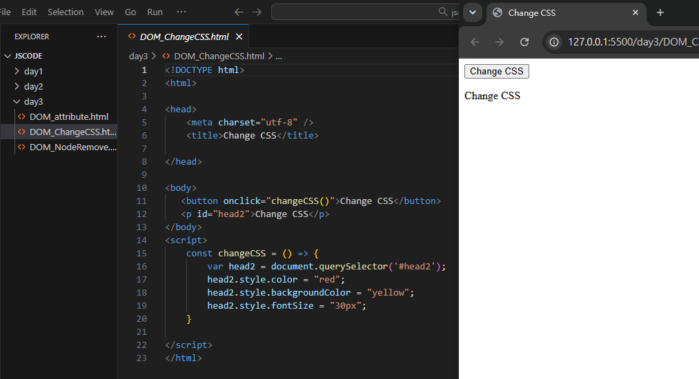
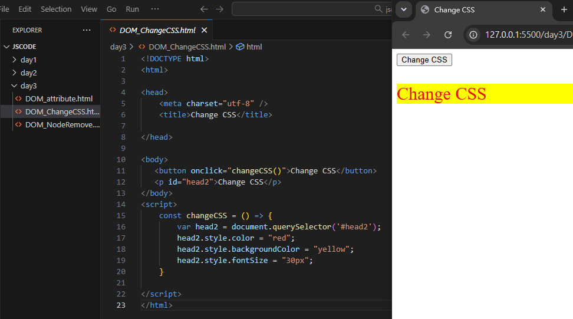

# JavaScript DOM：元素選取、節點與動態修改

[返回JavaScript課程功能快速索引](00_JavaScript功能快速索引.md)

本章整理DOM元素選取、內容、節點、表格、Attribute與Event，並把必要主線與可選延伸分開標示。

> 語法速查：[DOM與事件](../語法字典/12_DOM_BOM表單與Fetch.md)

## 本章快速索引

- [1. 完成後的效果](#1-完成後的效果)
- [2. 完整範例](#2-完整範例)
- [3. DOM的角色](#3-dom的角色)
- [4. `onclick`：按鈕的點擊事件](#4-onclick按鈕的點擊事件)
- [5. Arrow Function：定義事件處理函式](#5-arrow-function定義事件處理函式)
- [6. `querySelector`：使用CSS Selector尋找元素](#6-queryselector使用css-selector尋找元素)
- [7. `.style`：修改元素的inline style](#7-style修改元素的inline-style)
- [8. 空值風險](#8-空值風險)
- [9. 執行與驗證](#9-執行與驗證)
- [10. 選取單一元素、全部元素與限定範圍](#10-選取單一元素全部元素與限定範圍)
- [11. `textContent`、`innerHTML`與表單的`value`](#11-textcontentinnerhtml與表單的value)
- [12. 建立與加入DOM節點](#12-建立與加入dom節點)
- [13. `childNodes`包含文字節點](#13-childnodes包含文字節點)
- [14. 動態建立表格](#14-動態建立表格)
- [15. 讀寫Attribute與刪除節點](#15-讀寫attribute與刪除節點)
- [16. DOM Event與事件物件](#16-dom-event與事件物件)
- [17. 常見錯誤](#17-常見錯誤)
- [18. 本章檢查表](#18-本章檢查表)

## 1. 完成後的效果

頁面剛開啟時包含：

- 一個`Change CSS`按鈕。
- 一段文字大小與顏色皆為瀏覽器預設值的`Change CSS`。

按下按鈕後，該段文字會變成：

- 紅色文字。
- 黃色背景。
- `30px`字體大小。

這些變化不會修改硬碟中的HTML檔案，只會改變目前瀏覽器頁面中的DOM狀態；重新整理頁面後會回到初始狀態。

## 2. 完整範例

在`day3/`建立`DOM_ChangeCSS.html`：

```html
<!DOCTYPE html>
<html>

<head>
    <meta charset="utf-8" />
    <title>Change CSS</title>
</head>

<body>
    <button onclick="changeCSS()">Change CSS</button>
    <p id="head2">Change CSS</p>
</body>
<script>
    const changeCSS = () => {
        var head2 = document.querySelector('#head2');
        head2.style.color = "red";
        head2.style.backgroundColor = "yellow";
        head2.style.fontSize = "30px";
    }
</script>
</html>
```

## 3. DOM的角色

DOM是瀏覽器把HTML文件解析後建立的物件結構。JavaScript可以透過`document`存取這份結構，進一步讀取、修改、新增或刪除頁面元素。

本例的處理流程如下：

```text
使用者按下按鈕
  → onclick呼叫changeCSS()
  → document.querySelector('#head2')尋找元素
  → 修改該元素的style屬性
  → 瀏覽器重新呈現畫面
```

## 4. `onclick`：按鈕的點擊事件



*圖1：按鈕尚未點擊時，目標段落仍使用預設樣式。*

```html
<button onclick="changeCSS()">Change CSS</button>
```

`onclick`是HTML元素的事件屬性。使用者按下按鈕時，瀏覽器會執行屬性值中的JavaScript；此處會呼叫`changeCSS()`。

使用條件：

- `changeCSS`必須在點擊發生前已經成為瀏覽器可以呼叫的函式。
- 函式名稱及大小寫必須完全一致。
- `changeCSS()`中的括號代表立即呼叫該函式，不是只取得函式本身。

本例使用inline event handler，適合看懂事件與函式的基本關係。較大的程式通常會改用`addEventListener`，把HTML結構與JavaScript事件處理分開。

## 5. Arrow Function：定義事件處理函式

```javascript
const changeCSS = () => {
    // 按鈕被點擊後要執行的程式
};
```

這是JavaScript的箭頭函式（Arrow Function）：

| 部分 | 定義 |
|---|---|
| `const changeCSS` | 宣告名稱為`changeCSS`的常數變數 |
| `()` | 參數清單；目前沒有參數 |
| `=>` | 箭頭函式語法 |
| `{ ... }` | 函式被呼叫時執行的程式區塊 |

此例也可以使用一般函式語法：

```javascript
function changeCSS() {
    // 相同處理內容
}
```

兩者在這個簡單範例中都能完成相同工作，但它們在`this`、提升（hoisting）等規則上並不完全相同，不能在所有情境中視為完全等價。

## 6. `querySelector`：使用CSS Selector尋找元素

```javascript
var head2 = document.querySelector('#head2');
```

`document.querySelector(selector)`接收一段CSS Selector字串，回傳文件中第一個符合條件的元素：

- `'#head2'`中的`#`代表ID Selector。
- 它會匹配`id="head2"`。
- 找到後，回傳的元素物件存入`head2`變數。
- 如果沒有任何元素符合，回傳`null`。

常見選擇方式：

```javascript
document.querySelector('#head2'); // 第一個id為head2的元素
document.querySelector('.item');  // 第一個class包含item的元素
document.querySelector('p');      // 第一個p元素
```

若要取得所有符合元素，應使用`document.querySelectorAll(...)`；`querySelector(...)`只回傳第一個。

## 7. `.style`：修改元素的inline style



*圖2：事件函式取得元素後，透過style更新文字色、背景色與字體大小。*

```javascript
head2.style.color = "red";
head2.style.backgroundColor = "yellow";
head2.style.fontSize = "30px";
```

元素的`.style`用來讀寫其inline style。本例執行後，DOM中的元素效果相當於：

```html
<p id="head2" style="color: red; background-color: yellow; font-size: 30px;">
    Change CSS
</p>
```

JavaScript屬性名稱與CSS寫法的對照：

| CSS屬性 | JavaScript `.style`屬性 |
|---|---|
| `color` | `style.color` |
| `background-color` | `style.backgroundColor` |
| `font-size` | `style.fontSize` |

CSS中含有連字號的屬性，在JavaScript中通常改用camelCase：移除連字號，並將後一個單字的第一個字母改成大寫。

尺寸值必須包含單位：

```javascript
head2.style.fontSize = "30px"; // 正確：值包含px
```

只寫數字`30`不能完整表示CSS字體尺寸。

## 8. 空值風險

如果HTML中沒有`id="head2"`，下列程式會得到`null`：

```javascript
var head2 = document.querySelector('#head2');
```

接著執行`head2.style...`時會發生錯誤。需要防止頁面結構變動造成錯誤時，可先判斷：

```javascript
const head2 = document.querySelector('#head2');

if (head2 !== null) {
    head2.style.color = "red";
    head2.style.backgroundColor = "yellow";
    head2.style.fontSize = "30px";
}
```

本段是安全性補充，基本入門範例可以先不加入此判斷。

## 9. 執行與驗證

1. 在VS Code開啟包含`day3`的練習資料夾。
2. 確認檔案位於`day3\DOM_ChangeCSS.html`。
3. 儲存檔案。
4. 對該HTML按右鍵，選擇`Open with Live Server`。
5. 確認網址類似：

```text
http://127.0.0.1:5500/day3/DOM_ChangeCSS.html
```

6. 按下按鈕前，確認段落仍是預設樣式。
7. 按下`Change CSS`按鈕。
8. 確認段落變成紅字、黃底、30px。
9. 重新整理頁面，確認樣式回到初始狀態。

## 10. 選取單一元素、全部元素與限定範圍

範例檔案：`day2/DOM_basic.html`

```javascript
const title = document.querySelector('#title');
const first = document.querySelector('.item');
const input = document.querySelector('input[type="text"]');

console.log(title.textContent);
console.log(first.textContent);
console.log(input.value);

const items = document.querySelectorAll('.item');
items.forEach(el => console.log(el.textContent));
```

`forEach`的callback也可以接收第二個`index`參數，可利用它一併印出索引。

| API | 回傳內容 | 找不到時 |
|---|---|---|
| `querySelector(...)` | 第一個符合Selector的Element | `null` |
| `querySelectorAll(...)` | 所有符合元素組成的靜態`NodeList` | 空的`NodeList` |
| `getElementById(...)` | 指定ID的Element | `null` |

Selector可以使用CSS的屬性條件：

```javascript
document.querySelector('input[type="text"]');
```

也可以先取得父元素，再限制搜尋範圍：

```javascript
const parent = document.querySelector('#innerContainer');
const links = parent.querySelectorAll('a');
```

此時只會搜尋`#innerContainer`內的`a`，不會取得頁面其他區域的連結。

範例程式印出`link.href`。這個DOM property通常會回傳瀏覽器解析後的絕對網址；如果要讀取HTML原本寫下的相對值，可使用：

```javascript
link.getAttribute('href');
```

## 11. `textContent`、`innerHTML`與表單的`value`

三者讀取的對象不同：

| Property | 用途 | 內容是否被解析成HTML |
|---|---|---|
| `textContent` | 讀寫純文字 | 否 |
| `innerHTML` | 讀寫元素內部的HTML標記 | 是 |
| `value` | 讀寫`input`等表單控制項目前的值 | 不適用 |

`DOM_Nodes.html`中的範例：

```javascript
var foo2 = document.getElementById('foo2');
alert(foo2.innerHTML);
foo2.innerHTML = "<h3 style='color:red'>New Content</h3>";
```

這會把`foo2`原本的子內容全部替換成紅色`h3`。若內容來自使用者或外部資料，直接放進`innerHTML`可能造成HTML Injection或XSS；只需要顯示文字時，優先使用`textContent`。

## 12. 建立與加入DOM節點

範例檔案：`day2/DOM_Node2.html`

```javascript
const addElement = () => {
    var list = document.getElementById('firstUL');

    for (var i = 1; i <= 3; i++) {
        var li = document.createElement('li');
        li.innerHTML = "<p style='color:blue'>顯示的文字 " + i + "</p>";
        list.appendChild(li);
    }
};
```

執行順序：

1. `createElement('li')`建立尚未放入文件的Element。
2. `innerHTML`設定`li`內部內容。
3. `appendChild(li)`把新節點加到`ul`最後面。
4. 每按一次按鈕新增三個藍色`li`，文字編號都是1～3。

可選延伸是加入全域`num`及顏色Array，讓多次點擊時編號持續增加，顏色以`num % color.length`循環。這是Array與餘數運算的綜合練習。

## 13. `childNodes`包含文字節點

`DOM_Nodes.html`使用：

```javascript
var children = foo.childNodes;
```

`childNodes`會包含Element、換行與縮排產生的Text Node等所有子節點。因此實際結果不一定只有`P`、`SPAN`、`P`；空白可能產生：

```text
#text
```

而Text Node沒有與Element相同的`innerHTML`，印出時可能得到`undefined`。如果需求只是取得子元素，改用：

```javascript
var children = foo.children;
```

常用判斷：

```javascript
foo.hasChildNodes();   // 是否有任何類型的子節點
foo.firstChild;        // 第一個Node，可能是空白Text Node
foo.firstElementChild; // 第一個Element，不受縮排空白影響
```

## 14. 動態建立表格

範例檔案：`day2/DOM_Table.html`

### 14.1 使用一般節點API

```javascript
var table = document.createElement('table');
var tr = document.createElement('tr');
var td = document.createElement('td');

td.textContent = 'Row 1 Col 1';
tr.appendChild(td);
table.appendChild(tr);
document.body.appendChild(table);
```

### 14.2 使用Table專用API

```javascript
var table = document.getElementById('tb1');
var newRow = table.insertRow(-1); // -1表示加到最後
var cell1 = newRow.insertCell();
cell1.textContent = 'Book Name';
var cell2 = newRow.insertCell();
cell2.textContent = 'Book Price';
```

兩種方式都能建立表格。`insertRow`與`insertCell`較適合已知操作對象是Table時使用；一般節點API則可套用到所有HTML元素。

## 15. 讀寫Attribute與刪除節點

### 15.1 `getAttribute`與`setAttribute`

範例檔案：`day3/DOM_attribute.html`

```javascript
var foo = document.querySelector('#foo');

console.log(foo.getAttribute('href'));
console.log(foo.getAttribute('target'));
console.log(foo.getAttribute('data-foo'));

foo.setAttribute('href', 'http://www.google.com/');
foo.textContent = 'www.google.com';
```

| API | 作用 |
|---|---|
| `getAttribute(name)` | 讀取HTML Attribute原始字串；不存在時回傳`null` |
| `setAttribute(name, value)` | 新增或覆寫Attribute |

`data-foo`在HTML中只有名稱、沒有指定值，因此讀取到的是空字串。修改`href`不會自動修改畫面文字，所以範例另用`textContent`改成`www.google.com`。

### 15.2 移除清單項目

範例檔案：`day3/DOM_NodeRemove.html`

若從`firstChild`開始處理，必須注意HTML縮排可能使第一個Node成為空白Text Node（`#text`）。只需要Element時，較直接且穩定的寫法是：

```javascript
const list = document.querySelector('#firstUL');
const firstItem = list.firstElementChild;

if (firstItem !== null) {
    firstItem.remove();
}
```

若要保留父節點呼叫形式：

```javascript
list.removeChild(firstItem);
```

兩者都應先確認目標存在，否則清單刪空後再次按鈕可能發生錯誤。

### 15.3 刪除表格列

```javascript
var table = document.querySelector('table');

if (table.rows.length > 0) {
    table.deleteRow(0);
}
```

索引`0`代表第一列。若表格已經沒有列，再執行`deleteRow(0)`會發生索引錯誤，因此應先檢查`rows.length`。

## 16. DOM Event與事件物件

範例檔案：`day3/DOM_Event.html`

### 16.1 inline event與`this`

```html
<button onclick="eventOP(this)" data-name="Mike">Event(this)</button>
```

```javascript
const eventOP = (button) => {
    console.log(button.getAttribute('data-name'));
};
```

inline handler中的`this`代表觸發事件的按鈕Element。把它當參數傳給`eventOP`後，函式即可讀取該按鈕的`data-name`。

### 16.2 `addEventListener`

```javascript
const loaded = () => {
    alert('document loaded');
};

window.addEventListener('load', loaded);
```

`addEventListener(type, listener)`不會立即呼叫listener，而是登記在指定事件發生時執行。`load`代表頁面及其依賴資源完成載入。

### 16.3 指派事件Property

```javascript
const scene = document.getElementById('scene');

scene.onmouseover = function () {
    this.style.backgroundColor = 'blue';
};
```

範例HTML另以`onmouseout`把背景改回灰色。這可觀察滑鼠進入與離開元素時的兩個事件。

| 寫法 | 特性 |
|---|---|
| `onclick="..."` | 直接寫在HTML Attribute中 |
| `element.onclick = handler` | 同一事件Property後一次指派會覆蓋前一次 |
| `element.addEventListener('click', handler)` | 可為同一事件登記多個listener，較適合較大的程式 |

### 16.4 Keyboard Event

透過`document.onkeydown`可取得Event並判斷`Ctrl + Y`或`Ctrl + Z`。舊程式常使用`keyCode`與`which`，但這兩個Property已不建議在新程式中使用；現代寫法可使用`event.key`：

```javascript
document.addEventListener('keydown', event => {
    if (event.ctrlKey && event.key.toLowerCase() === 'y') {
        alert('你同時按下 control + y');
    }
});
```

`event.ctrlKey`表示事件發生時Control鍵是否按住，`event.key`表示按鍵內容。

## 17. 常見錯誤

| 現象 | 常見原因 | 檢查方式 |
|---|---|---|
| 按鈕沒有反應 | `onclick`中的函式名稱拼錯 | 比對`changeCSS()`與函式宣告的大小寫 |
| Console顯示`changeCSS is not defined` | 函式沒有成功宣告，或Script未載入 | 檢查`<script>`內容與Console中較早出現的語法錯誤 |
| Console顯示無法讀取`null`的`style` | `#head2`沒有匹配任何元素 | 比對`querySelector('#head2')`與`id="head2"` |
| 背景沒有變黃 | 寫成`background-color`或屬性拼錯 | JavaScript中使用`style.backgroundColor` |
| 字體大小沒有改變 | 缺少CSS單位 | 使用字串`"30px"` |
| 修改後重新整理就消失 | DOM變更只存在於目前頁面 | 這是本例的正常結果；若需永久樣式，應修改CSS／HTML或由程式保存狀態 |
| `querySelectorAll`的結果不能直接當成單一元素 | 它回傳`NodeList` | 使用`forEach`逐一處理，或用索引選取其中一項 |
| `childNodes`出現`#text` | 換行與縮排也是Text Node | 只要Element時改用`children`或`firstElementChild` |
| `innerHTML`顯示外部輸入 | 內容可能被解析成危險標記 | 純文字改用`textContent`，外部HTML必須先做可信任的清理 |
| 清單／表格刪完後再按一次發生錯誤 | 沒有先檢查節點或列是否存在 | 判斷`firstElementChild !== null`或`rows.length > 0` |
| 相對`href`印成完整網址 | 讀取DOM property得到解析後URL | 若要原始Attribute字串，使用`getAttribute('href')` |
| `addEventListener('load', handler())`立即執行 | 傳入了函式呼叫結果 | 傳入函式本身：`addEventListener('load', handler)` |
| 滑鼠移出後顏色沒有復原 | 沒有處理`mouseout`／`mouseleave` | 登記對應離開事件並恢復樣式 |
| 新程式使用`keyCode`或`which` | 兩者屬於舊式Keyboard Event API | 使用`event.key`或必要時`event.code` |

## 18. 本章檢查表

- [ ] 能說明DOM與`document`的角色
- [ ] 能說明按下按鈕後的事件執行順序
- [ ] 能使用Arrow Function定義無參數函式
- [ ] 能用`querySelector`搭配ID、Class及Type Selector
- [ ] 知道`querySelector`只回傳第一個符合元素，找不到時回傳`null`
- [ ] 能將`background-color`與`font-size`改寫成`.style`使用的camelCase名稱
- [ ] 能說明`.style`寫入的是inline style
- [ ] 能重現按下按鈕後紅字、黃底、30px的結果
- [ ] 能說明重新整理後樣式為何恢復
- [ ] 能分辨`querySelector`與`querySelectorAll`的回傳結果
- [ ] 能分辨`textContent`、`innerHTML`與`value`
- [ ] 能使用`createElement`與`appendChild`建立節點
- [ ] 能說明`childNodes`為何可能包含`#text`
- [ ] 能使用`insertRow`、`insertCell`與`deleteRow`
- [ ] 能用`getAttribute`與`setAttribute`讀寫Attribute
- [ ] 能在刪除前確認目標Element存在
- [ ] 能分辨inline handler、事件Property與`addEventListener`
- [ ] 能把觸發事件的Element或Event物件傳入函式
- [ ] 能使用`event.ctrlKey`及`event.key`判斷組合鍵
