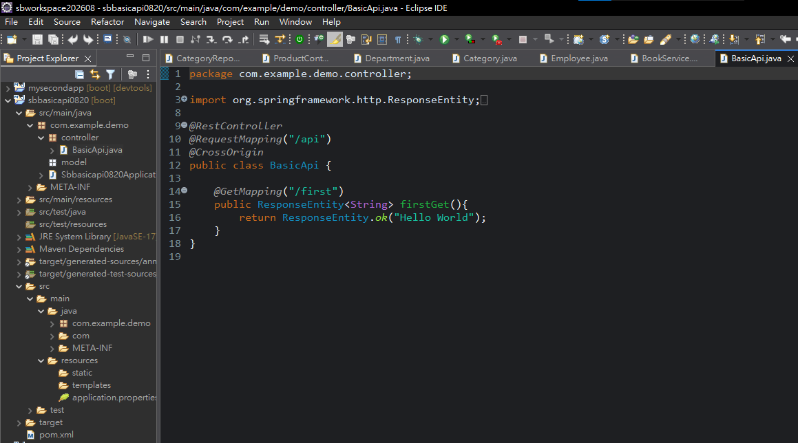

# jQuery AJAX與Spring Boot前後端分離

[返回JavaScript課程功能快速索引](00_JavaScript功能快速索引.md)

本章把Live Server上的HTML／jQuery當作前端，把`sbbasicapi0820`當作Spring Boot後端。前端透過`$.get()`與`$.post()`呼叫REST API，後端只回傳資料，不負責產生前端HTML。

前端範例檔案為`day3/jquery_get.html`；後端範例專案為`sbbasicapi0820`。

> 語法速查：[MVC與REST](../語法字典/02_Spring_MVC與REST.md)｜[jQuery AJAX](../語法字典/13_jQuery與AJAX.md#ajax)

## 1. 本章功能快速索引

| 功能 | 主要寫法 |
|---|---|
| 建立REST Controller | `@RestController` |
| 設定API共同路徑 | `@RequestMapping("/api")` |
| 允許跨Origin請求 | `@CrossOrigin` |
| 建立GET API | `@GetMapping("/first")` |
| 建立POST API | `@PostMapping` |
| 接收表單格式參數 | `@ModelAttribute Info data` |
| 回傳狀態碼與文字Body | `ResponseEntity.ok(...)` |
| jQuery發送GET | `$.get(url, callback)` |
| jQuery發送POST | `$.post(url, data, callback)` |
| 接收回傳資料與狀態 | callback中的`data`、`status` |

## 2. 前後端分離的結構

本例分成兩個獨立執行的部分：

```text
前端：day3/jquery_get.html
執行方式：VS Code Live Server
網址範例：http://127.0.0.1:5500/day3/jquery_get.html

後端範例專案：sbbasicapi0820
執行方式：Spring Boot App
API根網址：http://localhost:8080/api
```

執行流程：

```text
使用者按下前端按鈕
→ jQuery送出HTTP Request
→ Spring Boot Controller接收
→ Controller建立Response
→ jQuery callback取得資料
→ 前端自行決定如何顯示
```

與Thymeleaf方式不同，Spring Boot沒有回傳模板View Name，也沒有替前端組成完整HTML。

## 3. 建立後端專案

使用Spring Starter Project建立：

| 設定 | 值 |
|---|---|
| Name／Artifact | `sbbasicapi0820` |
| Type | Maven |
| Packaging | Jar |
| Java | 17 |
| Dependency | Spring Web MVC、Lombok |

目前範例專案使用Spring Boot 4.1.0。產生專案後確認`pom.xml`至少包含Web MVC與Lombok依賴。

## 4. 建立接收資料的`Info`

建立：

```text
src/main/java/com/example/demo/model/Info.java
```

```java
package com.example.demo.model;

import lombok.Data;

@Data
public class Info {
    String name;
    String city;
}
```

`@Data`由Lombok產生getter、setter及其他常用方法。POST資料中的`name`、`city`會透過setter綁定至同名欄位。若欄位省略存取修飾詞，會成為package-private；一般封裝寫法建議宣告為`private`，Lombok仍會產生public getter與setter。

## 5. 建立REST API

建立：

```text
src/main/java/com/example/demo/controller/BasicApi.java
```

```java
package com.example.demo.controller;

import org.springframework.http.ResponseEntity;
import org.springframework.web.bind.annotation.CrossOrigin;
import org.springframework.web.bind.annotation.GetMapping;
import org.springframework.web.bind.annotation.ModelAttribute;
import org.springframework.web.bind.annotation.PostMapping;
import org.springframework.web.bind.annotation.RequestMapping;
import org.springframework.web.bind.annotation.RestController;

import com.example.demo.model.Info;

@RestController
@RequestMapping("/api")
@CrossOrigin
public class BasicApi {

    @GetMapping("/first")
    public ResponseEntity<String> firstGet() {
        return ResponseEntity.ok("Hello World");
    }

    @PostMapping
    public ResponseEntity<String> nameCity(@ModelAttribute Info data) {
        String msg = "Name:" + data.getName() + " City:" + data.getCity();
        return ResponseEntity.ok(msg);
    }
}
```

端點對照：

| Method | URL | 輸入 | 回傳Body |
|---|---|---|---|
| GET | `/api/first` | 無 | `Hello World` |
| POST | `/api` | `name`、`city`表單欄位 | `Name:... City:...` |

`ResponseEntity<String>`可同時控制HTTP狀態與Response Body；`ResponseEntity.ok(msg)`代表200 OK。

## 6. 為什麼需要`@CrossOrigin`

Live Server與Spring Boot使用不同Origin：

```text
http://127.0.0.1:5500
http://localhost:8080
```

Origin由通訊協定、主機名稱及Port共同決定。兩個網址的主機名稱與Port都不同，因此瀏覽器的Same-Origin Policy會限制前端JavaScript讀取後端Response。

```java
@CrossOrigin
```

這會允許跨Origin呼叫這個Controller。開發測試可以暫時放寬來源；正式環境宜限制允許的前端網址，例如：

```java
@CrossOrigin(origins = "http://127.0.0.1:5500")
```

直接在瀏覽器網址列開啟GET API不一定能測出CORS問題；CORS主要限制的是網頁中的JavaScript跨Origin讀取Response。

## 7. 建立jQuery前端

建立：

```text
day3/jquery_get.html
```

```html
<!DOCTYPE html>
<html>
<head>
    <meta charset="utf-8">
    <title>jQuery API</title>
    <script src="https://ajax.googleapis.com/ajax/libs/jquery/3.6.4/jquery.min.js"></script>
</head>
<body>
    <button id="b1">jQuery Get</button>
    <button id="b2">jQuery Post</button>

    <script>
        const btnClick = () => {
            $.get(
                "http://localhost:8080/api/first",
                function (data, status) {
                    alert("Data: " + data + "\nStatus: " + status);
                }
            );
        };

        const btn2Click = () => {
            $.post(
                "http://localhost:8080/api",
                { name: "Lee", city: "Taipei" },
                function (data, status) {
                    alert("Data: " + data + "\nStatus: " + status);
                }
            );
        };

        const start = () => {
            $("#b1").click(btnClick);
            $("#b2").click(btn2Click);
        };

        $(document).ready(start);
    </script>
</body>
</html>
```

## 8. `$.get()`與`$.post()`如何交換資料

GET：

```javascript
$.get(url, function (data, status) {
    // data是Response Body
    // status成功時通常是"success"
});
```

POST：

```javascript
$.post(
    "http://localhost:8080/api",
    { name: "Lee", city: "Taipei" },
    callback
);
```

jQuery會把這個Object編碼成一般表單格式：

```text
name=Lee&city=Taipei
```

因此後端使用：

```java
@ModelAttribute Info data
```

若前端改成傳送JSON，就應改用JSON設定及後端的`@RequestBody`，不能只把資料外觀看起來像JavaScript Object就當成JSON。

## 9. 啟動與驗證

### 9.1 啟動後端

在Eclipse對`sbbasicapi0820`選擇：

```text
Run As → Spring Boot App
```

確認8080 Port啟動後，先測試：

```text
GET http://localhost:8080/api/first
```

預期Body：

```text
Hello World
```

### 9.2 啟動前端

對`jquery_get.html`使用`Open with Live Server`，依序按下兩個按鈕。

GET預期alert：

```text
Data: Hello World
Status: success
```

POST預期alert：

```text
Data: Name:Lee City:Taipei
Status: success
```

正確啟動前後端後，應能取得：

```text
GET /api/first → 200、Hello World
POST /api      → 200、Name:Lee City:Taipei
```

## 10. 目前範例檔案狀態



*圖1：此畫面只記錄GET端點與CrossOrigin的中途狀態；最終功能仍須依本章完整程式與測試結果驗證。*

完成版`jquery_get.html`應同時包含GET與POST兩個按鈕；若檔案仍只有GET，請依本章POST段落補上第二個按鈕與Request。

後端範例專案`sbbasicapi0820`須同時具備GET與POST端點，才能完成本章兩種Request測試。

目前POST只把輸入組成文字後回傳，沒有Service、Repository或資料庫；成功Response不能證明資料已保存。

## 11. 常見錯誤

- 後端尚未啟動，前端Request出現連線失敗。
- URL或Port不一致，導致404或連不到服務。
- 移除`@CrossOrigin`後，API在網址列可開啟，但前端JavaScript仍被瀏覽器CORS政策阻擋。
- 前端仍停留在較早的GET-only版本，因而誤以為POST尚未實作。
- 前端使用`$.post()`傳表單格式，後端卻用`@RequestBody`期待JSON。
- 把Spring Boot回傳文字誤認為後端已經回傳HTML頁面。

## 12. 本章檢查表

- 能區分前端HTML／jQuery與後端Spring Boot的執行位置。
- 能說明不同Origin及`@CrossOrigin`的用途。
- 能建立GET與POST REST API。
- 能使用`$.get()`與`$.post()`取得Response。
- 能解釋`@ModelAttribute`如何接收jQuery表單格式資料。
- 能完成兩個200回應及預期Body。
- 知道目前案例沒有資料庫，不能宣稱資料已保存。
