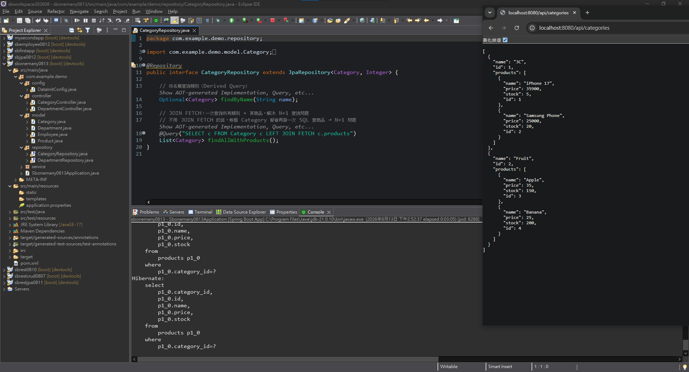
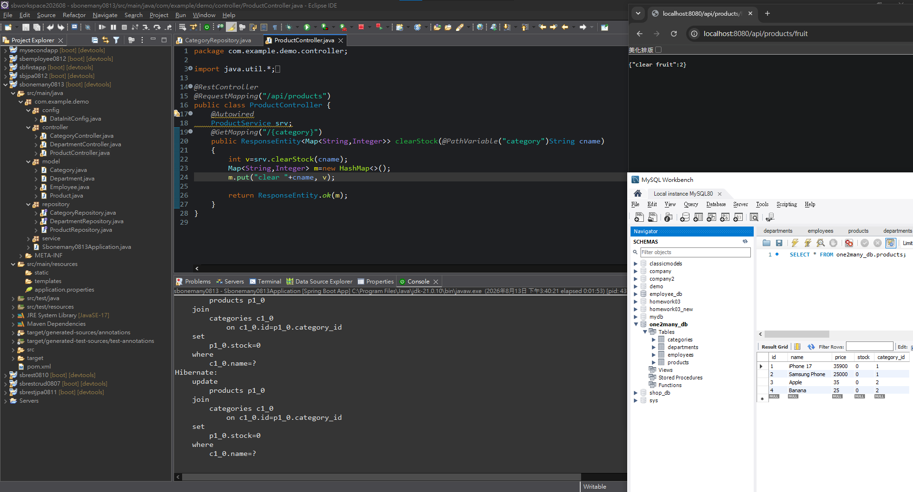

# 第16章延伸閱讀：JPA查詢效能、批次更新與關聯風險

## 本頁快速索引

- [0. 前置條件](#0-前置條件)
- [1. `JOIN FETCH`與N+1查詢](#1-join-fetch與n1查詢)
- [2. `@Modifying`、`@Transactional`與批次更新](#2-modifyingtransactional與批次更新)
- [3. Lombok與雙向關聯的額外風險](#3-lombok與雙向關聯的額外風險)
- [4. 重現測試](#4-重現測試)
- [5. 常見錯誤](#5-常見錯誤)
- [6. 延伸閱讀檢查表](#6-延伸閱讀檢查表)

## 0. 前置條件

- 已完成第16章主章，Department／Employee與Category／Product關聯可正常查詢。
- 已理解第15章Derived Query與`@Query`的基本差異。
- 測試時能查看Hibernate SQL，並能把資料庫恢復至固定種子狀態。

## 1. `JOIN FETCH`與N+1查詢

下圖對照本節的操作位置或執行結果：



*圖1：API回傳兩個Category及各自Product；Console對每個Category另執行一次category_id查詢，呈現一筆主查詢加N筆集合查詢的N+1型態。*

Repository定義：

```java
@Query("SELECT d FROM Department d LEFT JOIN FETCH d.employees")
List<Department> findAllWithEmployees();
```

Category也有相同用途的方法：

```java
@Query("SELECT c FROM Category c LEFT JOIN FETCH c.products")
List<Category> findAllWithProducts();
```

### 1.1 `LEFT JOIN FETCH`

- `LEFT JOIN`：沒有員工的部門也會保留。
- `FETCH`：這次查詢直接把`employees`集合載入持久化Context。
- `d.employees`使用Entity關聯屬性，不是SQL資料表名。

Service在查全部時使用這個方法：

```java
public List<Department> findAll() {
    return departmentRepository.findAllWithEmployees();
}
```

### 1.2 N+1問題的實際比較

如果先查N個Department，再於序列化時逐一載入各自的employees，可能形成：

```text
1次：查全部Department
N次：每個Department各查一次Employee
```

這就是常說的N+1查詢。`JOIN FETCH`可在同一次查詢中把父Entity與需要的子集合一起取得。

Department路線已使用：

```java
departmentRepository.findAllWithEmployees();
```

因此畫面可看到`departments LEFT JOIN employees ON ...`。

Category路線目前刻意使用一般`findAll()`：

```java
// return ResponseEntity.ok(repo.findAllWithProducts());
return ResponseEntity.ok(repo.findAll());
```

查到兩個Category後，Jackson輸出各自的`products`集合；目前執行環境能在序列化期間載入LAZY集合，因此Console可看到兩次類似查詢：

```sql
select ...
from products
where category_id = ?
```

兩個Category各補查一次Product，配合前面的Category主查詢，形成`1 + 2`。Category數量增加至N時，最壞情況會變成`1 + N`。

要比較`JOIN FETCH`，把Controller切換為：

```java
return ResponseEntity.ok(repo.findAllWithProducts());
// return ResponseEntity.ok(repo.findAll());
```

重新啟動並再次呼叫`GET /api/categories`。JSON內容應維持相同，但Console應改為概念上相當於：

```sql
select ...
from categories c
left join products p
    on c.id = p.category_id
```

若關閉Open EntityManager in View，或Entity已離開持久化Context，直接序列化尚未載入的LAZY集合可能改成`LazyInitializationException`；所以「目前findAll也能回JSON」不代表它已處理N+1或在所有設定下都安全。

集合Fetch Join可能讓SQL結果中同一Department出現多列；若使用情境或provider產生重複的根Entity，可改寫為：

```java
@Query("SELECT DISTINCT d " +
       "FROM Department d LEFT JOIN FETCH d.employees")
List<Department> findAllWithEmployees();
```

是否需要`DISTINCT`應以實際JPQL結果與provider行為驗證。


## 2. `@Modifying`、`@Transactional`與批次更新

下圖對照本節的操作位置或執行結果：



*圖2：呼叫fruit端點回傳affected rows為2，Console顯示Join Update；Workbench的庫存畫面只能證明當下狀態，不能把四筆全為0都歸因於同一次Request。*

本段目標是依Category名稱，把所有對應Product的`stock`一次更新為0，而不是先查出每個Product再逐筆呼叫`save()`。

### 2.1 Repository：宣告修改查詢

```java
public interface ProductRepository
        extends JpaRepository<Product, Integer> {

    @Modifying
    @Query("UPDATE Product p " +
           "SET p.stock = 0 " +
           "WHERE p.category.name = :cat")
    int clearStockByCategory(@Param("cat") String cat);
}
```

各部分的確切角色：

| 語法／註解 | 定義與成立條件 |
|---|---|
| `@Query` | 這裡放JPQL；`Product`、`stock`、`category.name`都是Entity與Java屬性路徑，不是SQL表欄位名稱 |
| `p.category.name` | 沿著`Product.category`關聯取得Category的`name`作為條件；Hibernate可據此產生對categories的Join |
| `:cat` | JPQL命名參數，必須和`@Param("cat")`完全對應 |
| `@Modifying` | 告訴Spring Data這不是SELECT，而是UPDATE／DELETE等資料修改查詢 |
| `int`回傳值 | 資料庫實際受影響的資料列數，不是更新後的Product物件 |

只寫`@Query`而沒有`@Modifying`時，Spring Data仍可能依查詢方法的預設SELECT流程處理，修改查詢無法正確執行。

### 2.2 Service：交易邊界

```java
@Service
public class ProductService {
    @Autowired
    ProductRepository repo;

    @Transactional
    public int clearStock(String category) {
        return repo.clearStockByCategory(category);
    }
}
```

`@Transactional`讓方法在可提交的資料庫交易中執行。修改查詢若沒有有效交易，通常會因沒有transaction而失敗；方法正常結束時提交，丟出符合rollback規則的例外時回復。

交易放在Service的原因是Service負責一個完整業務操作的邊界。即使本例只有一次Repository呼叫，日後若加入紀錄、檢查或其他更新，也可以納入同一交易。

### 2.3 Controller與目前回應

```java
@RestController
@RequestMapping("/api/products")
public class ProductController {
    @Autowired
    ProductService service;

    @GetMapping("/{category}")
    public ResponseEntity<Map<String, Integer>> clearStock(
            @PathVariable("category") String category) {
        int count = service.clearStock(category);
        Map<String, Integer> result = new HashMap<>();
        result.put("clear " + category, count);
        return ResponseEntity.ok(result);
    }
}
```

範例呼叫：

```http
GET http://localhost:8080/api/products/fruit
```

畫面回應：

```json
{"clear fruit": 2}
```

這代表該次UPDATE影響兩列。種子資料中的Category名稱是`Fruit`，Request使用小寫`fruit`仍匹配，是目前MySQL字串collation比較不分大小寫所產生的結果；JPQL本身沒有寫`LOWER()`，換成區分大小寫的collation或不同資料庫時不保證仍能匹配。

### 2.4 Hibernate產生的SQL

JPQL條件沿著`p.category.name`導覽關聯，因此Hibernate在目前MySQL環境產生概念上相當於：

```sql
update products p
join categories c
    on c.id = p.category_id
set p.stock = 0
where c.name = ?
```

這是單次Bulk Update。Console看到的Join不是Repository寫的原生SQL，而是Hibernate把JPQL關聯路徑轉換成資料庫SQL的結果。

### 2.5 用影響列數驗證更新範圍

`/api/products/fruit`回應的更新筆數是2，而且WHERE條件只匹配Fruit，因此這個Request只能證明Apple與Banana兩列被更新。

資料庫查詢畫面只顯示目前狀態，不能證明每一列由哪一次Request修改。若四筆資料最後都是0，仍須依每次回傳的affected rows與重設後的測試結果判斷更新範圍。

要做可重複的驗證，先把四筆庫存恢復成種子值，再依序測：

```http
GET /api/products/fruit
```

預期只有Apple、Banana變為0，回傳2。接著測：

```http
GET /api/products/3C
```

預期iPhone 17、Samsung Phone也變為0，回傳2。`3C`含數字，URL可直接使用；若類別名稱含空白或特殊字元，Client必須做URL encoding。

### 2.6 Bulk Update與Persistence Context

JPQL Bulk Update直接修改資料庫，不會逐一同步目前Persistence Context中已載入的Product物件。因此同一個交易裡若先查Product、再做Bulk Update，記憶體中的Entity可能仍保留舊stock。

需要修改後自動清除Persistence Context時，可依流程使用：

```java
@Modifying(clearAutomatically = true,
           flushAutomatically = true)
```

但清除Context會讓尚未flush的其他Entity變更有遺失風險，所以不能機械套用；要先確認同一交易中是否還有其他待保存變更。

### 2.7 HTTP Method的設計問題

目前使用`GET /api/products/{category}`會修改資料庫，不符合GET應為safe method、不得要求伺服器改變資源狀態的HTTP語意。Browser、Cache、Crawler或預先載入機制可能在使用者沒有更新意圖時觸發GET。

較合適的設計例如：

```java
@PatchMapping("/category/{category}/stock/clear")
public ResponseEntity<Map<String, Integer>> clearStock(...)
```

對應Request：

```http
PATCH /api/products/category/Fruit/stock/clear
```

目前範例的GET端點可用來觀察`@Modifying`，但實務API應改用PATCH、PUT或依資源設計選擇其他非GET方法。


## 3. Lombok與雙向關聯的額外風險

`@Data`會產生`toString()`、`equals()`及`hashCode()`。若雙向關聯兩端都把對方欄位納入這些方法，可能反覆互相呼叫，或在不預期時觸發LAZY載入。

本專案的Department自行覆寫`toString()`且不印employees，但`equals()`／`hashCode()`仍需留意。常見處理方式：

```java
@ToString.Exclude
@EqualsAndHashCode.Exclude
@ManyToOne(fetch = FetchType.LAZY)
private Department department;
```

也可以不用`@Data`，只產生必要Getter／Setter，並以穩定識別策略自行設計Entity的`equals()`與`hashCode()`。


## 4. 重現測試

### 4.1 比較Category的N+1與Join Fetch

先保留Controller目前的`repo.findAll()`：

```http
GET http://localhost:8080/api/categories
```

預期JSON：

- 3C包含iPhone 17與Samsung Phone。
- Fruit包含Apple與Banana。
- Product不包含反向`category`欄位。

此時Console應出現Category主查詢，以及依`category_id`重複查Product的SQL。接著依第7.2節改用`findAllWithProducts()`並重新啟動；JSON應相同，SQL則改為一次`LEFT JOIN`載入Category與Product。

批次更新測試已包含在第2.5節；每次測試前先恢復四筆Product的種子庫存，避免把先前操作造成的最終狀態歸因於單一Request。

## 5. 常見錯誤

1. **看到JSON正確便以為沒有N+1：**結果內容與查詢次數是兩項不同驗證。
2. **建立`findAllWithProducts()`卻仍呼叫`findAll()`：**自訂方法不會自動取代內建方法。
3. **修改查詢漏掉`@Modifying`或交易：**JPQL UPDATE必須被辨識為修改操作並在有效transaction內執行。
4. **把Bulk Update當成逐筆Entity更新：**它直接修改資料庫，已載入Entity可能保留舊值。
5. **用GET改庫存：**雖能執行，但違反GET的safe語意，實務API應改用PATCH或PUT。
6. **只看資料庫最終畫面：**最終狀態不能證明每一列由哪次Request修改，應同時核對affected rows。
7. **雙向關聯直接使用`@Data`：**自動產生的方法可能遞迴或意外觸發LAZY載入。

## 6. 延伸閱讀檢查表

- [ ] 能從重複的`where category_id=?`辨認`1 + N`
- [ ] 能比較`findAll()`與`JOIN FETCH`的SQL次數
- [ ] 能說明`@Modifying`、`@Transactional`與affected rows的不同責任
- [ ] 能從`p.category.name`解釋Hibernate產生Join Update的原因
- [ ] 能說明Bulk Update為何可能使Persistence Context保留舊值
- [ ] 知道讀取用GET不應拿來修改庫存
- [ ] 知道如何排除Lombok自動方法中的關聯欄位
